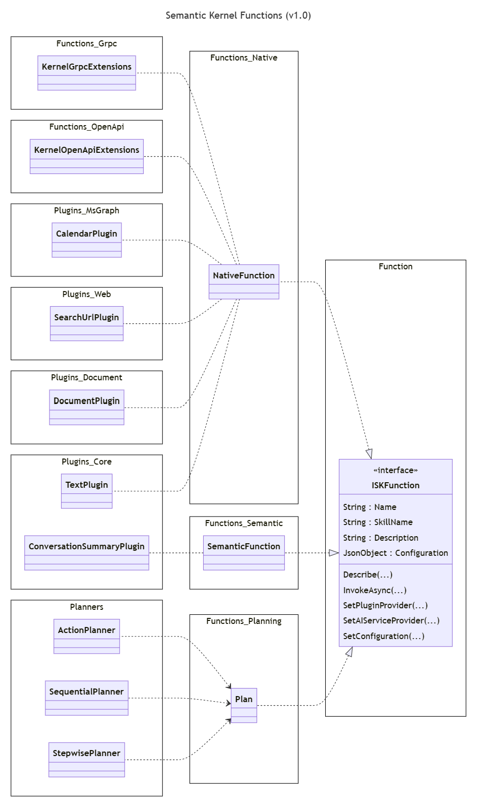
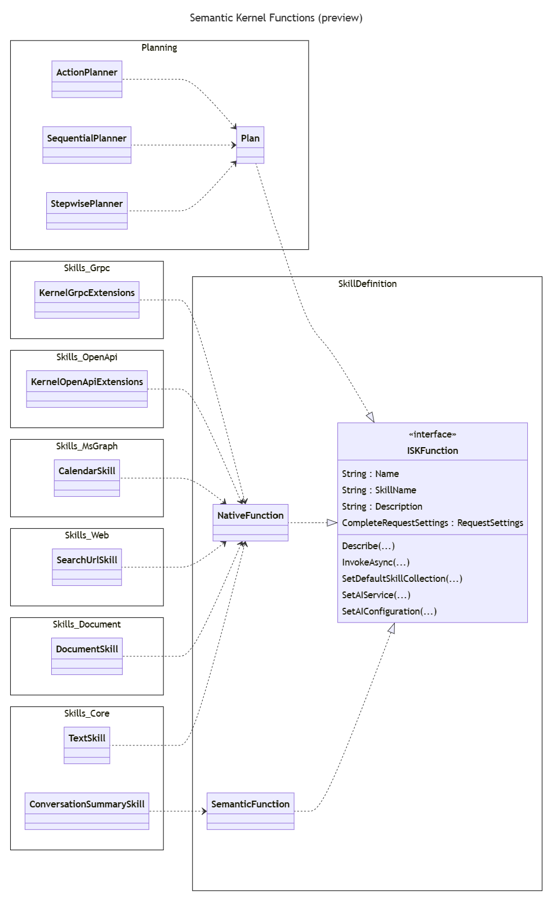

---
# 이 항목들은 선택 사항입니다. 필요 없는 항목은 자유롭게 제거하세요.

status: superseded by [ADR-0042](0042-samples-restructure.md)
contact: markwallace-microsoft
date: 2023-09-29
deciders: SergeyMenshykh, dmytrostruk, RogerBarreto
consulted: shawncal, stephentoub, lemillermicrosoft
informed:
  {
    list everyone who is kept up-to-date on progress; and with whom there is a one-way communication,
  }
---

# 1.0 릴리스를 위한 DotNet 프로젝트 구조

## 배경 및 문제 상황

- 개발자가 필요에 따라 쉽게 조합할 수 있는 응집력 있고 잘 정의된 어셈블리 세트를 제공합니다.
  - Semantic Kernel 코어는 AI 오케스트레이션과 관련된 기능만 포함해야 합니다.
    - 프롬프트 템플릿 엔진과 시맨틱 함수를 제거합니다.
  - Semantic Kernel 추상화는 인터페이스, 추상 클래스 및 이를 지원하는 최소한의 클래스만 포함해야 합니다.
- NuGet 패키지에서 `Skills` 명명을 제거하고 `Plugins`로 대체합니다.
  - 플러그인 구현(`Skills.MsGraph`)과 플러그인 통합(`Skills.OpenAPI`)을 명확하게 구분합니다.
- 어셈블리와 루트 네임스페이스의 일관된 명명을 유지합니다.
  - 현재 패턴의 예제는 [명명 패턴](#명명-패턴) 섹션을 참조하세요.

## 결정 동인

- 서명의 영향과 복잡성을 줄이기 위해 어셈블리가 너무 많아지는 것을 방지합니다.
- .Net 명명 가이드라인을 따릅니다.
  - [어셈블리 및 DLL 이름](https://learn.microsoft.com/en-us/dotnet/standard/design-guidelines/names-of-assemblies-and-dlls)
  - [네임스페이스 이름](https://learn.microsoft.com/en-us/dotnet/standard/design-guidelines/names-of-namespaces)

## 검토된 옵션

- 옵션 #1: 새로운 `planning`, `functions`, `plugins` 프로젝트 영역
- 옵션 #2: 폴더 명명이 어셈블리 이름과 일치

모든 경우에 다음 변경이 적용됩니다:

- 비핵심 Connectors를 별도의 저장소로 이동
- 프롬프트 템플릿 엔진과 시맨틱 함수를 단일 패키지로 병합

## 결정 결과

선택된 옵션: 옵션 #2: 폴더 명명이 어셈블리 이름과 일치, 그 이유는:

1. 개발자가 특정 어셈블리의 코드가 어디에 있는지 쉽게 찾을 수 있는 방법을 제공합니다.
1. [azure-sdk-for-net](https://github.com/Azure/azure-sdk-for-net) 등과 일관됩니다.

프로젝트의 주요 카테고리는 다음과 같습니다:

1. `Connectors`: **_커넥터 프로젝트는 Semantic Kernel이 AI 및 Memory 서비스에 연결할 수 있게 합니다_**. 일부 기존 커넥터 프로젝트는 다른 저장소로 이동할 수 있습니다.
1. `Planners`: **_플래너 프로젝트는 요청을 받아 해당 요청을 달성하기 위한 실행 가능한 계획으로 변환하는 하나 이상의 플래너 구현을 제공합니다_**. 이 카테고리에는 현재의 액션, 순차적, 단계별 플래너가 포함됩니다(이들은 단일 프로젝트로 병합될 수 있습니다). Powershell이나 Python 코드를 생성하는 플래너 등 추가 계획 구현은 별도의 프로젝트로 추가할 수 있습니다.
1. `Functions`: **_함수 프로젝트는 Semantic Kernel이 오케스트레이션할 함수에 접근할 수 있게 합니다_**. 이 카테고리에는 다음이 포함됩니다:
   1. 시맨틱 함수, 즉 LLM에 대해 실행되는 프롬프트
   1. GRPC 원격 프로시저, 즉 GRPC 프레임워크를 사용하여 원격으로 실행되는 프로시저
   1. Open API 엔드포인트, 즉 Open API 정의가 있는 REST 엔드포인트로 HTTP 프로토콜을 사용하여 원격으로 실행
1. `Plugins`: **_플러그인 프로젝트는 Semantic Kernel 플러그인의 구현을 포함합니다_**. Semantic Kernel 플러그인은 함수의 구체적인 구현을 포함합니다. 예: 플러그인에 기본 텍스트 작업 코드가 포함될 수 있습니다.

### 옵션 #1: 새로운 `planning`, `functions`, `plugins` 프로젝트 영역

```text
SK-dotnet
├── samples/
└── src/
    ├── connectors/
    │   ├── Connectors.AI.OpenAI*
    │   ├── Connectors.AI.HuggingFace
    │   ├── Connectors.Memory.AzureCognitiveSearch
    │   ├── Connectors.Memory.Qdrant
    │   ├── ...
    │   └── Connectors.UnitTests
    ├── planners/
    │   ├── Planners.Action*
    │   ├── Planners.Sequential*
    │   └── Planners.Stepwise*
    ├── functions/
    │   ├── Functions.Native*
    │   ├── Functions.Semantic*
    │   ├── Functions.Planning*
    │   ├── Functions.Grpc
    │   ├── Functions.OpenAPI
    │   └── Functions.UnitTests
    ├── plugins/
    │   ├── Plugins.Core*
    │   ├── Plugins.Document
    │   ├── Plugins.MsGraph
    │   ├── Plugins.WebSearch
    │   └── Plugins.UnitTests
    ├── InternalUtilities/
    ├── IntegrationTests
    ├── SemanticKernel*
    ├── SemanticKernel.Abstractions*
    ├── SemanticKernel.MetaPackage
    └── SemanticKernel.UnitTests
```

### 변경 사항

| 프로젝트             | 설명                                                                                                       |
| -------------------- | ---------------------------------------------------------------------------------------------------------- |
| `Functions.Native`   | Semantic Kernel 코어와 추상화에서 네이티브 함수를 추출합니다.                                              |
| `Functions.Semantic` | Semantic Kernel 코어와 추상화에서 시맨틱 함수를 추출합니다. 프롬프트 템플릿 엔진을 포함합니다.             |
| `Functions.Planning` | Semantic Kernel 코어와 추상화에서 계획 기능을 추출합니다.                                                  |
| `Functions.Grpc`     | 기존 `Skills.Grpc` 프로젝트                                                                                |
| `Functions.OpenAPI`  | 기존 `Skills.OpenAPI` 프로젝트                                                                             |
| `Plugins.Core`       | 기존 `Skills.Core` 프로젝트                                                                                |
| `Plugins.Document`   | 기존 `Skills.Document` 프로젝트                                                                            |
| `Plugins.MsGraph`    | 기존 `Skills.MsGraph` 프로젝트                                                                             |
| `Plugins.WebSearch`  | 기존 `Skills.WebSearch` 프로젝트                                                                           |

### Semantic Kernel 스킬 및 함수

이 다이어그램은 함수와 플러그인이 Semantic Kernel 코어와 어떻게 통합되는지 보여줍니다.



### 옵션 #2: 폴더 명명이 어셈블리 이름과 일치

```text
SK-dotnet
├── samples/
└── libraries/
    ├── SK-dotnet.sln
    │
    ├── Microsoft.SemanticKernel.Connectors.AI.OpenAI*
    │   ├── src
    │   └── tests
    │ (표시되지 않았지만 모든 프로젝트에 src 및 tests 하위 폴더가 있습니다)
    ├── Microsoft.SemanticKernel.Connectors.AI.HuggingFace
    ├── Microsoft.SemanticKernel.Connectors.Memory.AzureCognitiveSearch
    ├── Microsoft.SemanticKernel.Connectors.Memory.Qdrant
    │
    ├── Microsoft.SemanticKernel.Planners*
    │
    ├── Microsoft.SemanticKernel.Reliability.Basic*
    ├── Microsoft.SemanticKernel.Reliability.Polly
    │
    ├── Microsoft.SemanticKernel.TemplateEngines.Basic*
    │
    ├── Microsoft.SemanticKernel.Functions.Semantic*
    ├── Microsoft.SemanticKernel.Functions.Grpc
    ├── Microsoft.SemanticKernel.Functions.OpenAPI
    │
    ├── Microsoft.SemanticKernel.Plugins.Core*
    ├── Microsoft.SemanticKernel.Plugins.Document
    ├── Microsoft.SemanticKernel.Plugins.MsGraph
    ├── Microsoft.SemanticKernel.Plugins.Web
    │
    ├── InternalUtilities
    │
    ├── IntegrationTests
    │
    ├── Microsoft.SemanticKernel.Core*
    ├── Microsoft.SemanticKernel.Abstractions*
    └── Microsoft.SemanticKernel.MetaPackage
```

**_참고:_**

- 솔루션 파일은 하나만 있습니다(초기에).
- 프로젝트는 솔루션에서 그룹화됩니다. 즉, connectors, planners, plugins, functions, extensions, ...
- 각 프로젝트 폴더에는 `src`와 `tests` 폴더가 포함됩니다.
- 일부 프로젝트를 분리해야 하므로 기존 단위 테스트를 올바른 위치로 이동하는 점진적 프로세스가 있을 것입니다.

## 추가 정보

### 현재 프로젝트 구조

```text
SK-dotnet
├── samples/
└── src/
    ├── connectors/
    │   ├── Connectors.AI.OpenAI*
    │   ├── Connectors...
    │   └── Connectors.UnitTests
    ├── extensions/
    │   ├── Planner.ActionPlanner*
    │   ├── Planner.SequentialPlanner*
    │   ├── Planner.StepwisePlanner
    │   ├── TemplateEngine.PromptTemplateEngine*
    │   └── Extensions.UnitTests
    ├── InternalUtilities/
    ├── skills/
    │   ├── Skills.Core
    │   ├── Skills.Document
    │   ├── Skills.Grpc
    │   ├── Skills.MsGraph
    │   ├── Skills.OpenAPI
    │   ├── Skills.Web
    │   └── Skills.UnitTests
    ├── IntegrationTests
    ├── SemanticKernel*
    ├── SemanticKernel.Abstractions*
    ├── SemanticKernel.MetaPackage
    └── SemanticKernel.UnitTests
```

\\\* - 해당 프로젝트가 Semantic Kernel 메타 패키지의 일부임을 의미합니다.

### 프로젝트 설명

| 프로젝트                    | 설명                                                                                                             |
| --------------------------- | ---------------------------------------------------------------------------------------------------------------- |
| Connectors.AI.OpenAI        | Azure OpenAI 및 OpenAI 서비스 커넥터                                                                            |
| Connectors...               | 다른 AI 서비스 커넥터 모음, 일부는 다른 저장소로 이동 예정                                                       |
| Connectors.UnitTests        | 커넥터 단위 테스트                                                                                               |
| Planner.ActionPlanner       | Semantic Kernel 액션 플래너 구현                                                                                 |
| Planner.SequentialPlanner   | Semantic Kernel 순차적 플래너 구현                                                                               |
| Planner.StepwisePlanner     | Semantic Kernel 단계별 플래너 구현                                                                               |
| TemplateEngine.Basic        | 시맨틱 함수에서만 사용되는 프롬프트 템플릿 엔진 기본 구현                                                        |
| Extensions.UnitTests        | 확장 단위 테스트                                                                                                 |
| InternalUtilities           | 여러 NuGet 패키지에서 재사용되는 내부 유틸리티 (모두 internal)                                                   |
| Skills.Core                 | 시맨틱 함수를 지원하기 위해 제공되는 핵심 네이티브 함수 세트                                                     |
| Skills.Document             | Microsoft 문서와 상호작용하기 위한 네이티브 함수                                                                 |
| Skills.Grpc                 | GRPC 기반 엔드포인트를 위한 Semantic Kernel 통합                                                                 |
| Skills.MsGraph              | Microsoft Graph 엔드포인트와 상호작용하기 위한 네이티브 함수                                                     |
| Skills.OpenAPI              | OpenAI 엔드포인트를 위한 Semantic Kernel 통합 및 참조 Azure Key Vault 구현                                       |
| Skills.Web                  | 웹 엔드포인트와 상호작용하기 위한 네이티브 함수. 예: Bing, Google, 파일 다운로드                                 |
| Skills.UnitTests            | 스킬 단위 테스트                                                                                                 |
| IntegrationTests            | Semantic Kernel 통합 테스트                                                                                      |
| SemanticKernel              | Semantic Kernel 핵심 구현                                                                                        |
| SemanticKernel.Abstractions | Semantic Kernel 추상화, 즉 인터페이스, 추상 클래스, 지원 클래스, ...                                             |
| SemanticKernel.MetaPackage  | Semantic Kernel 메타 패키지, 즉 필요한 다른 Semantic Kernel NuGet 패키지를 참조하는 NuGet 패키지                  |
| SemanticKernel.UnitTests    | Semantic Kernel 단위 테스트                                                                                      |

### 명명 패턴

다음은 프로젝트에서 사용되는 어셈블리 및 루트 네임스페이스 명명의 다양한 예제입니다.

```xml
    <AssemblyName>Microsoft.SemanticKernel.Abstractions</AssemblyName>
    <RootNamespace>Microsoft.SemanticKernel</RootNamespace>

    <AssemblyName>Microsoft.SemanticKernel.Core</AssemblyName>
    <RootNamespace>Microsoft.SemanticKernel</RootNamespace>

    <AssemblyName>Microsoft.SemanticKernel.Planning.ActionPlanner</AssemblyName>
    <RootNamespace>Microsoft.SemanticKernel.Planning.Action</RootNamespace>

    <AssemblyName>Microsoft.SemanticKernel.Skills.Core</AssemblyName>
    <RootNamespace>$(AssemblyName)</RootNamespace>
```

### 현재 폴더 구조

```text
dotnet/
├── samples/
│   ├── ApplicationInsightsExample/
│   ├── KernelSyntaxExamples/
│   └── NCalcSkills/
└── src/
    ├── Connectors/
    │   ├── Connectors.AI.OpenAI*
    │   ├── Connectors...
    │   └── Connectors.UnitTests
    ├── Extensions/
    │   ├── Planner.ActionPlanner
    │   ├── Planner.SequentialPlanner
    │   ├── Planner.StepwisePlanner
    │   ├── TemplateEngine.PromptTemplateEngine
    │   └── Extensions.UnitTests
    ├── InternalUtilities/
    ├── Skills/
    │   ├── Skills.Core
    │   ├── Skills.Document
    │   ├── Skills.Grpc
    │   ├── Skills.MsGraph
    │   ├── Skills.OpenAPI
    │   ├── Skills.Web
    │   └── Skills.UnitTests
    ├── IntegrationTests/
    ├── SemanticKernel/
    ├── SemanticKerne.Abstractions/
    ├── SemanticKernel.MetaPackage/
    └── SemanticKernel.UnitTests/

```

### Semantic Kernel 스킬 및 함수

이 다이어그램은 현재 스킬이 Semantic Kernel 코어와 어떻게 통합되어 있는지 보여줍니다.

**_참고:_**

- 이것은 정확한 클래스 계층 구조 다이어그램이 아닙니다. 일부 클래스 관계와 의존성을 보여줍니다.
- 네임스페이스는 Microsoft.SemanticKernel 접두사를 제거하여 축약되었습니다. 네임스페이스는 `.` 대신 `_`를 사용합니다.


