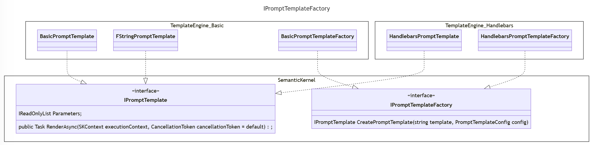

# 사용자 정의 프롬프트 템플릿 형식

## 맥락 및 문제 설명

Semantic Kernel은 현재 변수 보간(interpolation)과 함수 실행을 허용하는 사용자 정의 프롬프트 템플릿 언어를 지원합니다.
Semantic Kernel은 [Handlebars](https://handlebarsjs.com/) 구문을 사용하는 프롬프트 템플릿과 같은 사용자 정의 프롬프트 템플릿 형식의 통합을 허용합니다.

이 ADR의 목적은 Semantic Kernel에서 사용자 정의 프롬프트 템플릿 형식을 어떻게 지원할 것인지 설명하는 것입니다.

### 현재 설계

기본적으로 `Kernel`은 Semantic Kernel 전용 템플릿 형식을 지원하는 `BasicPromptTemplateEngine`을 사용합니다.

#### 코드 패턴

다음은 내장 Semantic Kernel 형식을 사용하는 프롬프트 템플릿 문자열에서 시맨틱 함수를 생성하는 확장된 예시입니다:

```csharp
IKernel kernel = Kernel.Builder
    .WithPromptTemplateEngine(new BasicPromptTemplateEngine())
    .WithOpenAIChatCompletionService(
        modelId: openAIModelId,
        apiKey: openAIApiKey)
    .Build();

kernel.ImportFunctions(new TimePlugin(), "time");

string templateString = "Today is: {{time.Date}} Is it weekend time (weekend/not weekend)?";
var promptTemplateConfig = new PromptTemplateConfig();
var promptTemplate = new PromptTemplate(templateString, promptTemplateConfig, kernel.PromptTemplateEngine);
var kindOfDay = kernel.RegisterSemanticFunction("KindOfDay", promptTemplateConfig, promptTemplate);

var result = await kernel.RunAsync(kindOfDay);
Console.WriteLine(result.GetValue<string>());
```

시맨틱 함수 생성 및 등록 과정을 단순화하기 위한 확장 메서드 `var kindOfDay = kernel.CreateSemanticFunction(promptTemplate);`가 있지만, 위에서는 `kernel.PromptTemplateEngine`에 대한 의존성을 강조하기 위해 확장된 형식을 보여주고 있습니다.
또한 `BasicPromptTemplateEngine`은 기본 프롬프트 템플릿 엔진이며, 패키지가 사용 가능하고 다른 프롬프트 템플릿 엔진이 지정되지 않은 경우 자동으로 로드됩니다.

이 방식의 일부 문제점:

1. `Kernel`은 단일 `IPromptTemplateEngine`만 지원하므로 여러 프롬프트 템플릿을 동시에 사용할 수 없습니다.
1. `IPromptTemplateEngine`은 상태가 없으며(stateless) 각 렌더링마다 템플릿 파싱을 수행해야 합니다.
1. 시맨틱 함수 확장 메서드는 템플릿 문자열을 저장하고 매번 `IPromptTemplateEngine`을 사용하여 렌더링하는 `IPromptTemplate`(즉, `PromptTemplate`)의 구현에 의존합니다. `IPromptTemplate` 구현은 현재 매개변수도 저장하므로 상태를 유지합니다(stateful).

#### 성능

`BasicPromptTemplateEngine`은 `TemplateTokenizer`를 사용하여 템플릿을 파싱합니다(즉, 블록을 추출합니다).
그런 다음 템플릿을 렌더링합니다(즉, 변수를 삽입하고 함수를 실행합니다). 이러한 연산에 대한 샘플 타이밍:

| 연산             | 틱(Ticks) | 밀리초 |
| ---------------- | --------- | ------ |
| 블록 추출       | 1044427   | 103    |
| 변수 렌더링     | 168       | 0      |

사용된 샘플 템플릿: `"{{variable1}} {{variable2}} {{variable3}} {{variable4}} {{variable5}}"`

**참고: f-string 템플릿 형식을 지원하기 위해 샘플 구현을 사용할 것입니다.**

동일한 사용 사례에 `HandlebarsDotNet`을 사용하면 다음과 같은 타이밍이 됩니다:

| 연산             | 틱(Ticks) | 밀리초 |
| ---------------- | --------- | ------ |
| 템플릿 컴파일   | 66277     | 6      |
| 변수 렌더링     | 4173      | 0      |

**블록 추출/컴파일을 변수 렌더링 연산에서 분리하면, 템플릿을 한 번만 컴파일하여 성능을 최적화할 수 있습니다.**

#### 사용자 정의 프롬프트 템플릿 엔진 구현

두 가지 인터페이스가 제공됩니다:

```csharp
public interface IPromptTemplateEngine
{
    Task<string> RenderAsync(string templateText, SKContext context, CancellationToken cancellationToken = default);
}

public interface IPromptTemplate
{
    IReadOnlyList<ParameterView> Parameters { get; }

    public Task<string> RenderAsync(SKContext executionContext, CancellationToken cancellationToken = default);
}
```

handlebars 프롬프트 템플릿 엔진의 프로토타입 구현은 다음과 같을 수 있습니다:

```csharp
public class HandlebarsTemplateEngine : IPromptTemplateEngine
{
    private readonly ILoggerFactory _loggerFactory;

    public HandlebarsTemplateEngine(ILoggerFactory? loggerFactory = null)
    {
        this._loggerFactory = loggerFactory ?? NullLoggerFactory.Instance;
    }

    public async Task<string> RenderAsync(string templateText, SKContext context, CancellationToken cancellationToken = default)
    {
        var handlebars = HandlebarsDotNet.Handlebars.Create();

        var functionViews = context.Functions.GetFunctionViews();
        foreach (FunctionView functionView in functionViews)
        {
            var skfunction = context.Functions.GetFunction(functionView.PluginName, functionView.Name);
            handlebars.RegisterHelper($"{functionView.PluginName}_{functionView.Name}", async (writer, hcontext, parameters) =>
                {
                    var result = await skfunction.InvokeAsync(context).ConfigureAwait(true);
                    writer.WriteSafeString(result.GetValue<string>());
                });
        }

        var template = handlebars.Compile(templateText);

        var prompt = template(context.Variables);

        return await Task.FromResult(prompt).ConfigureAwait(true);
    }
}
```

**참고: 이것은 설명 목적으로만 사용되는 프로토타입 구현입니다.**

일부 문제점:

1. `IPromptTemplate` 인터페이스가 사용되지 않아 혼란을 줍니다.
1. 개발자가 여러 프롬프트 템플릿 형식을 동시에 지원할 수 있는 방법이 없습니다.

Semantic Kernel 코어 패키지에 `IPromptTemplate`의 구현이 하나 제공됩니다.
`RenderAsync` 구현은 단순히 `IPromptTemplateEngine`에 위임합니다.
`Parameters` 목록은 `PromptTemplateConfig`에 정의된 매개변수와 템플릿에 정의된 누락된 변수로 채워집니다.

#### Handlebars 고려 사항

Handlebars는 헬퍼의 동적 바인딩을 지원하지 않습니다. 다음 스니펫을 고려하세요:

```csharp
HandlebarsHelper link_to = (writer, context, parameters) =>
{
    writer.WriteSafeString($"<a href='{context["url"]}'>{context["text"]}</a>");
};

string source = @"Click here: {{link_to}}";

var data = new
{
    url = "https://github.com/rexm/handlebars.net",
    text = "Handlebars.Net"
};

// 실행
var handlebars = HandlebarsDotNet.Handlebars.Create();
handlebars.RegisterHelper("link_to", link_to);
var template = handlebars1.Compile(source);
// handlebars.RegisterHelper("link_to", link_to); 이것도 작동합니다
var result = template1(data);
```

Handlebars는 템플릿이 컴파일되기 전 또는 후에 `Handlebars` 인스턴스에 헬퍼를 등록할 수 있습니다.
최적의 방법은 특정 함수 컬렉션에 대해 공유된 `Handlebars` 인스턴스를 갖고 헬퍼를 한 번만 등록하는 것입니다.
Kernel 함수 컬렉션이 변경되었을 수 있는 사용 사례에서는 렌더링 시점에 `Handlebars` 인스턴스를 생성한 후 헬퍼를 등록해야 합니다. 이는 템플릿 컴파일이 제공하는 성능 향상을 활용할 수 없음을 의미합니다.

## 결정 요인

순서 없이:

- `IKernel` 인스턴스 없이 시맨틱 함수 생성을 지원합니다.
- 함수의 지연 바인딩을 지원합니다. 즉, 프롬프트가 렌더링될 때 함수가 해석됩니다.
- 필요한 경우 성능을 최적화하기 위해 프롬프트 템플릿을 한 번만 파싱(컴파일)할 수 있도록 지원합니다.
- 단일 `Kernel` 인스턴스로 여러 프롬프트 템플릿 형식 사용을 지원합니다.
- 서드파티가 사용자 정의 프롬프트 템플릿 형식 지원을 구현할 수 있는 간단한 추상화를 제공합니다.

## 검토한 옵션

- `IPromptTemplateEngine`을 폐기하고 `IPromptTemplateFactory`로 대체합니다.
-

### `IPromptTemplateEngine`을 폐기하고 `IPromptTemplateFactory`로 대체



다음은 내장 Semantic Kernel 형식을 사용하는 프롬프트 템플릿 문자열에서 시맨틱 함수를 생성하는 확장된 예시입니다:

```csharp
// 시맨틱 함수는 한 번 생성할 수 있습니다
var promptTemplateFactory = new BasicPromptTemplateFactory();
string templateString = "Today is: {{time.Date}} Is it weekend time (weekend/not weekend)?";
var promptTemplateConfig = new PromptTemplateConfig();
// 아래 줄이 주석 처리된 코드를 대체합니다
var promptTemplate = promptTemplateFactory.CreatePromptTemplate(templateString, promptTemplateConfig);
var kindOfDay = ISKFunction.CreateSemanticFunction("KindOfDay", promptTemplateConfig, promptTemplate)
// var promptTemplate = new PromptTemplate(promptTemplate, promptTemplateConfig, kernel.PromptTemplateEngine);
// var kindOfDay = kernel.RegisterSemanticFunction("KindOfDay", promptTemplateConfig, promptTemplate);

// 시맨틱 함수를 생성한 후 Kernel을 생성합니다
// 나중에 KernelBuilder에 함수 컬렉션 전달을 지원할 것입니다
IKernel kernel = Kernel.Builder
    .WithOpenAIChatCompletionService(
        modelId: openAIModelId,
        apiKey: openAIApiKey)
    .Build();

kernel.ImportFunctions(new TimePlugin(), "time");
// 선택적으로 시맨틱 함수를 Kernel에 등록합니다
kernel.RegisterCustomFunction(kindOfDay);

var result = await kernel.RunAsync(kindOfDay);
Console.WriteLine(result.GetValue<string>());
```

**참고:**

- `BasicPromptTemplateFactory`는 기본 구현이며 `KernelSemanticFunctionExtensions`에서 자동으로 제공됩니다. 개발자는 자체 구현을 제공할 수도 있습니다.
- 팩토리는 새로운 `PromptTemplateConfig.TemplateFormat`을 사용하여 적절한 `IPromptTemplate` 인스턴스를 생성합니다.
- `CreateSemanticFunction`의 매개변수에서 `promptTemplateConfig`을 제거하는 것을 검토해야 합니다. 해당 변경은 이 ADR의 범위 밖입니다.

`BasicPromptTemplateFactory`와 `BasicPromptTemplate` 구현은 다음과 같습니다:

```csharp
public sealed class BasicPromptTemplateFactory : IPromptTemplateFactory
{
    private readonly IPromptTemplateFactory _promptTemplateFactory;
    private readonly ILoggerFactory _loggerFactory;

    public BasicPromptTemplateFactory(IPromptTemplateFactory promptTemplateFactory, ILoggerFactory? loggerFactory = null)
    {
        this._promptTemplateFactory = promptTemplateFactory;
        this._loggerFactory = loggerFactory ?? NullLoggerFactory.Instance;
    }

    public IPromptTemplate? CreatePromptTemplate(string templateString, PromptTemplateConfig promptTemplateConfig)
    {
        if (promptTemplateConfig.TemplateFormat.Equals(PromptTemplateConfig.SEMANTICKERNEL, System.StringComparison.Ordinal))
        {
            return new BasicPromptTemplate(templateString, promptTemplateConfig, this._loggerFactory);
        }
        else if (this._promptTemplateFactory is not null)
        {
            return this._promptTemplateFactory.CreatePromptTemplate(templateString, promptTemplateConfig);
        }

        throw new SKException($"Invalid prompt template format {promptTemplateConfig.TemplateFormat}");
    }
}

public sealed class BasicPromptTemplate : IPromptTemplate
{
    public BasicPromptTemplate(string templateString, PromptTemplateConfig promptTemplateConfig, ILoggerFactory? loggerFactory = null)
    {
        this._loggerFactory = loggerFactory ?? NullLoggerFactory.Instance;
        this._logger = this._loggerFactory.CreateLogger(typeof(BasicPromptTemplate));
        this._templateString = templateString;
        this._promptTemplateConfig = promptTemplateConfig;
        this._parameters = new(() => this.InitParameters());
        this._blocks = new(() => this.ExtractBlocks(this._templateString));
        this._tokenizer = new TemplateTokenizer(this._loggerFactory);
    }

    public IReadOnlyList<ParameterView> Parameters => this._parameters.Value;

    public async Task<string> RenderAsync(SKContext executionContext, CancellationToken cancellationToken = default)
    {
        return await this.RenderAsync(this._blocks.Value, executionContext, cancellationToken).ConfigureAwait(false);
    }

    // 구현 세부 사항은 표시하지 않습니다
}
```

**참고:**

- `ExtractBlocks` 호출은 각 프롬프트 템플릿마다 한 번 지연 호출됩니다
- `RenderAsync`는 매번 블록을 추출할 필요가 없습니다

## 결정 결과

선택한 옵션: "`IPromptTemplateEngine`을 폐기하고 `IPromptTemplateFactory`로 대체", 이유는 요구 사항을 충족하고 향후에 대한 좋은 유연성을 제공하기 때문입니다.
