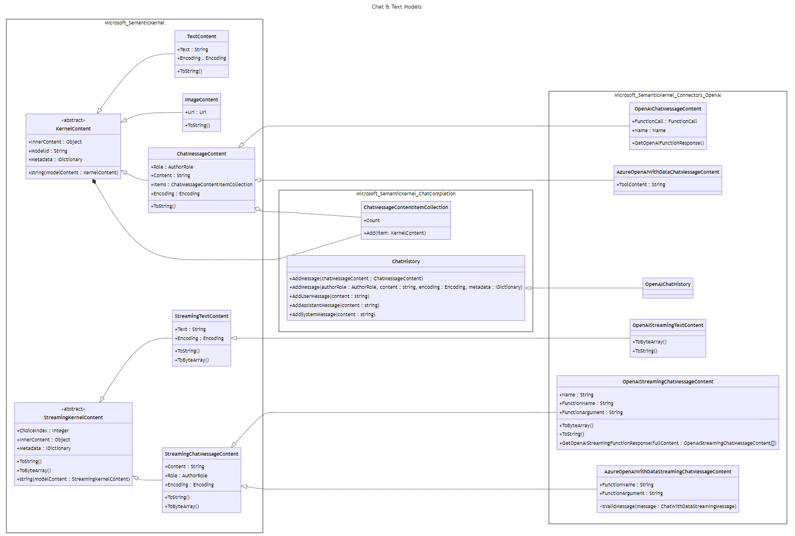

---
# 이 항목들은 선택 사항입니다. 필요 없는 항목은 자유롭게 삭제하세요.
status: accepted
contact: dmytrostruk
date: 2023-12-08
deciders: SergeyMenshykh, markwallace, rbarreto, mabolan, stephentoub, dmytrostruk
consulted: 
informed: 
---
# 채팅 모델

## 맥락 및 문제 설명

최신 OpenAI API에서 `chat message` 객체의 `content` 속성은 `string` 또는 `array` 두 가지 유형의 값을 받을 수 있습니다 ([문서](https://platform.openai.com/docs/api-reference/chat/create)).

이 API를 지원하기 위해 `string Content` 속성을 가진 현재 `ChatMessageContent` 클래스의 구현을 업데이트해야 합니다.

## 결정 요인

1. 새로운 설계는 OpenAI API에 결합되어서는 안 되며 다른 AI 제공자에서도 작동해야 합니다.
2. 클래스와 속성의 명명은 일관되고 직관적이어야 합니다.

## 검토한 옵션

일부 옵션 변형은 결합할 수 있습니다.

### 옵션 #1: 명명 업데이트 및 `chat message content`에 대한 새 데이터 타입

`chat message content`가 이제 `string` 대신 객체가 될 수 있으므로, 도메인에서 더 나은 이해를 위해 예약된 이름이 필요합니다.

1. `ChatMessageContent`를 `ChatMessage`로 이름을 변경합니다. (`StreamingChatMessageContent`도 동일)
2. `GetChatMessageContent` 메서드를 `GetChatMessage`로 이름을 변경합니다.
3. `text`, `image` 값을 가진 `ChatMessageContentType Type` 속성을 가진 새로운 추상 클래스 `ChatMessageContent`. (향후 `audio`, `video`로 확장됩니다.)
4. `ChatMessage`에 `ChatMessageContent` 객체의 컬렉션 `IList<ChatMessageContent> Contents`를 포함합니다.
5. `ChatMessageContent`의 구체적인 구현 - `ChatMessageTextContent`와 `ChatMessageImageContent`가 있습니다.

새로운 _ChatMessageContentType.cs_

```csharp
public readonly struct ChatMessageContentType : IEquatable<ChatMessageContentType>
{
    public static ChatMessageContentType Text { get; } = new("text");

    public static ChatMessageContentType Image { get; } = new("image");

    public string Label { get; }

    // `IEquatable` 구현...
}
```

새로운 _ChatMessageContent.cs_

```csharp
public abstract class ChatMessageContent
{
    public ChatMessageContentType Type { get; set; }

    public ChatMessageContent(ChatMessageContentType type)
    {
        this.Type = type;
    }
}
```

업데이트된 _ChatMessage.cs_:

```csharp
public class ChatMessage : ContentBase
{
    public AuthorRole Role { get; set; }

    public IList<ChatMessageContent> Contents { get; set; }
```

새로운 _ChatMessageTextContent.cs_

```csharp
public class ChatMessageTextContent : ChatMessageContent
{
    public string Text { get; set; }

    public ChatMessageTextContent(string text) : base(ChatMessageContentType.Text)
    {
        this.Text = text;
    }
}
```

새로운 _ChatMessageImageContent.cs_

```csharp
public class ChatMessageImageContent : ChatMessageContent
{
    public Uri Uri { get; set; }

    public ChatMessageImageContent(Uri uri) : base(ChatMessageContentType.Image)
    {
        this.Uri = uri;
    }
}
```

사용법:

```csharp
var chatHistory = new ChatHistory("You are friendly assistant.");

// 요청 구성
var userContents = new List<ChatMessageContent>
{
    new ChatMessageTextContent("What's in this image?"),
    new ChatMessageImageContent(new Uri("https://link-to-image.com"))
};

chatHistory.AddUserMessage(userContents);

// 응답 가져오기
var message = await chatCompletionService.GetChatMessageAsync(chatHistory);

foreach (var content in message.Contents)
{
    // 콘텐츠 타입(text 또는 image) 가져오기 가능.
    var contentType = content.Type;

    // 특정 콘텐츠 타입으로 캐스팅
    // 더 나은 사용성을 위해 확장 메서드를 제공할 수 있습니다
    // (예: message GetContent<ChatMessageTextContent>()).
    if (content is ChatMessageTextContent textContent)
    {
        Console.WriteLine(textContent);
    }

    if (content is ChatMessageImageContent imageContent)
    {
        Console.WriteLine(imageContent.Uri);
    }
}
```

### 옵션 #2: 이름 변경 없이 `chat message content`에 대한 새 데이터 타입

옵션 #1과 동일하지만 명명 변경 없이 합니다. 실제 `chat message`와 `chat message content`를 구분하기 위해:

- `Chat Message`는 `ChatMessageContent`입니다 (현재와 동일).
- `Chat Message Content`는 `ChatMessageContentItem`입니다.

1. `text`, `image` 값을 가진 `ChatMessageContentItemType Type` 속성을 가진 새로운 추상 클래스 `ChatMessageContentItem`. (향후 `audio`, `video`로 확장됩니다.)
2. `ChatMessageContent`에 `ChatMessageContentItem` 객체의 컬렉션 `IList<ChatMessageContentItem> Items`를 포함합니다.
3. `ChatMessageContentItem`의 구체적인 구현 - `ChatMessageTextContentItem`과 `ChatMessageImageContentItem`이 있습니다.

새로운 _ChatMessageContentItemType.cs_

```csharp
public readonly struct ChatMessageContentItemType : IEquatable<ChatMessageContentItemType>
{
    public static ChatMessageContentItemType Text { get; } = new("text");

    public static ChatMessageContentItemType Image { get; } = new("image");

    public string Label { get; }

    // `IEquatable` 구현...
}
```

새로운 _ChatMessageContentItem.cs_

```csharp
public abstract class ChatMessageContentItem
{
    public ChatMessageContentItemType Type { get; set; }

    public ChatMessageContentItem(ChatMessageContentItemType type)
    {
        this.Type = type;
    }
}
```

업데이트된 _ChatMessageContent.cs_:

```csharp
public class ChatMessageContent : ContentBase
{
    public AuthorRole Role { get; set; }

    public IList<ChatMessageContentItem> Items { get; set; }
```

새로운 _ChatMessageTextContentItem.cs_

```csharp
public class ChatMessageTextContentItem : ChatMessageContentItem
{
    public string Text { get; set; }

    public ChatMessageTextContentItem(string text) : base(ChatMessageContentType.Text)
    {
        this.Text = text;
    }
}
```

새로운 _ChatMessageImageContent.cs_

```csharp
public class ChatMessageImageContentItem : ChatMessageContentItem
{
    public Uri Uri { get; set; }

    public ChatMessageImageContentItem(Uri uri) : base(ChatMessageContentType.Image)
    {
        this.Uri = uri;
    }
}
```

사용법:

```csharp
var chatHistory = new ChatHistory("You are friendly assistant.");

// 요청 구성
var userContentItems = new List<ChatMessageContentItem>
{
    new ChatMessageTextContentItem("What's in this image?"),
    new ChatMessageImageContentItem(new Uri("https://link-to-image.com"))
};

chatHistory.AddUserMessage(userContentItems);

// 응답 가져오기
var message = await chatCompletionService.GetChatMessageContentAsync(chatHistory);

foreach (var contentItem in message.Items)
{
    // 콘텐츠 타입(text 또는 image) 가져오기 가능.
    var contentItemType = contentItem.Type;

    // 특정 콘텐츠 타입으로 캐스팅
    // 더 나은 사용성을 위해 확장 메서드를 제공할 수 있습니다
    // (예: message GetContent<ChatMessageTextContentItem>()).
    if (contentItem is ChatMessageTextContentItem textContentItem)
    {
        Console.WriteLine(textContentItem);
    }

    if (contentItem is ChatMessageImageContentItem imageContentItem)
    {
        Console.WriteLine(imageContentItem.Uri);
    }
}
```

### 옵션 #3: `ChatMessageContent`에 새 속성 추가 - 콘텐츠 항목 컬렉션

이 옵션은 `string Content` 속성을 그대로 유지하면서, 새 속성 - `ContentBase` 항목의 컬렉션을 추가합니다.

업데이트된 _ChatMessageContent.cs_

```csharp
public class ChatMessageContent : ContentBase
{
    public AuthorRole Role { get; set; }

    public string? Content { get; set; }

    public ChatMessageContentItemCollection? Items { get; set; }
}
```

새로운 _ChatMessageContentItemCollection.cs_

```csharp
public class ChatMessageContentItemCollection : IList<ContentBase>, IReadOnlyList<ContentBase>
{
    // null 값을 잡기 위한 IList<ContentBase>, IReadOnlyList<ContentBase> 구현.
}
```

사용법:

```csharp
var chatCompletionService = kernel.GetRequiredService<IChatCompletionService>();

var chatHistory = new ChatHistory("You are a friendly assistant.");

chatHistory.AddUserMessage(new ChatMessageContentItemCollection
{
    new TextContent("What's in this image?"),
    new ImageContent(new Uri(ImageUri))
});

var reply = await chatCompletionService.GetChatMessageContentAsync(chatHistory);

Console.WriteLine(reply.Content);
```

## 결정 결과

옵션 #3이 선호되었습니다. 기존 계층 구조에 대한 적은 양의 변경이 필요하고 최종 사용자에게 깔끔한 사용성을 제공하기 때문입니다.

다이어그램:

