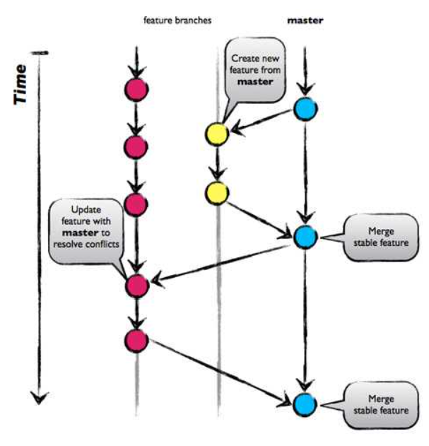
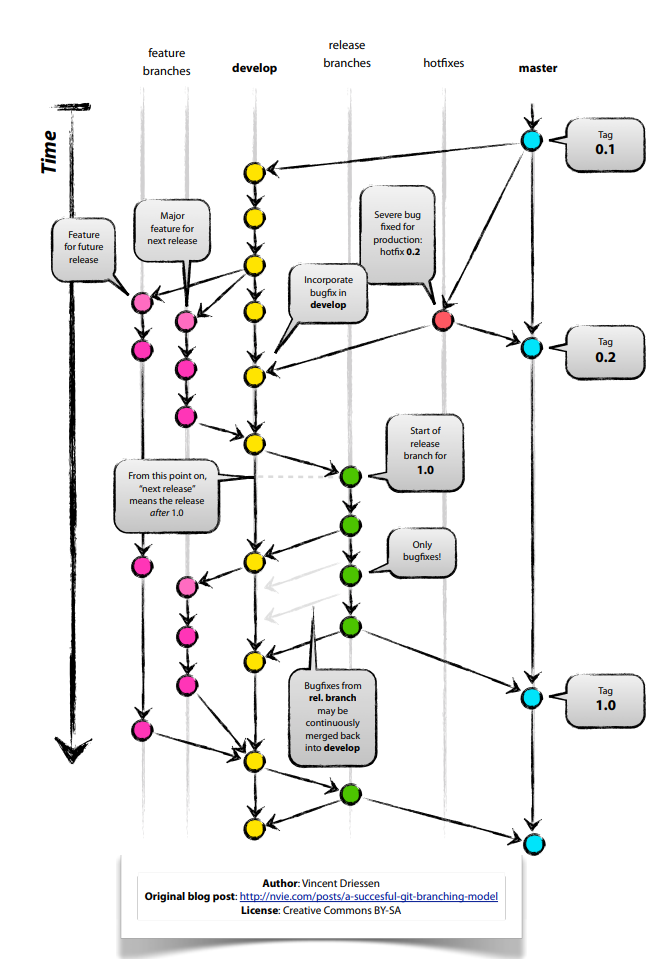
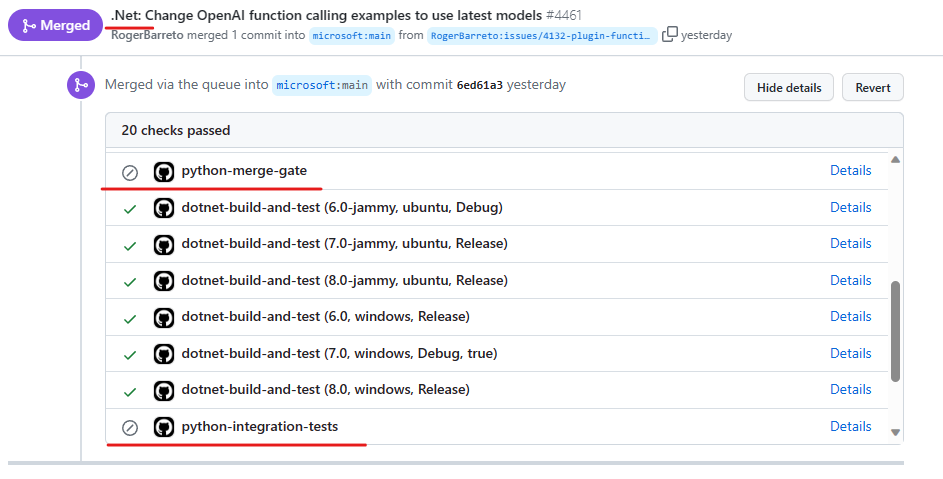

---
# 선택적 요소입니다. 필요 없는 항목은 자유롭게 제거하세요.
status: proposed
contact: SergeyMenshykh
date: 2024-01-04
deciders: markwallace-microsoft
consulted: rogerbarreto, dmytrostruk
informed:
---

# SK 브랜칭 전략

## 업계에서 채택된 브랜칭 전략
Git에는 GitHub Flow, Git-Flow, GitLab Flow 등 업계에서 채택된 여러 브랜칭 전략이 있습니다. 그러나 여기서는 가장 널리 사용되는 두 가지인 GitHub Flow와 Git-Flow에만 집중합니다.

### GitHub Flow
GitHub Flow는 'main' 브랜치를 중심으로 한 간단한 브랜칭 전략입니다. 개발자는 각 기능이나 버그 수정에 대해 새 브랜치를 생성하고, 변경 사항을 만들고, 풀 리퀘스트를 제출한 후, 변경 사항을 'main' 브랜치에 다시 병합합니다. 릴리스는 'main' 브랜치에서 직접 수행되므로 지속적 통합/배포가 필요한 프로젝트에 이상적입니다. [GitHub Flow](https://docs.github.com/en/get-started/quickstart/github-flow)에 대해 자세히 알아보세요.

[이미지 출처](https://www.abtasty.com/blog/git-branching-strategies/)

장점:
- 관리할 브랜치가 적고 병합 충돌이 적어 간단함.
- 장기 실행 개발 브랜치가 없음.

단점:
- Git-Flow만큼 체계적이지 않음.
- 프로덕션과 개발 브랜치를 겸하므로 'main' 브랜치가 더 쉽게 복잡해질 수 있음.

### Git-Flow
Git-Flow는 'main'과 'develop' 두 개의 장기 메인 브랜치와 단기 기능, 릴리스, 핫픽스 브랜치를 중심으로 소프트웨어 개발을 조직하는 브랜칭 전략입니다. 개발자는 기능 브랜치에서 새로운 기능을 작업하고, 이를 'develop' 브랜치에 병합합니다. 릴리스를 준비할 때, 향후 릴리스 기능을 차단하지 않기 위해 릴리스 브랜치를 생성하고, 완료되면(테스트 및 버그 수정) 'main'과 'develop' 모두에 병합합니다. Git Flow의 핫픽스 브랜치는 'main' 브랜치에서 생성되어 중요한 버그 수정을 처리하고, 이후 'main'과 'develop' 브랜치 모두에 다시 병합됩니다. 실제 릴리스(배포 가능한 아티팩트)는 실제 프로덕션에 적합한 공식 릴리스를 반영하는 'main' 브랜치에서 수행됩니다. [Git-Flow](https://nvie.com/posts/a-successful-git-branching-model/)에 대해 자세히 알아보세요.

장점:
- 개발 중인 코드와 프로덕션 준비 코드 간의 명확한 분리.
- 효율적인 릴리스 관리.

단점:
- GitHub Flow보다 복잡하여 많은 구조가 필요하지 않은 소규모 팀이나 프로젝트에는 부담스러울 수 있음.
- 보다 통제된 릴리스 프로세스를 강조하므로 지속적 배포를 우선시하는 프로젝트에는 덜 적합함.
- 여러 브랜치 관리의 오버헤드로 인해 지속적 배포 프로젝트에는 이상적이지 않음.
- Git에서의 스파게티 히스토리 - [GitFlow는 해롭다고 간주됨](https://www.endoflineblog.com/gitflow-considered-harmful)

# SK 브랜칭 전략
현재 SK SDK는 .NET, Java, Python 세 가지 언어로 제공됩니다. 모두 동일한 Git 저장소에 해당 폴더 아래에 조직되어 공존하지만, 브랜칭 전략은 서로 다릅니다.

.NET과 Python 버전 모두 'main' 브랜치에서 분기된 단기 토픽 브랜치에서 개발이 이루어집니다. 이러한 토픽 브랜치는 PR 리뷰, 단위 테스트, 통합 테스트 실행을 통해 기능이 프로덕션 준비 상태로 간주될 때 'main' 브랜치에 다시 병합됩니다. 릴리스는 'main' 브랜치에서 직접 수행됩니다. 이 접근 방식은 GitHub Flow 브랜칭 전략과 일치하며, 릴리스가 지속적으로 배포되지 않고 매주 수행된다는 약간의 차이가 있습니다.

Java 버전의 SK는 전용 개발 브랜치에서 개발되어 Git-Flow 전략을 따릅니다. 토픽 브랜치는 개발 브랜치에서 생성되고 단위 테스트 및 통합 테스트 실행 후 풀 리퀘스트를 통해 다시 병합됩니다. 릴리스 브랜치도 개발 브랜치에서 생성되고 릴리스가 프로덕션 준비 상태로 간주될 때 개발 브랜치와 'main' 브랜치 모두에 병합됩니다. 이 전략은 릴리스 아티팩트가 'main' 브랜치가 아닌 릴리스 브랜치에서 생성된다는 점에서 바닐라 Git-Flow와 약간 다릅니다.

## 결정 동인
- 전략은 상당한 투자 없이 구현 및 유지 관리가 쉬워야 합니다.
- 전략은 필요한 경우 여러 릴리스를 병렬로 유지할 수 있어야 합니다.
- 이상적으로 전략은 직관적이고 단순하여 Git에 익숙한 모든 사람이 채택하고 따를 수 있어야 합니다.
- 이상적으로 모든 SK 언어가 동일한 브랜칭 전략을 채택하고 사용할 수 있어야 합니다.
- 최소한의 오버헤드로 새 릴리스를 지속적으로 배포할 수 있는 능력.
- 언어 버전을 독립적으로 다른 일정에 릴리스할 수 있는 능력.
- .Net, Java, Python 팀이 독립적으로 운영할 수 있도록 허용.
- 릴리스에 패치를 적용할 수 있는 능력(모든 언어에 대해).
- PR과 이슈의 통합으로 분류 및 리뷰 프로세스 간소화.

SK의 브랜칭 전략을 결정할 때 고려해야 할 또 다른 측면은 접근 권한과 액션 범위입니다. GitHub은 폴더와 같은 저장소의 일부에만 접근 제한을 적용하는 것을 허용하지 않습니다. 이는 SK .NET 기여자가 Python PR을 푸시하는 것을 제한할 수 없다는 것을 의미하며, 이상적으로는 해당 팀이 수행해야 합니다. 그러나 GitHub은 브랜치에 접근 권한을 할당할 수 있으므로 적절한 전략 옵션이 선택되면 성공적으로 활용할 수 있습니다. GitHub의 필수 액션/상태 검사에서도 유사한 문제가 발생하며, 이는 브랜치 수준에서만 설정할 수 있습니다. .NET과 Python 개발이 'main' 브랜치에서 이루어지고 상태 검사가 폴더별이 아닌 브랜치별로 구성되므로, .NET과 Python PR에 대해 별도의 상태 검사를 구성할 수 없습니다. 결과적으로 특정 언어와 관련이 없더라도 .NET과 Python PR 모두에 동일한 상태 검사가 실행됩니다.

선택한 전략에 관계없이 여러 버전의 SK를 지원할 수 있어야 합니다. 예를 들어, v3.0.0을 작업하면서 릴리스된 SK v1.1.0과 v2.4.0에 버그 수정이나 보안 패치를 적용할 수 있어야 합니다. 이를 달성하는 한 가지 방법은 각 SK 릴리스에 대해 릴리스 브랜치를 생성하는 것입니다. 그래야 필요한 패치/수정을 브랜치에 푸시하고 거기서 릴리스할 수 있습니다. 그러나 릴리스된 커밋에 태그를 표시하는 것으로 충분해야 합니다. 필요한 경우 언제든지 태그에서 새 브랜치를 소급적으로 생성할 수 있기 때문입니다. 기존 릴리스 파이프라인은 소스 브랜치를 매개변수로 받아 'main' 브랜치뿐만 아니라 모든 브랜치에서 릴리스할 수 있어야 합니다.

## 검토된 옵션

### SK 언어별 저장소
이 옵션은 각 SK 언어에 대해 별도의 GitHub 저장소를 갖는 것을 제안합니다. 이러한 저장소는 해당 조직 아래에 생성될 수 있습니다. 개발과 릴리스는 GitHub Flow를 따르며, 새로운 기능과 수정은 'main' 브랜치에서 생성된 토픽 브랜치에서 개발되어 최종적으로 다시 병합됩니다.

장점:
- 각 저장소에는 언어별 상태 검사와 액션만 있음.
- 브랜치 커밋 및 릴리스 히스토리에 관련 없는 커밋이나 릴리스가 포함되지 않음.
- Git-Flow 오버헤드 없이 친숙한 GitHub Flow를 활용하여 학습 곡선이 짧음.
- 접근 권한이 특정 소유 팀으로 제한됨.

단점:
- 세 개의 저장소를 설정하는 초기 오버헤드가 있음.
- 세 개의 저장소에 대한 잠재적인 지속적 유지 관리 오버헤드가 있을 수 있음.
- 하나가 아닌 세 개의 저장소에서 시크릿을 관리해야 함.
- 각 저장소에 별도로 관리해야 하는 백로그가 있음.

### SK 언어별 브랜치
이 옵션은 각 SDK 언어에 대해 전용 언어별 개발 브랜치를 갖는 것을 포함합니다: 'net-development', 'java-development', 'python-development'. SDK Java는 이미 이 옵션을 사용하고 있습니다. 개발과 릴리스는 GitHub Flow를 따르며, 새로운 기능과 수정은 해당 언어 브랜치에서 분기된 토픽 브랜치에서 개발되어 최종적으로 다시 병합됩니다.

장점:
- 언어 브랜치별로 구성된 간단한 언어별 상태 검사, 액션 및 규칙.
- PR을 승인하는 것뿐만 아니라 언어별 브랜치를 소유한 팀만 푸시하거나 병합할 수 있도록 허용.
- 브랜치 커밋 히스토리에 관련 없는 커밋이 포함되지 않음.

단점:
- GitHub 릴리스 히스토리에 모든 언어의 릴리스가 포함됨.
- 언어별 브랜치를 발견/사용하기가 직관적이지 않을 수 있음.

이 옵션에는 'main' 브랜치의 사용 방식을 정의하는 두 가지 하위 옵션이 있습니다:
1. 'main' 브랜치에는 문서, GitHub 액션, 샘플과 같은 일반/공통 아티팩트가 포함됩니다. 모든 언어 폴더가 'main' 브랜치에서 제거되고, 실수로 인한 병합을 방지하기 위해 잠글 수 있습니다.
2. 'main' 브랜치에는 발견 가능성을 위해 개발 브랜치가 가진 모든 것이 포함됩니다. 개발 브랜치의 커밋을 'main' 브랜치로 병합하는 작업/액션이 구현됩니다. SK 언어 간 공통 아티팩트 수를 최소화하여 병합 충돌 가능성을 줄여야 합니다. 이 하위 옵션을 결정하기 전에 SK Java가 현재 경험하고 있는 스쿼시 병합 문제에 대한 해결책을 찾아야 합니다.

두 번째 하위 옵션이 발견 가능성의 이점으로 인해 첫 번째보다 선호됩니다. 저장소에서 무언가를 검색할 때 GitHub UI에서 개발 브랜치를 선택할 필요가 없습니다. 'main' 브랜치가 기본적으로 선택되어 있으며, 최신 비트가 브랜치에 있으면 쉽게 찾을 수 있습니다. 이 직관적인 접근 방식은 많은 사람에게 친숙하며, 검색 전에 브랜치를 선택하도록 변경하면 검색 경험이 복잡해지고 불만을 초래합니다.

### 모든 SK 언어를 'main'에
이 옵션은 모든 SK 언어(.NET, Java, Python)의 코드를 'main' 브랜치에서 유지하는 것을 가정합니다. 개발은 일반적인 토픽 브랜치를 사용하고, 릴리스도 'main' 브랜치에서 수행됩니다. 이것은 현재 .NET과 Python이 채택하고 있는 전략이며, GitHub Flow에 해당합니다.

장점:
- 모든 코드가 한 곳('main' 브랜치)에 있음.
- 친숙한 GitHub Flow, Git-Flow 오버헤드 없음 - 학습 곡선이 짧음.

단점:
- 브랜치 커밋/릴리스 히스토리에 관련 없는 커밋/릴리스가 포함됨.
- 복잡하고 관련 없는 GitHub 상태 검사/액션.
- 비소유자 팀이 PR을 푸시할 수 있음.

### 현재 '하이브리드' 접근 방식
이 선택은 SK가 사용하는 기존 방법을 유지합니다. .NET과 Python 개발은 GitHub Flow를 사용하여 'main' 브랜치에서 이루어지고, Java 개발은 Git-Flow를 따라 java-development 브랜치에서 이루어집니다.

장점:
- 변경이 필요 없음.
- 각 SK 언어가 편리한 전략을 사용.

단점:
- 브랜치 커밋/릴리스 히스토리에 관련 없는 커밋/릴리스가 포함됨.
- 복잡하고 관련 없는 GitHub 상태 검사/액션.
- 비소유자 팀이 PR을 푸시할 수 있음.

## 결정 결과
선택된 옵션: "현재 '하이브리드' 접근 방식" - 사소한 비효율성(복잡한 릴리스 히스토리 및 다중 언어 복합 액션 등)이 있지만 작동하며, 현재 투자가 필요 없기 때문입니다. 나중에 팀 규모와 "현재 '하이브리드' 접근 방식"에서 팀이 겪는 문제에 따라 'SK 언어별 저장소' 옵션이나 'SK 언어별 브랜치' 옵션을 고려할 수 있습니다.
