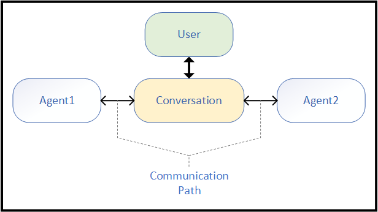
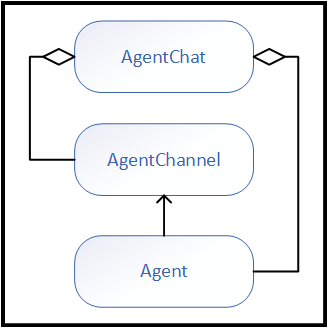
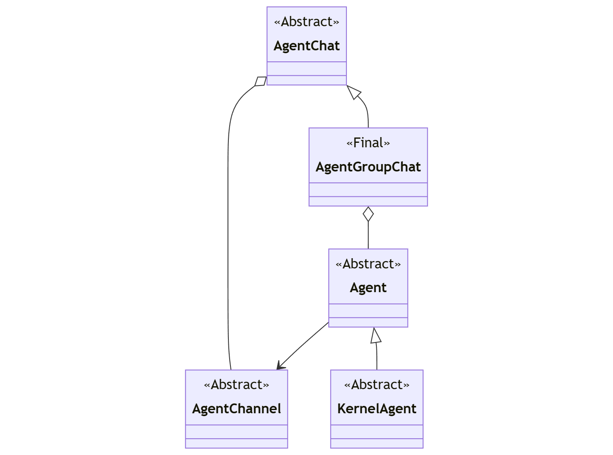
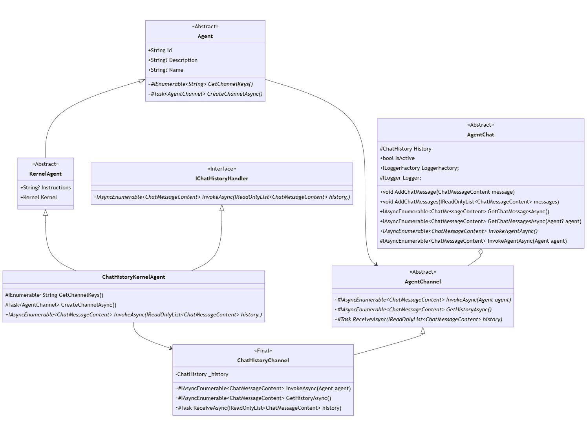
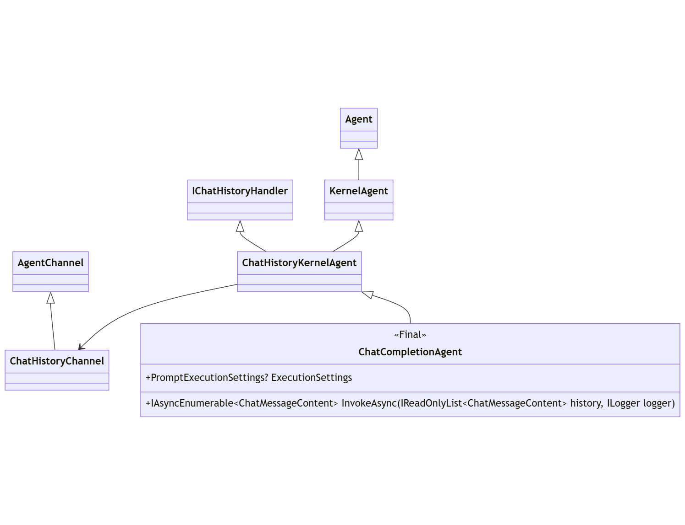
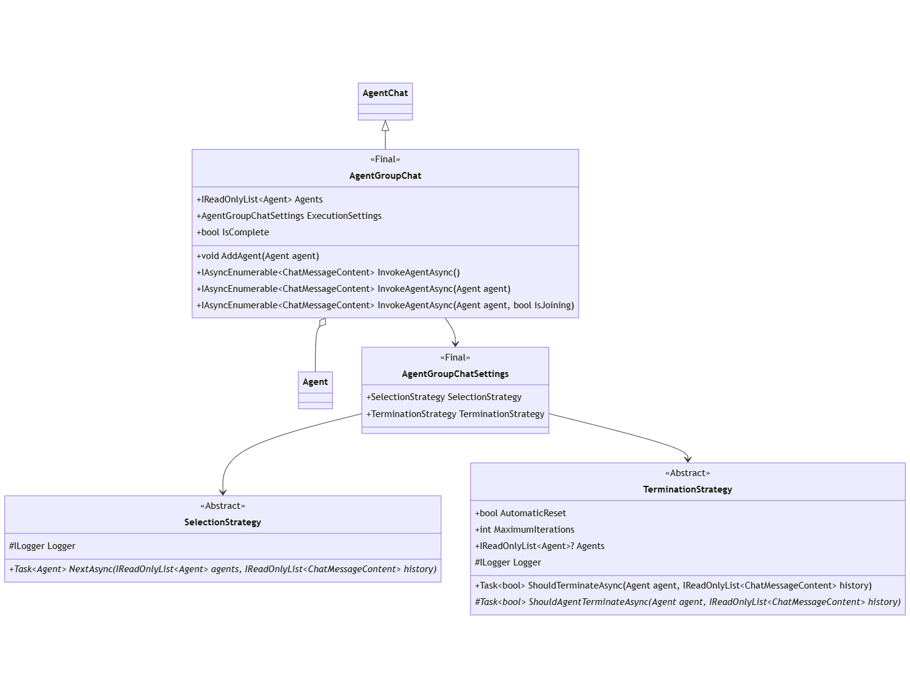
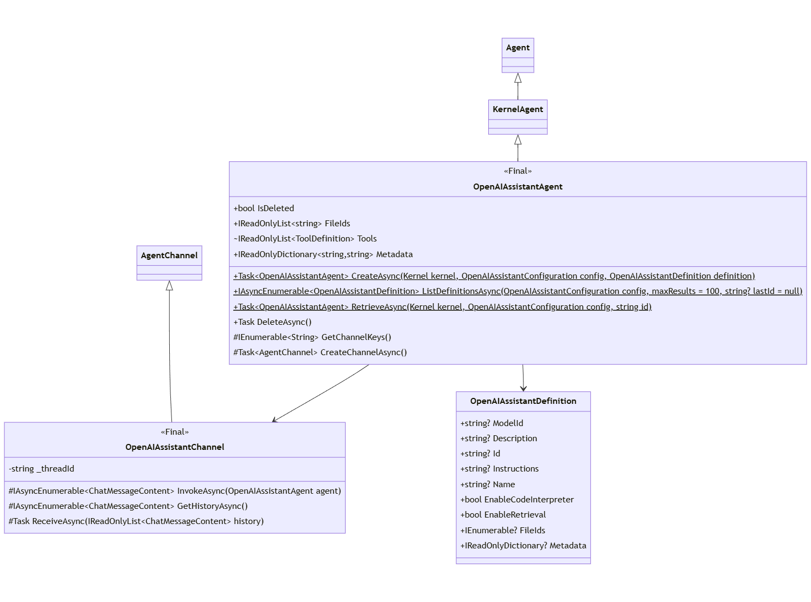
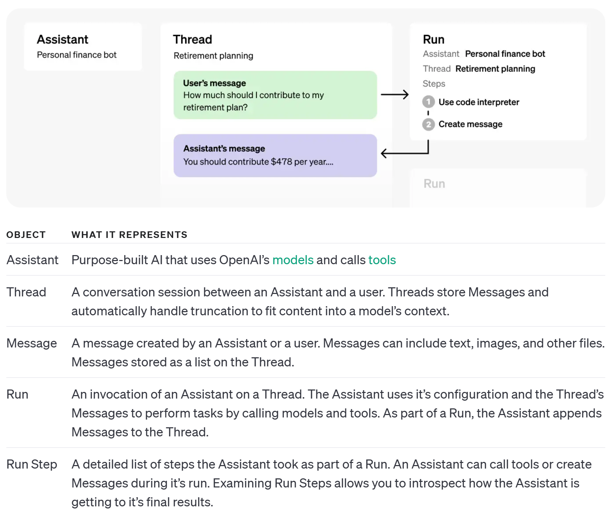
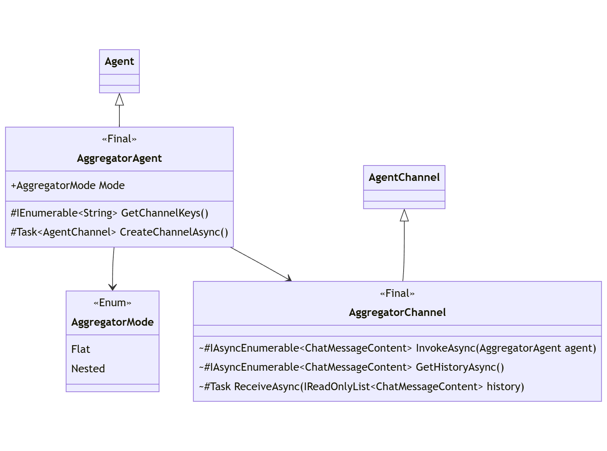

---
# 선택적 요소입니다. 필요 없는 항목은 자유롭게 제거하세요.
status: experimental
contact: crickman
date: 2024-01-24
deciders: markwallace-microsoft, matthewbolanos
consulted: rogerbarreto, dmytrostruk, alliscode, SergeyMenshykh
informed:
---

# SK 에이전트 개요 및 상위 수준 설계

## **배경 및 문제 설명**
OpenAI Assistant API에 대한 지원이 실험적 `*.Assistants` 패키지로 게시되었으며, 이후 더 일반적인 에이전트 프레임워크로 전환하려는 목표로 `*.Agents`로 이름이 변경되었습니다.

초기 `Assistants` 작업은 일반적인 _에이전트 프레임워크_로 발전할 의도가 없었습니다.

이 ADR은 해당 일반적인 _에이전트 프레임워크_를 정의합니다.

에이전트는 두 가지 상호작용 패턴을 지원할 수 있어야 합니다:

1. **직접 호출 ("채팅 없음"):**

    호출자는 중간 매커니즘이나 인프라 없이 단일 에이전트를 직접 호출할 수 있습니다.
    직접 호출을 사용하여 대화에서 다른 에이전트가 교대로 참여하려면 호출자가 각 턴마다 각 에이전트를 호출해야 합니다.
    다른 에이전트 유형 간의 상호작용 조정도 호출자가 명시적으로 관리해야 합니다.

2. **에이전트 채팅:**

    호출자는 특정 목표를 달성하기 위해 확장된 대화에 참여할 여러 에이전트를 구성할 수 있습니다
    (일반적으로 초기 또는 반복적인 입력에 대한 응답으로). 참여하면 에이전트는 교대로 여러 상호작용에 걸쳐 채팅에 참여할 수 있습니다.


## **에이전트 개요**
근본적으로 에이전트는 다음과 같은 특성을 가집니다:
- 정체성: 각 에이전트를 고유하게 식별할 수 있게 합니다.
- 동작: 에이전트가 대화에 참여하는 방식
- 상호작용: 에이전트 동작이 다른 에이전트나 입력에 대한 응답이라는 것.

다양한 에이전트 특수화에는 다음이 포함될 수 있습니다:
- 시스템 지시사항: 에이전트의 동작을 안내하는 일련의 지침.
- 도구/함수: 에이전트가 특정 작업이나 액션을 수행할 수 있게 합니다.
- 설정: 에이전트별 설정. 채팅 완성 에이전트의 경우 Temperature, TopP, StopSequence 등과 같은 LLM 설정이 포함될 수 있습니다.


### **에이전트 모달리티**
_에이전트_는 다양한 모달리티를 가질 수 있습니다. 모달리티는 능력과 제약 면에서 비대칭적입니다.

- **SemanticKernel - ChatCompletion**: *SemanticKernel*의 채팅 완성 지원(예: .NET `ChatCompletionService`)에만 기반한 _에이전트_.
- **OpenAI Assistants**: _OpenAI Assistant API_(OpenAI 및 Azure OpenAI 모두)에서 지원하는 호스팅된 _에이전트_ 솔루션.
- **사용자 정의**: _에이전트 프레임워크_를 확장하여 개발된 사용자 정의 에이전트.
- **향후**: 아직 발표되지 않은 것, 예를 들어 HuggingFace Assistant API(이미 어시스턴트가 있지만 아직 API를 게시하지 않음).


## **결정 동인**
- _에이전트 프레임워크_는 잠재적으로 모든 LLM API를 활용할 수 있는 에이전트 구성을 가능하게 하는 충분한 추상화를 제공해야 합니다.
- _에이전트 프레임워크_는 가장 빈번한 유형의 에이전트 협업을 위한 충분한 추상화와 빌딩 블록을 제공해야 합니다. 새로운 협업 방법이 등장하면 새 블록을 쉽게 추가할 수 있어야 합니다.
- _에이전트 프레임워크_는 다양한 커스터마이징 시나리오를 커버하기 위해 에이전트 입출력을 수정하는 빌딩 블록을 제공해야 합니다.
- _에이전트 프레임워크_는 _SemanticKernel_ 패턴에 맞춰야 합니다: 도구, DI, 플러그인, 함수 호출 등.
- _에이전트 프레임워크_는 다른 라이브러리가 자체 에이전트와 채팅 경험을 구축할 수 있도록 확장 가능해야 합니다.
- _에이전트 프레임워크_는 확장성을 용이하게 하기 위해 가능한 한 단순해야 합니다.
- _에이전트 프레임워크_는 복잡성을 호출 패턴이 아닌 구현 세부 사항 내에 캡슐화해야 합니다.
- _에이전트_ 추상화는 다양한 모달리티를 지원해야 합니다([에이전트 모달리티](#에이전트-모달리티) 섹션 참조).
- 모든 모달리티의 _에이전트_는 다른 모달리티의 _에이전트_와 상호작용할 수 있어야 합니다.
- _에이전트_는 자체 모달리티 요구 사항을 지원할 수 있어야 합니다. (특수화)
- _에이전트_ 입출력은 SK 콘텐츠 유형 `ChatMessageContent`에 맞춰야 합니다.


## **설계 - 분석**

에이전트는 대화에 참여하며, 주로 사용자 또는 환경 입력에 대한 응답으로 참여합니다.

<p align="center">
<kbd></kbd>
</p>

`Agent` 외에 이 패턴에서 두 가지 기본 개념이 식별됩니다:

- 대화 - 에이전트 상호작용 시퀀스를 위한 컨텍스트.
- 채널: (다이어그램의 "Communication Path") - 에이전트가 단일 대화와 상호작용하는 관련 상태 및 프로토콜.

> 다른 모달리티의 에이전트는 자신의 모달리티가 제시하는 요구 사항을 자유롭게 충족할 수 있어야 합니다. `Channel` 개념을 공식화하면 이를 위한 자연스러운 수단을 제공합니다.
_채팅 완성_ 기반 에이전트의 경우, 이는 특정 채팅 메시지 세트(채팅 히스토리)를 소유하고 관리하며 채팅 완성 API/엔드포인트와 통신하는 것을 의미합니다.
_Open AI Assistant API_ 기반 에이전트의 경우, 이는 특정 _스레드_를 정의하고 원격 서비스로서 Assistant API와 통신하는 것을 의미합니다.

이러한 개념들이 결합되어 다음과 같은 일반화를 제안합니다:

<p align="center">
<kbd></kbd>
</p>


팀과 이러한 개념들을 반복한 후, 이 일반화는 다음과 같은 상위 수준 정의로 변환됩니다:

<p align="center">
<kbd></kbd>
</p>


클래스 이름|부모 클래스|역할|모달리티|참고
-|-|-|-|-
Agent|-|에이전트|추상화|루트 에이전트 추상화
KernelAgent|Agent|에이전트|추상화|`Kernel` 서비스 및 플러그인 포함
AgentChannel|-|채널|추상화|채팅에서 에이전트 참여를 위한 통로.
AgentChat|-|채팅|추상화|에이전트 상호작용을 위한 핵심 기능 제공.
AgentGroupChat|AgentChat|채팅|유틸리티|전략 기반 채팅
---


## **설계 - 추상화**

여기서는 이전 섹션의 상위 수준 패턴에서의 상세 클래스 정의를 열거합니다.

또한 _ChatHistory_ 최적화의 일부로 정의된 엔티티도 표시됩니다: `IChatHistoryHandler`, `ChatHistoryKernelAgent`, `ChatHistoryChannel`.
이러한 _ChatHistory_ 엔티티는 (원격 호스팅 프레임워크를 통해 관리되는 에이전트와 반대로) 로컬에서 관리되는 `ChatHistory` 인스턴스에 작용하는 _에이전트_가 자체 `AgentChannel`을 구현해야 하는 요구 사항을 제거합니다.

<p align="center">
<kbd></kbd>
</p>


클래스 이름|부모 클래스|역할|모달리티|참고
-|-|-|-|-
Agent|-|에이전트|추상화|루트 에이전트 추상화
AgentChannel|-|채널|추상화|`AgentChat`에서 에이전트 참여를 위한 통로.
KernelAgent|Agent|에이전트|추상화|`Kernel` 서비스 및 플러그인 정의
ChatHistoryChannel|AgentChannel|채널|추상화|로컬 채팅 히스토리 기반 에이전트 참여를 위한 통로.
IChatHistoryHandler|-|에이전트|추상화|`ChatHistoryChannel`을 활용하는 에이전트의 공통 부분 정의.
ChatHistoryKernelAgent|KernelAgent|에이전트|추상화|`ChatHistoryChannel`을 활용하는 모든 `KernelAgent`의 공통 정의.
AgentChat|-|채팅|추상화|다중 턴 에이전트 대화를 위한 핵심 기능 제공.
---


## **설계 - 채팅 완성 에이전트**

첫 번째 구체적 에이전트는 `ChatCompletionAgent`입니다.
`ChatCompletionAgent` 구현은 모든 `IChatCompletionService` 구현과 통합할 수 있습니다.
`IChatCompletionService`가 `ChatHistory`에 작용하므로, 이는 `ChatHistoryKernelAgent`가 어떻게 간단히 구현될 수 있는지를 보여줍니다.

에이전트 동작은 특정 `IChatCompletionService`의 동작에 따라 (자연스럽게) 제약됩니다.
예를 들어, 함수 호출을 지원하지 않는 커넥터는 _에이전트_로서도 어떤 `KernelFunction`도 실행하지 않습니다.

<p align="center">
<kbd></kbd>
</p>

클래스 이름|부모 클래스|역할|모달리티|참고
-|-|-|-|-
ChatCompletionAgent|ChatHistoryKernelAgent|에이전트|SemanticKernel|로컬 채팅 히스토리 기반의 구체적 _에이전트_.
---


## **설계 - 그룹 채팅**

`AgentGroupChat`는 다양한 _전략_에 의해 동작이 정의되는 구체적 `AgentChat`입니다.

<p align="center">
<kbd></kbd>
</p>

클래스 이름|부모 클래스|역할|모달리티|참고
-|-|-|-|-
AgentGroupChat|AgentChat|채팅|유틸리티|전략 기반 채팅
AgentGroupChatSettings|-|설정|유틸리티|`AgentGroupChat` 동작에 영향을 주는 전략 정의.
SelectionStrategy|-|설정|유틸리티|`AgentGroupChat`에서 `Agent` 인스턴스의 참여 순서 결정.
TerminationStrategy|-|설정|유틸리티|`AgentGroupChat` 대화가 종료될 수 있는 시점 결정(다른 `Agent` 선택 불필요).
---


## **설계 - OpenAI Assistant 에이전트**

다음 구체적 에이전트는 `OpenAIAssistantAgent`입니다.
이 에이전트는 _OpenAI Assistant API_를 기반으로 하며, 채팅 히스토리가 어시스턴트 _스레드_로서 원격으로 관리되므로 자체 채널을 구현합니다.

<p align="center">
<kbd></kbd>
</p>

클래스 이름|부모 클래스|역할|모달리티|참고
-|-|-|-|-
OpenAIAssistantAgent|KernelAgent|에이전트|OpenAI Assistant|_OpenAI Assistant API_ 기반의 기능적 에이전트
OpenAIAssistantChannel|AgentChannel|채널|OpenAI Assistant|`OpenAIAssistantAgent`와 연관된 채널
OpenAIAssistantDefinition|-|설정|OpenAI Assistant|호스팅된 에이전트 정의를 열거할 때 제공되는 _Open AI Assistant_ 정의.
---

### **OpenAI Assistant API 참조**

- [Assistants 문서](https://platform.openai.com/docs/assistants)
- [Assistants API](https://platform.openai.com/docs/api-reference/assistants)

<p>
<kbd></kbd>
</p>


## **설계 - 집계 에이전트**

복잡한 호출 패턴을 지원하기 위해, `AggregatorAgent`는 `AgentChat`에 참여하는 하나 이상의 에이전트가 단일 논리적 `Agent`로 표현될 수 있게 합니다.

<p align="center">
<kbd></kbd>
</p>

클래스 이름|부모 클래스|역할|모달리티|참고
-|-|-|-|-
AggregatorAgent|Agent|에이전트|유틸리티|`AgentChat`을 `Agent`로 적응
AggregatorChannel|AgentChannel|채널|유틸리티|`AggregatorAgent`가 사용하는 `AgentChannel`.
AggregatorMode|-|설정|유틸리티|`AggregatorAgent`의 집계 모드 정의.
---


## **사용 패턴**

**1. 에이전트 인스턴스화: ChatCompletion**

`ChatCompletionAgent` 생성은 _에이전트 프레임워크_ 외부에서 `IChatCompletionService`로 `Kernel` 객체를 정의하는 방식과 직접적으로 일치하며,
에이전트별 지시사항과 정체성을 제공하는 것이 추가됩니다.

(_dotnet_)
```c#
// Kernel로 시작
IKernelBuilder builder = Kernel.CreateBuilder();

// 모든 IChatCompletionService 추가
builder.AddOpenAIChatCompletion(...);

// 원하는 플러그인 / 함수 포함
builder.Plugins.Add(...);

// 원하는 필터 포함
builder.Filters.Add(...);

// 에이전트 생성
ChatCompletionAgent agent =
    new()
    {
        Instructions = "instructions",
        Name = "name",
        Kernel = builder.Build()
    };
```

(_python_)
```python
# Kernel로 시작
kernel = Kernel()

# 모든 ChatCompletionClientBase 추가
kernel.add_service(AzureChatCompletion(service_id="agent", ...))

# 원하는 플러그인 / 함수 포함
kernel.add_plugin(...)

# 원하는 필터 포함 (@kernel.filter 데코레이터 사용)

# 에이전트 생성
agent = ChatCompletionAgent(service_id="agent", kernel=kernel, name="name", instructions="instructions")
```


**2. 에이전트 인스턴스화: OpenAI Assistant**

모든 Assistant 액션이 REST 엔드포인트 호출이므로, `OpenAIAssistantAgent`의 최상위 작업은 정적 비동기 팩토리 메서드를 통해 실현됩니다:

**생성:**

(_dotnet_)
```c#
// Kernel로 시작
IKernelBuilder builder = Kernel.CreateBuilder();

// 원하는 플러그인 / 함수 포함
builder.Plugins.Add(...);

// 설정 및 정의 생성
OpenAIServiceConfiguration config = new("apikey", "endpoint");
OpenAIAssistantDefinition definition = new()
{
    Instructions = "instructions",
    Name = "name",
    Model = "gpt-4",
};

// 에이전트 생성
OpenAIAssistantAgent agent =  
    OpenAIAssistantAgent.CreateAsync(
        builder.Build(),
        config,
        definition);
```

(_python_)
```python
# Kernel로 시작
kernel = Kernel()

# 원하는 플러그인 / 함수 포함
kernel.add_plugin(...)

# 설정 및 정의 생성
config = OpenAIServiceConfiguration("apikey", "endpoint")
definition = OpenAIAssistantDefinition(instructions="instructions", name="name", model="gpt-4")

agent = OpenAIAssistantAgent.create(kernel=kernel, config=config, definition=definition)
```


**조회:**

(_dotnet_)
```c#
// Kernel로 시작
Kernel kernel = ...;

// 설정 생성
OpenAIServiceConfiguration config = new("apikey", "endpoint");

// 기존 정의 기반으로 에이전트 생성
OpenAIAssistantAgent agent =  OpenAIAssistantAgent.RetrieveAsync(kernel, config, "agent-id");
```

(_python_)
```python
# Kernel로 시작
kernel = Kernel()

# 설정 생성
config = OpenAIServiceConfiguration("apikey", "endpoint")

# 기존 정의 기반으로 에이전트 생성
agent = OpenAIAssistantAgent.retrieve(kernel = kernel, config=config, agentid="agent-id")
```


**검사:**

(_dotnet_)
```c#
// 설정 생성
OpenAIServiceConfiguration config = new("apikey", "endpoint");

// 정의된 에이전트 열거
IAsyncEnumerable<OpenAIAssistantDefinition> definitions = OpenAIAssistantAgent.ListDefinitionsAsync(config);
```

(_python_)
```python
# 설정 생성
config = OpenAIServiceConfiguration("apikey", "endpoint")

# 정의된 에이전트 열거
definitions = await OpenAIAssistantAgent.list_definitions(config=config)
```


**3. 에이전트 채팅: 명시적**

`AgentGroupChat`에서 _에이전트_를 명시적으로 대상 지정하여 응답하게 할 수 있습니다.

(_dotnet_)
```c#
// 에이전트 정의
ChatCompletionAgent agent1 = ...;
OpenAIAssistantAgent agent2 = ...;

// 채팅 생성
AgentGroupChat chat = new();

// 채팅 입력 제공
ChatMessageContent input = new (AuthorRole.User, "input");
await WriteMessageAsync(input);
chat.AddChatMessage(input);

// 먼저 한 에이전트를 호출한 다음 다른 에이전트를 호출하고, 각 응답을 표시합니다.
await WriteMessagesAsync(chat.InvokeAsync(agent1));
await WriteMessagesAsync(chat.InvokeAsync(agent2));

// 전체 히스토리에 접근할 수 있습니다.
// 에이전트별 히스토리는 주요 히스토리의 적응입니다.
await WriteMessagesAsync(chat.GetHistoryAsync());
await WriteMessagesAsync(chat.GetHistoryAsync(agent1));
await WriteMessagesAsync(chat.GetHistoryAsync(agent2));
```

(_python_)
```python
# 에이전트 정의
agent1 = ChatCompletionAgent(...)
agent2 = OpenAIAssistantAgent.create(...)

# 채팅 생성
chat = AgentGroupChat()

# 채팅 입력 제공
input = ChatMessageContent(AuthorRole.User, "input")
await write_message(input)
chat.add_chat_message(input)

# 먼저 한 에이전트를 호출한 다음 다른 에이전트를 호출하고, 각 응답을 표시합니다.
await write_message(chat.invoke(agent1))
await write_message(chat.invoke(agent2))

# 전체 히스토리에 접근할 수 있습니다.
# 에이전트별 히스토리는 주요 히스토리의 적응입니다.
await write_message(chat.get_history())
await write_message(chat.get_history(agent1))
await write_message(chat.get_history(agent2))
```


**4. 에이전트 채팅: 다중 턴**

_에이전트_는 목표를 향해 여러 턴을 수행할 수도 있습니다:

(_dotnet_)
```c#
// 에이전트 정의
ChatCompletionAgent agent1 = ...;
OpenAIAssistantAgent agent2 = ...;
ChatCompletionAgent agent3 = ...;

// 두 에이전트로 채팅 생성.
AgentGroupChat chat =
    new(agent1, agent2)
    { 
        ExecutionSettings =
        {
            // 종료 기준을 충족할 때까지 채팅이 계속됩니다.
            TerminationionStrategy = new MyTerminationStrategy(),
        } 
    };

// 채팅 입력 제공
ChatMessageContent input = new(AuthorRole.User, "input");
await WriteMessageAsync(input);
chat.AddChatMessage(input);

// 기존 채팅에 에이전트를 추가할 수 있습니다
chat.AddAgent(agent3);

// 종료될 때까지 채팅 실행
await WriteMessagesAsync(chat.InvokeAsync());
```

(_python_)
```python
# 에이전트 정의
agent1 = ChatCompletionAgent(...)
agent2 = OpenAIAssistantAgent.create(...)
agent3 = ChatCompletionAgent(...)

// 두 에이전트로 채팅 생성.
chat =
    AgentGroupChat(agent1, agent2)
    { 
        execution_settings =
        {
            # 종료 기준을 충족할 때까지 채팅이 계속됩니다.
            terminationion_strategy = MyTerminationStrategy(),
        } 
    }

# 채팅 입력 제공
input = ChatMessageContent(AuthorRole.User, "input")
await write_message(input)
chat.add_chat_message(input)

# 기존 채팅에 에이전트를 추가할 수 있습니다
chat.add_agent(agent3)

# 종료될 때까지 채팅 실행
await write_message(chat.invoke())
```
