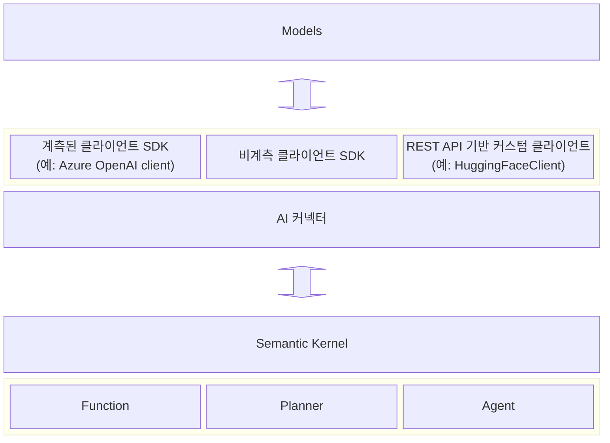

---
# 선택적 요소입니다. 필요 없는 항목은 자유롭게 제거하세요.
status: { accepted }
contact: { Tao Chen }
date: { 2024-05-02 }
deciders: { Stephen Toub, Ben Thomas }
consulted: { Stephen Toub, Liudmila Molkova, Ben Thomas }
informed: { Dmytro Struk, Mark Wallace }
---

# Semantic Kernel에서 관측성을 위한 표준화된 어휘 및 명세 사용

## 배경 및 문제 설명

LLM 애플리케이션의 관측은 고객과 커뮤니티로부터 큰 요구 사항이었습니다. 이 작업은 SK가 생성형 AI 기반 애플리케이션의 관측성에 대한 업계 표준을 준수하면서 최상의 개발자 경험을 제공하도록 보장하는 것을 목표로 합니다.

자세한 내용은 이 이슈를 참조하세요: https://github.com/open-telemetry/semantic-conventions/issues/327

### 시맨틱 규약

생성형 AI에 대한 시맨틱 규약은 현재 초기 단계에 있으며, 결과적으로 여기에 명시된 많은 요구 사항이 향후 변경될 수 있습니다. 따라서 이 아키텍처 결정 기록(ADR)에서 파생된 여러 기능은 실험적으로 간주될 수 있습니다. 시스템의 성능과 신뢰성을 지속적으로 개선하기 위해 진화하는 업계 표준에 적응하고 대응하는 것이 필수적입니다.

- [생성형 AI를 위한 시맨틱 규약](https://github.com/open-telemetry/semantic-conventions/tree/main/docs/gen-ai)
- [일반 LLM 속성](https://github.com/open-telemetry/semantic-conventions/blob/main/docs/attributes-registry/gen-ai.md)

### 텔레메트리 요구 사항 (실험적)

[초기 버전](https://github.com/open-telemetry/semantic-conventions/blob/651d779183ecc7c2f8cfa90bf94e105f7b9d3f5a/docs/attributes-registry/gen-ai.md)에 기반하여, Semantic Kernel은 개별 LLM 요청을 나타내는 액티비티에 다음 속성을 제공해야 합니다:

> `Activity`는 .Net 개념이며 OpenTelemetry 이전에 존재했습니다. `span`은 `Activity`에 해당하는 OpenTelemetry 개념입니다.

- (필수)`gen_ai.system`
- (필수)`gen_ai.request.model`
- (권장)`gen_ai.request.max_token`
- (권장)`gen_ai.request.temperature`
- (권장)`gen_ai.request.top_p`
- (권장)`gen_ai.response.id`
- (권장)`gen_ai.response.model`
- (권장)`gen_ai.response.finish_reasons`
- (권장)`gen_ai.response.prompt_tokens`
- (권장)`gen_ai.response.completion_tokens`

다음 이벤트는 선택적으로 액티비티에 첨부됩니다:
| 이벤트 이름| 속성|
|---|---|
|`gen_ai.content.prompt`|`gen_ai.prompt`|
|`gen_ai.content.completion`|`gen_ai.completion`|

> 커널은 이러한 이벤트에 PII가 포함될 수 있으므로 이를 비활성화하는 구성 옵션을 제공해야 합니다.
> 이러한 속성의 요구 수준은 [생성형 AI를 위한 시맨틱 규약](https://github.com/open-telemetry/semantic-conventions/tree/main/docs/gen-ai)을 참조하세요.

## 액티비티를 생성하는 위치

특히 Azure OpenAI SDK와 같은 일부 서비스 제공자가 기존 계측을 가지고 있으므로 책임의 명확한 선을 설정하는 것이 중요합니다. 우리의 목표는 더 일관되고 통일된 개발자 경험을 촉진하기 위해 액티비티를 모델 수준에 가능한 한 가깝게 배치하는 것입니다.



> Semantic Kernel은 메모리/벡터 데이터베이스를 위한 다른 유형의 커넥터도 지원합니다. 해당 커넥터의 계측은 별도의 ADR에서 논의합니다.

> 이것은 [플래너와 커널 함수를 위한 계측](./0025-planner-telemetry-enhancement.md)에 대한 접근 방식을 변경하지 않습니다. 이전에 생성한 일부 미터를 수정하거나 제거할 수 있으며, 이는 브레이킹 변경을 도입합니다.

액티비티를 모델 수준에 가능한 한 가깝게 유지하기 위해 커넥터 수준에서 유지해야 합니다.

### 범위 외

이러한 서비스는 향후 논의될 예정입니다:

- 메모리/벡터 데이터베이스 서비스
- 오디오-텍스트 서비스 (`IAudioToTextService`)
- 임베딩 서비스 (`IEmbeddingGenerationService`)
- 이미지-텍스트 서비스 (`IImageToTextService`)
- 텍스트-오디오 서비스 (`ITextToAudioService`)
- 텍스트-이미지 서비스 (`ITextToImageService`)

## 검토된 옵션

- 액티비티 범위
  - 사용된 클라이언트 SDK에 관계없이 모든 커넥터.
  - 클라이언트 SDK에 계측이 없거나 커스텀 클라이언트를 사용하는 커넥터.
  - 커넥터에서 파생된 액티비티의 속성과 계측된 클라이언트 SDK의 속성이 겹치지 않는 모든 커넥터.
- 계측 구현
  - 정적 클래스
- 실험적 기능 및 민감한 데이터 수집을 위한 스위치
  - 앱 컨텍스트 스위치

### 액티비티 범위

#### 사용된 클라이언트 SDK에 관계없이 모든 커넥터

모든 AI 커넥터가 모델에 대한 개별 요청을 추적하기 위한 액티비티를 생성합니다. 각 액티비티는 **일관된 속성 세트**를 유지합니다. 이 균일성은 애플리케이션에서 사용되는 커넥터에 관계없이 사용자가 LLM 요청을 일관되게 모니터링할 수 있음을 보장합니다. 그러나 클라이언트 SDK도 시맨틱 규약에 맞게 계측된다고 가정할 때, 이러한 액티비티에 포함된 속성이 클라이언트 SDK가 생성한 것보다 더 넓은 세트(즉, 추가 SK 특정 속성)를 포함하므로 데이터 중복의 잠재적 단점이 도입되어 **비용이 증가**합니다.

> 이상적인 세계에서는 모든 클라이언트 SDK가 결국 시맨틱 규약에 맞춰질 것으로 예상됩니다.

#### 클라이언트 SDK에 계측이 없거나 커스텀 클라이언트를 사용하는 커넥터

LLM 요청에 대한 액티비티를 생성할 수 없는 클라이언트 SDK와 결합된 AI 커넥터가 이러한 액티비티를 생성하는 책임을 맡습니다. 반면, 이미 요청 액티비티를 생성하는 클라이언트 SDK와 연관된 커넥터는 추가 계측 대상이 되지 않습니다. LLM 요청의 일관된 추적을 보장하기 위해 사용자는 클라이언트 SDK가 제공하는 액티비티 소스를 구독해야 합니다. 이 접근 방식은 불필요한 데이터 중복과 관련된 **비용을 완화**하는 데 도움이 됩니다. 그러나 모든 LLM 요청에 커넥터 생성 액티비티가 동반되지 않으므로 **추적의 불일치**를 초래할 수 있습니다.

#### 커넥터에서 파생된 액티비티의 속성과 계측된 클라이언트 SDK의 속성이 겹치지 않는 모든 커넥터

모든 커넥터가 모델에 대한 개별 요청을 추적하기 위한 액티비티를 생성합니다. 이러한 커넥터 액티비티의 구성, 특히 포함되는 속성은 연관된 클라이언트 SDK의 계측 상태에 따라 결정됩니다. 목표는 데이터 중복을 방지하기 위해 필요한 속성만 포함하는 것입니다. 초기에 계측이 없는 클라이언트 SDK에 연결된 커넥터는 LLM 시맨틱 규약에서 설명한 모든 잠재적 속성과 일부 SK 특정 속성을 포함하는 액티비티를 생성합니다. 그러나 클라이언트 SDK가 이러한 규약에 맞게 계측되면, 커넥터는 중복을 피하기 위해 이전에 추가한 속성을 액티비티에 포함하는 것을 중단합니다. 이 접근 방식은 SK로 구축하는 사용자에게 **비교적 일관된** 개발 경험을 제공하면서 관측성과 관련된 **비용을 최적화**합니다.

### 계측 구현

#### 정적 클래스 `ModelDiagnostics`

이 클래스는 `dotnet\src\InternalUtilities\src\Diagnostics` 아래에 위치합니다.

```C#
// 예시
namespace Microsoft.SemanticKernel;

internal static class ModelDiagnostics
{
    public static Activity? StartCompletionActivity(
        string name,
        string modelName,
        string modelProvider,
        string prompt,
        PromptExecutionSettings? executionSettings)
    {
        ...
    }

    // 비스트리밍 엔드포인트와 스트리밍 엔드포인트 모두에 사용할 수 있습니다.
    // 스트리밍의 경우, `StreamingTextContent` 목록을 수집하고 스트리밍 끝에 단일 `TextContent`로 연결합니다.
    public static void SetCompletionResponses(
        Activity? activity,
        IEnumerable<TextContent> completions,
        int promptTokens,
        int completionTokens,
        IEnumerable<string?>? finishReasons)
    {
        ...
    }

    // 채팅 완성 및 기타 서비스를 위한 더 많은 메서드 포함
    ...
}
```

사용 예시

```C#
public async Task<IReadOnlyList<TextContent>> GenerateTextAsync(
    string prompt,
    PromptExecutionSettings? executionSettings,
    CancellationToken cancellationToken)
{
    using var activity = ModelDiagnostics.StartCompletionActivity(
        $"text.generation {this._modelId}",
        this._modelId,
        "HuggingFace",
        prompt,
        executionSettings);

    var completions = ...;
    var finishReasons = ...;
    // 사용량은 추정할 수 있습니다.
    var promptTokens = ...;
    var completionTokens = ...;

    ModelDiagnostics.SetCompletionResponses(
        activity,
        completions,
        promptTokens,
        completionTokens,
        finishReasons);

    return completions;
}
```

### 실험적 기능 및 민감한 데이터 수집을 위한 스위치

#### 앱 컨텍스트 스위치

LLM 요청 추적의 명시적 활성화를 용이하게 하기 위해 두 가지 플래그를 도입합니다:

1. `Microsoft.SemanticKernel.Experimental.EnableModelDiagnostics`
   - 활성화하면 개별 LLM 요청을 나타내는 액티비티 생성이 활성화됩니다.
2. `Microsoft.SemanticKernel.Experimental.EnableModelDiagnosticsWithSensitiveData`
   - 활성화하면 PII 정보를 포함할 수 있는 이벤트가 있는 개별 LLM 요청을 나타내는 액티비티 생성이 활성화됩니다.

```C#
// 애플리케이션 코드에서
if (builder.Environment.IsProduction())
{
    AppContext.SetSwitch("Microsoft.SemanticKernel.Experimental.EnableModelDiagnostics", true);
}
else
{
    AppContext.SetSwitch("Microsoft.SemanticKernel.Experimental.EnableModelDiagnosticsWithSensitiveData", true);
}

// 또는 프로젝트 파일에서
<ItemGroup Condition="'$(Configuration)' == 'Release'">
    <RuntimeHostConfigurationOption Include="Microsoft.SemanticKernel.Experimental.EnableModelDiagnostics" Value="true" />
</ItemGroup>

<ItemGroup Condition="'$(Configuration)' == 'Debug'">
    <RuntimeHostConfigurationOption Include="Microsoft.SemanticKernel.Experimental.EnableModelDiagnosticsWithSensitiveData" Value="true" />
</ItemGroup>
```

## 결정 결과

선택된 옵션:

[x] 액티비티 범위: **옵션 3** - 커넥터에서 파생된 액티비티의 속성과 계측된 클라이언트 SDK의 속성이 겹치지 않는 모든 커넥터.

[x] 계측 구현: **옵션 1** - 정적 클래스

[x] 실험적 스위치: **옵션 1** - 앱 컨텍스트 스위치

## 부록

### `AppContextSwitchHelper.cs`

```C#
internal static class AppContextSwitchHelper
{
    public static bool GetConfigValue(string appContextSwitchName)
    {
        if (AppContext.TryGetSwitch(appContextSwitchName, out bool value))
        {
            return value;
        }

        return false;
    }
}
```

### `ModelDiagnostics`

```C#
internal static class ModelDiagnostics
{
    // 모든 커넥터를 위한 일관된 네임스페이스
    private static readonly string s_namespace = typeof(ModelDiagnostics).Namespace;
    private static readonly ActivitySource s_activitySource = new(s_namespace);

    private const string EnableModelDiagnosticsSettingName = "Microsoft.SemanticKernel.Experimental.GenAI.EnableOTelDiagnostics";
    private const string EnableSensitiveEventsSettingName = "Microsoft.SemanticKernel.Experimental.GenAI.EnableOTelDiagnosticsSensitive";

    private static readonly bool s_enableSensitiveEvents = AppContextSwitchHelper.GetConfigValue(EnableSensitiveEventsSettingName);
    private static readonly bool s_enableModelDiagnostics = AppContextSwitchHelper.GetConfigValue(EnableModelDiagnosticsSettingName) || s_enableSensitiveEvents;

    public static Activity? StartCompletionActivity(string name, string modelName, string modelProvider, string prompt, PromptExecutionSettings? executionSettings)
    {
        if (!s_enableModelDiagnostics)
        {
            return null;
        }

        var activity = s_activitySource.StartActivityWithTags(
            name,
            new() {
                new("gen_ai.request.model", modelName),
                new("gen_ai.system", modelProvider),
                ...
            });

        // 채팅 히스토리는 민감한 데이터를 포함할 수 있으므로 선택적입니다.
        if (s_enableSensitiveEvents)
        {
            activity?.AttachSensitiveDataAsEvent("gen_ai.content.prompt", new() { new("gen_ai.prompt", prompt) });
        }

        return activity;
    }
    ...
}
```

### 확장 메서드

```C#
internal static class ActivityExtensions
{
    public static Activity? StartActivityWithTags(this ActivitySource source, string name, List<KeyValuePair<string, object?>> tags)
    {
        return source.StartActivity(
            name,
            ActivityKind.Internal,
            Activity.Current?.Context ?? new ActivityContext(),
            tags);
    }

    public static Activity EnrichAfterResponse(this Activity activity, List<KeyValuePair<string, object?>> tags)
    {
        tags.ForEach(tag =>
        {
            if (tag.Value is not null)
            {
                activity.SetTag(tag.Key, tag.Value);
            }
        });
    }

    public static Activity AttachSensitiveDataAsEvent(this Activity activity, string name, List<KeyValuePair<string, object?>> tags)
    {
        activity.AddEvent(new ActivityEvent(
            name,
            tags: new ActivityTagsCollection(tags)
        ));

        return activity;
    }
}
```

> 위에 제공된 구현은 예시이며, 코드베이스 내의 실제 구현은 수정될 수 있음을 유의하세요.
