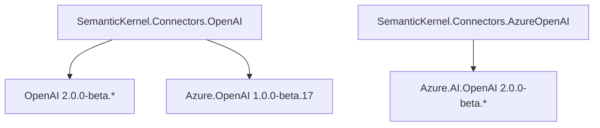
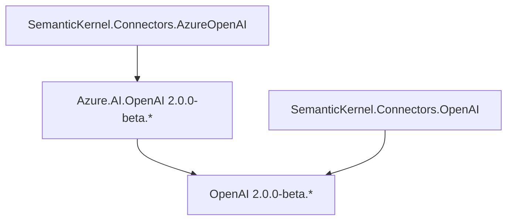

---
# 이 항목들은 선택 사항입니다. 필요 없는 항목은 자유롭게 제거하세요.
status: approved
contact: rogerbarreto
date: 2024-06-24
deciders: rogerbarreto, matthewbolanos, markwallace-microsoft, sergeymenshykh
consulted: stephentoub, dmytrostruk
---

# OpenAI 및 Azure 커넥터 네이밍과 구조화

## 컨텍스트 및 문제 설명

최근 OpenAI와 Azure가 각각의 서비스에 접근하기 위한 전용 SDK를 보유하게 될 것이라고 발표되었습니다. 이전에는 OpenAI용 공식 SDK가 없었으며, 우리의 OpenAI 커넥터는 접근을 위해 Azure SDK 클라이언트에만 의존했습니다.

공식 OpenAI SDK가 도입됨에 따라, OpenAI가 제공하는 최신 기능에 접근할 수 있게 되었으므로 Azure SDK 대신 이 SDK를 사용하는 것이 유리합니다.

또한 OpenAI 커넥터를 두 개의 별도 대상으로 분리해야 한다는 것이 명확해졌습니다: 하나는 OpenAI용, 다른 하나는 Azure OpenAI용입니다. 이 분리는 코드 명확성을 높이고 각 대상의 사용에 대한 더 나은 이해를 촉진합니다.

## 결정 요인

- 커넥터를 최신 버전의 OpenAI 및 Azure SDK를 사용하도록 업데이트.
- 기존 OpenAI 커넥터를 사용하는 개발자에 대한 호환성 깨짐 변경을 최소화하거나 제거.
- 변경 사항은 미래 지향적이어야 함.

## 버전 관리

현재 `Azure.AI.OpenAI` 및 `OpenAI` SDK 패키지의 주요 버전이 업데이트(2.0.0)되었지만, 이 변경은 `SemanticKernel`의 주요 호환성 깨짐 변경을 나타내지 않습니다. 아래에 제공된 모든 대안 옵션은 업데이트된 `SemanticKernel.Connectors.OpenAI` 및 `SemanticKernel.Connectors.AzureOpenAI`의 새 버전이 모든 SemanticKernel 패키지에 대해 마이너 버전 범프 `1.N+1.0`이 될 것임을 고려합니다.

### 메타 패키지 전략

현재 `Microsoft.SemanticKernel` 패키지는 `SemanticKernel.Core`와 `SemanticKernel.Connectors.OpenAI`를 모두 포함하는 메타 패키지이며, 새로운 변경으로 새 Azure OpenAI 커넥터를 포함하는 `SemanticKernel.Connectors.AzureOpenAI` 프로젝트가 메타 패키지에 추가됩니다.

## 문서화 (업그레이드 경로)

현재 OpenAI 커넥터에서 새 커넥터로 업그레이드하는 방법에 대한 문서 가이드와 샘플/예제가 작성될 예정입니다.

## OpenAI SDK 제한 사항

새로운 OpenAI SDK는 고려해야 할 몇 가지 제한 사항을 도입하며, 내부 구현으로 해결하지 않으면 잠재적으로 호환성 깨짐 변경을 도입할 수 있습니다.

- #### ⚠️ 요청당 다중 결과(Choices) 미지원.

  **해결**: 내부적으로 다중 요청을 수행하고 결합.
  **미해결**: `OpenAIPromptExecutionSettings`에서 `ResultsPerPrompt`를 제거하는 호환성 깨짐 변경.

- #### ⚠️ 텍스트 생성 모달리티 미지원.

  **해결**: 텍스트 생성 모달리티를 위해 `gpt-3.5-turbo-instruct`에 대해 사용할 HttpClient를 내부적으로 제공. `TextToImage`, `AudioToText` 서비스 모달리티에서 했던 것과 동일한 방식.
  **미해결**: 특정 `TextGeneration` 서비스 구현을 제거하는 호환성 깨짐 변경, 이 변경은 `ITextGenerationService` 구현으로 사용될 수 있는 `ChatCompletion` 서비스에 영향을 주지 않음.

## 개선 사항

이것은 또한 서비스와 구성에 대한 더 많은 유연성과 제어를 허용하기 위해 `Configuration` 패턴을 도입하여 현재 OpenAI 커넥터를 개선할 수 있는 기회입니다.

```csharp
// 이전
builder.AddAzureOpenAIChatCompletion(deploymentName, endpoint, apiKey, httpClient);
// 이후
builder.AddAzureOpenAIChatCompletion(new
{
    DeploymentName = modelId;
    Endpoint = endpoint;
    ApiKey = apiKey;
});
```

```csharp
// 이전
builder.AddAzureOpenAIChatCompletion(deploymentName, openAIClient, serviceId, modelId)
// 이후
builder.AddAzureOpenAIChatCompletion(new
{
    DeploymentName = deploymentName;
    ServiceId = serviceId;
    ModelId = modelId;
}, openAIClient);
```

## 잠재적 의존성 충돌

`SemanticKernel.Connectors.AzureOpenAI`와 `SemanticKernel.Connectors.OpenAI`가 동일한 `OpenAI 2.0.0` 의존성을 공유하므로, 각각의 `OpenAI 2.0.0` 버전이 다르면 두 커넥터 패키지를 프로젝트에서 함께 사용할 때 충돌이 발생할 수 있습니다.

이 경우:

1. OpenAI 커넥터 패키지를 업데이트하기 전에 `Azure.AI.OpenAI` 팀에 연락하여 업데이트 ETA를 조율합니다.

2. 최신 `OpenAI` 패키지를 초기에 이전 버전의 `OpenAI` SDK를 대상으로 했던 `Azure.AI.OpenAI`와 함께 사용할 때 호환성 깨짐 변경이나 충돌이 발생하지 않는지 조사합니다.

3. 충돌이 있고 그들의 ETA가 짧다면 `SemanticKernel.Connectors.OpenAI`의 `OpenAI` 의존성을 짧은 기간 동안 Azure와 유사하게 유지할 수 있으며, 그렇지 않으면 `OpenAI` 의존성 버전 업그레이드를 진행합니다.

## 고려된 옵션

- 옵션 1 - 신규와 레거시 병합 (독립 커넥터로의 느린 전환).
- 옵션 2 - 처음부터 독립 커넥터.
- 옵션 3 - OpenAI와 Azure를 같은 커넥터에 유지 (현재 상태 유지).

## 옵션 1 - 신규와 레거시 병합 (독립 커넥터로의 느린 전환).

이것은 가장 적은 호환성 깨짐 변경 접근 방식으로, 마지막 Azure SDK `Azure.AI.OpenAI 1.0.0-beta.17`을 사용하여 현재 레거시 OpenAI 및 AzureOpenAI API를 커넥터에 임시로 유지하고, 새로운 `OpenAI 2.0.0-beta.*` SDK 패키지를 사용하여 새로운 OpenAI 전용 API를 추가합니다.

이 접근 방식은 또한 두 번째 단계에서 최신 `Azure.AI.OpenAI 2.0.0-beta.*` SDK 패키지에 완전히 의존하는 Azure OpenAI 서비스 전용 새 커넥터가 생성됨을 의미합니다.

이후 단계에서는 `SemanticKernel.Connectors.OpenAI` 네임스페이스의 모든 OpenAI 및 Azure 레거시 API를 사용 중단으로 표시하고, Azure SDK `Azure.AI.OpenAI 1.0.0-beta.17`과 해당 API를 향후 릴리스에서 제거하여 OpenAI 커넥터를 `OpenAI 2.0.0-beta.*` 의존성만으로 OpenAI 서비스 전용으로 만듭니다.



레거시 API와의 호환성 깨짐 변경을 피하기 위한 조치이자 개선으로 새로운 `Options` 패턴이 사용됩니다.

이 변경에 따라 `SemanticKernel.Connectors.OpenAI`와 새로운 `SemanticKernel.Connectors.AzureOpenAI` 커넥터가 Azure 전용 서비스를 위해 생성되며, 새 Azure SDK `Azure.AI.OpenAI 2.0.0-beta.*`를 사용하고 모든 새 API는 options 접근 방식을 사용합니다.

### 전환 단계

- **1단계**: 현재 OpenAI 커넥터에 새 OpenAI SDK API를 추가하고, 마지막 Azure SDK를 사용하여 Azure OpenAI API를 유지합니다.
- **2단계**:
  - 새 Azure SDK를 사용하여 Azure OpenAI 서비스용 새 커넥터 생성
  - `OpenAI` 커넥터의 모든 Azure OpenAI API를 새 `AzureOpenAI` 커넥터를 가리키도록 사용 중단 표시
  - OpenAI 커넥터에서 Azure SDK 의존성 제거.
  - `Microsoft.SemanticKernel` 메타 패키지에 `AzureOpenAI` 커넥터 추가.
- **3단계**: `OpenAI` 커넥터의 모든 레거시 `OpenAI API`를 새 `Options` API를 가리키도록 사용 중단 표시.
- **4단계**: OpenAI 커넥터에서 모든 레거시 API 제거.

### 영향

장점:

- 현재 OpenAI 커넥터를 사용하는 개발자에 대한 최소한의 호환성 깨짐 변경.
- OpenAI와 Azure OpenAI 커넥터 간의 명확한 관심사 분리.

단점:

- `SemanticKernel.Connectors.AzureOpenAI`와 `SemanticKernel.Connectors.OpenAI`가 서로 다른 버전의 동일 의존성을 공유하므로, 두 패키지를 같은 프로젝트에서 사용할 수 없으며 두 커넥터를 배포할 때 전략이 필요합니다.
- `Azure OpenAI 1.0-beta17`과 `OpenAI 2.0-beta1` 모두에 대한 추가 의존성.

### 의존성 관리 전략

1. 같은 프로젝트에서 커넥터 중 하나만 사용하며, OpenAI와 AzureOpenAI 예제를 공유하는 `Concepts` 및 기타 프로젝트를 수용하기 위해 일부 수정이 필요합니다.
2. OpenAI 커넥터에서 모든 Azure API를 제거(중단)할 준비가 될 때까지 AzureOpenAI 커넥터 구현을 보류합니다.
3. `Azure.AI.OpenAI.Legacy 1.0.0-beta.17`에 대한 새 네임스페이스로 새 프로젝트를 배포하고, `Azure.AI.OpenAI` 네임스페이스에서의 버전 충돌을 피하기 위해 `SemanticKernel.Connectors.OpenAI`를 이 새 네임스페이스를 사용하도록 업데이트합니다.

## 옵션 2 - 처음부터 독립 커넥터.

이 옵션은 처음부터 필요한 모든 호환성 깨짐 변경을 통해 OpenAI와 Azure OpenAI 서비스를 위한 완전히 독립적인 커넥터를 만드는 데 초점을 맞춥니다.



영향:

- 모든 `Azure` 관련 로직이 `SemanticKernel.Connectors.OpenAI`에서 제거되어 새 `SemanticKernel.Connectors.AzureOpenAI`에서 도입되는 동일 이름과의 충돌을 방지하고, 앞으로 OpenAI 커넥터가 OpenAI 서비스에만 집중한다는 일관된 메시지를 개발자에게 전달합니다.

### 영향

장점:

- OpenAI와 Azure OpenAI 커넥터 간의 명확한 관심사 분리.
- OpenAI 전용 API에 집중하는 개발자에 대한 적은 호환성 깨짐 변경.
- 새 OpenAI SDK 및 Azure OpenAI SDK로의 빠른 전환.

단점:

- Azure용 현재 OpenAI 커넥터를 사용하는 개발자에 대한 큰 호환성 깨짐 변경.
- `Azure.AI.OpenAI` 팀이 패키지를 업데이트하지 않으면 [잠재적 의존성 충돌](#잠재적-의존성-충돌)이 발생할 수 있음.

## 옵션 3 - OpenAI와 Azure를 같은 커넥터에 유지 (현재 상태 유지).

이 옵션은 가능한 최소한의 영향에 완전히 초점을 맞추며, 현재 커넥터와 동일한 접근 방식을 따라 Azure와 OpenAI SDK 의존성을 하나의 단일 커넥터에 결합합니다.

변경 사항:

1. 모든 현재 OpenAI 전용 서비스와 클라이언트를 새 OpenAI SDK를 사용하도록 업데이트
2. Azure 전용 서비스와 클라이언트를 최신 Azure OpenAI SDK를 사용하도록 업데이트.
3. 선택적으로 커넥터 서비스에 `Options` 패턴 새 API를 추가하고 이전 API를 사용 중단 표시.

### 영향

장점:

- 현재 OpenAI 커넥터를 사용하는 개발자에 대한 최소한의 호환성 깨짐 변경.
- 호환성 깨짐 변경은 위의 [OpenAI SDK 제한 사항](#openai-sdk-제한-사항)에서 언급된 사항을 어떻게 처리하느냐에 따라 제한됩니다.
- `Azure.AI.OpenAI`와 `OpenAI` SDK 간의 의존성 충돌이 발생하지 않음.

단점:

- 최신 `Azure.AI.OpenAI` 패키지가 사용하는 OpenAI SDK 버전에 제한되며, 이는 사용 가능한 최신 버전이 아닐 수 있음.
- Azure 또는 OpenAI 전용 서비스를 직접 사용할 때 개발자는 옵션 풀과 의존성에서 다른 공급자 전용 서비스를 보길 기대하지 않음.

## 결정 결과

### 옵션 2 - 처음부터 독립 커넥터.

이 옵션은 `OpenAI` SDK의 잠재적 1.0 정식 출시로의 전환에 가장 빠른 접근 방식입니다.

이 옵션은 또한 처음부터 OpenAI와 Azure OpenAI 커넥터 간의 명확한 관심사 분리를 제공합니다.

`OpenAI`와 `AzureOpenAI` 구성 요소를 분리하겠다는 우리의 의도에 대한 명확한 메시지를 보내어 혼란을 방지합니다.

#### OpenAI SDK 제한 사항:

- [다중 결과](#openai-sdk-제한-사항): **해결하지 않음**.
- [텍스트 생성 모달리티 미지원](#openai-sdk-제한-사항): **해결하지 않음**.
