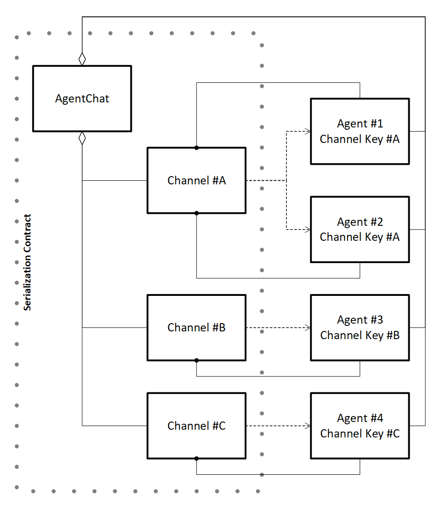
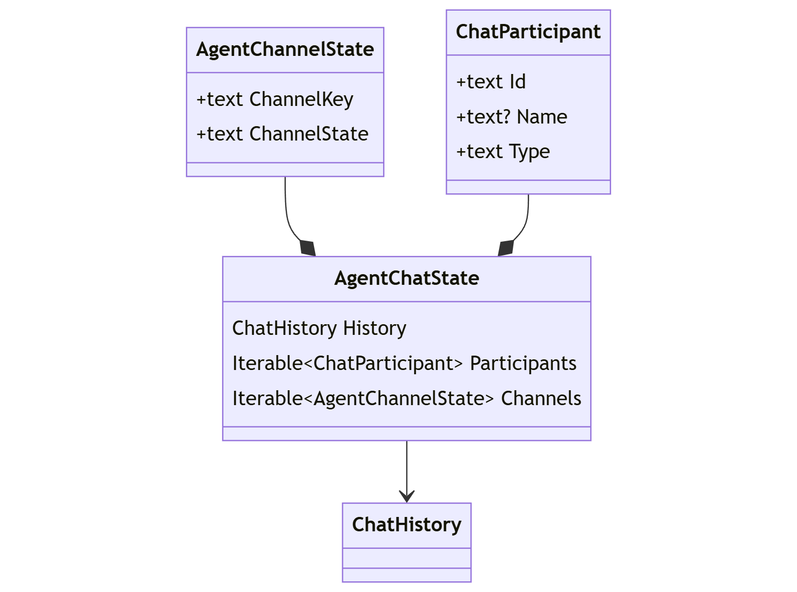

# `AgentChat` 직렬화 / 역직렬화

## 컨텍스트 및 문제 설명
_에이전트 프레임워크_ 사용자는 `AgentChat`을 사용하여 `Agent` 상호작용을 조율할 때 대화 상태를 저장하고 나중에 검색할 수 없습니다. 이는 에이전트 대화가 대화를 시작한 프로세스의 메모리 내에서 유지되어야 하므로 단일 사용으로 제한됩니다.

모든 `AgentChat` 클래스의 직렬화 및 역직렬화를 지원하는 메커니즘을 공식화하면, 여러 세션 및 컴퓨팅 경계 간에 상태를 캡처하고 복원할 수 있는 방법이 제공됩니다.

#### 목표
- **기본 채팅 히스토리 캡처 및 복원**: 완전한 충실도를 위해 기본 `AgentChat` 히스토리를 캡처하고 복원해야 합니다.
- **채널 상태 캡처 및 복원**: 기본 채팅 히스토리 외에도 `AgentChat` 내 각 `AgentChannel`의 상태를 캡처하고 복원해야 합니다.
- **에이전트 메타데이터 캡처**: 직렬화 시 에이전트 식별자, 이름 및 타입을 캡처하면 역직렬화 중 `AgentChat`을 복원하는 방법에 대한 가이드를 제공합니다.


#### 비목표
- **에이전트 정의 관리:** `Agent` 정의는 대화 상태의 일부로 캡처되지 않습니다. `AgentChat` 클래스의 상태를 역직렬화할 때 `Agent` 인스턴스가 생성되지 않습니다.
- **시크릿 또는 API 키 관리:** `Agent` 인스턴스를 생성하려면 시크릿/API 키가 필요합니다. 보안 고려 사항으로 인해 이러한 유형의 민감한 데이터 관리는 범위 밖입니다.


## 이슈

- 직렬화된 `ChatHistory`는 상호 운용성을 위해 플랫폼/언어 간에 동일해야 합니다

## 케이스
`AgentChat`을 복원할 때 애플리케이션은 채팅에 참여하는 `Agent` 인스턴스도 재생성해야 합니다(역직렬화 프로세스의 제어 밖). 이로 인해 다음과 같은 케이스가 발생합니다:

#### 1. **동일:** 복원된 채팅에서 모든 원래 에이전트 타입(채널)이 사용 가능한 경우.
이 경우 원래 채팅의 완전한 충실도 복원이 이루어집니다.

|원본 채팅|대상 채팅|
|---|---|
|`ChatCompletionAgent`|`ChatCompletionAgent`|
|`OpenAIAssistantAgent`|`OpenAIAssistantAgent`|
|`ChatCompletionAgent` & `OpenAIAssistantAgent`|`ChatCompletionAgent` & `OpenAIAssistantAgent`|

#### 2. **확장:** 복원된 채팅에서 추가 원래 에이전트 타입(채널)이 사용 가능한 경우.
이 경우에도 원래 채팅의 완전한 충실도 복원이 이루어집니다.
새로운 에이전트 타입(채널)은 복원 후 채팅에 동기화됩니다(진행 중인 채팅에 새 에이전트 타입을 추가하는 것과 동일).

|원본 채팅|대상 채팅|
|---|---|
|`ChatCompletionAgent`|`ChatCompletionAgent` & `OpenAIAssistantAgent`|
|`OpenAIAssistantAgent`|`ChatCompletionAgent` & `OpenAIAssistantAgent`|

#### 3. **축소:** 복원된 채팅에서 원래 에이전트 타입(채널)의 하위 집합만 사용 가능한 경우.
이 경우에도 사용 가능한 채널에 대해 원래 채팅의 완전한 충실도 복원이 이루어집니다. 복원 후 누락된 에이전트 타입(채널)이 도입되면 해당 채널이 현재 채팅에 동기화됩니다(진행 중인 채팅에 새 에이전트 타입을 추가하는 것과 동일).

|원본 채팅|대상 채팅|
|---|---|
|`ChatCompletionAgent` & `OpenAIAssistantAgent`|`ChatCompletionAgent`|
|`ChatCompletionAgent` & `OpenAIAssistantAgent`|`OpenAIAssistantAgent`|

#### 4. **비어 있음:** 복원된 채팅에서 사용 가능한 에이전트가 없는 경우.
이 경우 채팅이 복원되지 않았음을 강하게 나타내기 위해 즉시 예외(빠른 실패)가 발생합니다. 복원을 성공적으로 시도하기 위해 채팅에 에이전트를 추가하거나 자체적으로 활용할 수 있습니다. 즉, `AgentChat` 인스턴스가 무효화되지 않습니다.

#### 5. **유효하지 않음:** 채팅에 이미 히스토리나 채널 상태가 생성된 경우.
이 경우 채팅이 복원되지 않았음을 강하게 나타내기 위해 즉시 예외(빠른 실패)가 발생합니다. `AgentChat` 인스턴스가 무효화되지 않으므로 채팅은 계속 활용될 수 있습니다.

#### 참고:

> 복원 후 추가 `Agent` 인스턴스가 `AgentChat`에 참여할 수 있으며, 이는 다른 `AgentChat` 인스턴스와 다르지 않습니다.


## 분석

#### 관계:

`AgentChat`, 대화에 참여하는 `Agent` 인스턴스 및 관련 `AgentChannel` 도관 간의 관계는 다음 다이어그램에 설명되어 있습니다:

<p align="center">
<kbd></kbd>
</p>

`AgentChat`이 기본 `ChatHistory`를 관리하는 반면, 각 `AgentChannel`은 해당 히스토리가 특정 `Agent` 모달리티에 어떻게 적용되는지를 관리합니다. 예를 들어, Open AI Assistant API 기반 `Agent`용 `AgentChannel`은 관련 _thread-id_를 추적합니다. 반면 `ChatCompletionAgent`는 자체적으로 적용된 `ChatHistory` 인스턴스를 관리합니다.

이는 논리적으로 `AgentChat` 상태가 기본 `ChatHistory`와 함께 각 `AgentChannel`의 적절한 상태를 유지해야 함을 의미합니다:


#### 논리적 상태:

이러한 관계는 다음과 같은 논리적 상태 정의로 변환됩니다:

<p align="center">
<kbd></kbd>
</p>


#### 직렬화된 상태:

```javascript 
{
     // 직렬화된 ChatHistory
    "history": [
        { "role": "user", "items": [ /* ... */ ] },
        { "role": "assistant", "name": "John", "items": [ /* ... */ ] },
        // ...
    ],
     // 직렬화된 참여자
    "participants": [
        {
            "id": "01b6a120-7fef-45e2-aafb-81cf4a90d931",
            "name": "John",
            "type": "ChatCompletionAgent"
        },
        // ...
    ],
     // 직렬화된 AgentChannel 상태
    "channels": [
        {
            "channelkey": "Vdx37EnWT9BS+kkCkEgFCg9uHvHNw1+hXMA4sgNMKs4=",
            "channelstate": "...",  // AgentChannel의 직렬화된 상태
        },
        // ...
    ]
}
```


## 옵션

#### 1. JSON 직렬화기:

지배적인 직렬화 패턴은 dotnet `JsonSerializer`를 사용하는 것입니다. 이것은 _Semantic Kernel_ 콘텐츠 타입이 의존하는 접근 방식입니다.

**직렬화 예시:**

(_dotnet_)
```c#
// 에이전트 생성
ChatCompletionAgent agent1 = ...;
OpenAIAssistantAgent agent2 = ...;

// 에이전트 채팅 생성
AgentGroupChat chat = new(agent1, agent2);

// 채팅 객체를 JSON으로 직렬화
string chatState = JsonSerializer.Serialize(chat);
```

(_python_)
```python
# 에이전트 생성
agent1 = ChatCompletionAgent(...)
agent2 = OpenAIAssistantAgent(...)

# 에이전트 채팅 생성
chat = AgentGroupChat(agent1, agent2)

# 채팅을 JSON으로 직렬화
chat_state = chat.model_dump()
```

**역직렬화 예시:**

(_dotnet_)
```c#
// JSON 역직렬화
AgentGroupChat chat = JsonSerializer.Deserialize<AgentGroupChat>(chatState);
```

(_python_)
```python
# JSON 역직렬화
def agent_group_chat_decoder(obj) -> AgentGroupChat:
    pass
    
chat = json.loads(chat_state, object_hook=agent_group_chat_decoder)
```

**장점:**
- _에이전트 프레임워크_에 특화된 직렬화 패턴에 대한 지식이 필요하지 않음.

**단점:**
- `AgentChat`과 `AgentChannel` 모두 _데이터 전송 객체_(DTO)가 아닌 서비스 클래스로 설계되어 있음. 이는 파괴적인 리팩토링을 의미함. (완전한 재작성)
- 알 수 없는 `AgentChannel` 및 `AgentChat` 하위 클래스의 직렬화를 지원하기 위해 호출자가 복잡성을 처리해야 함.
- 채팅 복원 시 후처리 능력을 제한함 (예: 채널 동기화).
- 역직렬화에서 `Agent` 인스턴스의 부재가 `AgentChannel` 복원 능력을 방해함.


#### 2. `AgentChat` 직렬화기: 

`AgentChat` 계약에 대한 특정 지식을 가진 직렬화기를 도입하면 직렬화와 역직렬화를 간소화할 수 있습니다.

(_dotnet_)
```c#
class AgentChatSerializer
{
    // 채팅 상태를 제공된 스트림에 캡처
    static async Task SerializeAsync(AgentChat chat, Stream stream)

    // 제공된 스트림에서 채팅 상태를 읽고 직렬화기를 반환
    static async Task<AgentChatSerializer> DeserializeAsync(AgentChat chat, Stream stream)

    // 참여자 목록 제공
    IReadOnlyList<ChatParticipant> GetParticipants();

    // 채팅 상태 복원
    Task RestoreAsync(AgentChat chat);
}
```

(_python_)
```python
class AgentChatSerializer:

    # 채팅 상태를 제공된 스트림에 캡처
    @staticmethod
    async def serialize(chat: AgentChat, stream);
        pass

    # 제공된 스트림에서 채팅 상태를 읽고 직렬화기를 반환
    @staticmethod
    async def deserialize(chat: AgentChat, stream) -> AgentChatSerializer:
        pass

    # 참여자 목록 제공
    def get_participants(self) -> list[ChatParticipant]:
        pass

    # 채팅 상태 복원
    async def restore(self, chat: AgentChat):
        pass
```

**장점:**
- 채팅 _서비스_ 요구 사항과 별개로 채팅 상태를 명확하게 정의할 수 있음.
- 모든 `AgentChat` 및 `AgentChannel` 하위 클래스 지원.
- 채팅 복원 시 후처리 지원 가능 (예: 채널 동기화).
- 역직렬화 전에 모든 `AgentChat`이 적절하게 초기화될 수 있음.
- `ChatParticipant` 메타데이터 검사 허용.

**단점:**
- _에이전트 프레임워크_에 특화된 직렬화 패턴에 대한 지식 필요.

**직렬화 예시:**

(_dotnet_)
```c#
// 에이전트 생성
ChatCompletionAgent agent1 = ...;
OpenAIAssistantAgent agent2 = ...;

// 에이전트 채팅 생성
AgentGroupChat chat = new(agent1, agent2);

// 대화 시작
await chat.InvokeAsync();

// 직렬화 스트림 초기화
async using Stream stream = ...;

// 에이전트 채팅 캡처
await AgentChatSerializer.SerializeAsync(chat, stream);
```

(_python_)
```python
# 에이전트 생성
agent1 = ChatCompletionAgent(...)
agent2 = OpenAIAssistantAgent(...)

# 에이전트 채팅 생성
chat = AgentGroupChat(agent1, agent2)

# 대화 시작
await chat.invoke()

# 직렬화 스트림 초기화
async with ... as stream:

# 에이전트 채팅 캡처
await AgentChatSerializer.serialize(chat, stream)
```

**역직렬화 예시:**

(_dotnet_)
```c#
// 에이전트 생성
ChatCompletionAgent agent1 = ...;
OpenAIAssistantAgent agent2 = ...;

Dictionary<string, Agent> agents =
    new()
    {
        { agent1.Id, agent1 },
        { agent2.Id, agent2 },
    }

// 역직렬화 스트림 초기화
async using Stream stream = ...;
AgentChatSerializer serializer = AgentChatSerializer.Deserialize(stream);

// 에이전트 채팅 생성
AgentGroupChat chat = new();

// 에이전트 복원
foreach (ChatParticipant participant in serializer.GetParticipants())
{
    chat.AddAgent(agents[participant.Id]);
}

// 채팅 복원
serializer.Deserialize(chat);

// 채팅 계속
await chat.InvokeAsync();
```

(_python_)
```python
# 에이전트 생성
agent1 = ChatCompletionAgent(...)
agent2 = OpenAIAssistantAgent(...)

agents = {
    agent1.id: agent1,
    agent2.id: agent2,
}

# 직렬화 스트림 초기화
async with ... as stream:
serializer = await AgentChatSerializer.serialize(stream)

# 에이전트 채팅 생성
chat = AgentGroupChat(agent1, agent2)

# 에이전트 복원
for participant in serializer.get_participants():
    chat.add_agent(agents[participant.id])
    
# 에이전트 채팅 복원
await serializer.deserialize(chat)

# 채팅 계속
await chat.invoke();
```

#### 3. 인코딩된 상태 

이 옵션은 두 번째 옵션과 동일하지만, 각 개별 상태가 캡처된 상태의 수정/조작을 방지하기 위해 base64로 인코딩됩니다.

**장점:**
- 검사 및 수정 능력을 억제.

**단점:**
- 검사 능력을 불분명하게 함.
- 여전히 디코딩하여 검사 및 수정 가능.

**직렬화된 상태:**
```javascript
{
    "history": "VGhpcyBpcyB0aGUgcHJpbWFyeSBjaGF0IGhpc3Rvcnkg...",
    "participants": [
        {
            "aId37EnWT9BS+kkCkEgFCg9uHvHNw1+hXMA4sgNMKs4...",
            // ...
        },
    ],
    "channels": [
        {
            "channelkey": "Vdx37EnWT9BS+kkCkEgFCg9uHvHNw1+hXMA4sgNMKs4=",
            "channelstate": "VGhpcyBpcyBhZ2VudCBjaGFubmVsIHN0YXRlIGV4YW1wbG..."
        },
        // ...
    ]
}
```


## 결과

미정(TBD)
