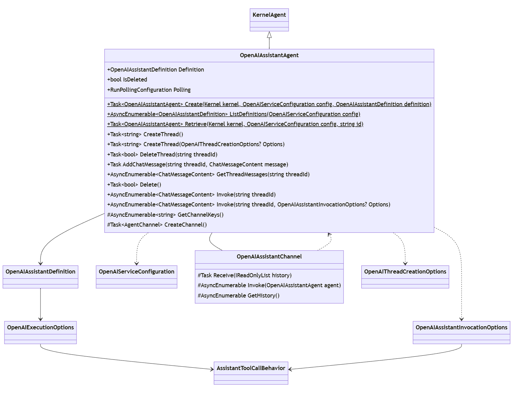
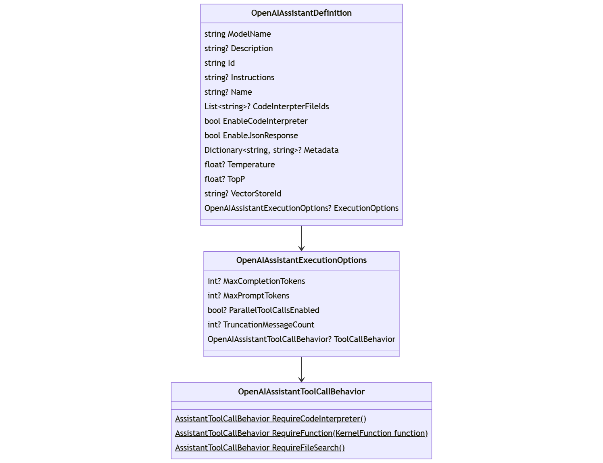
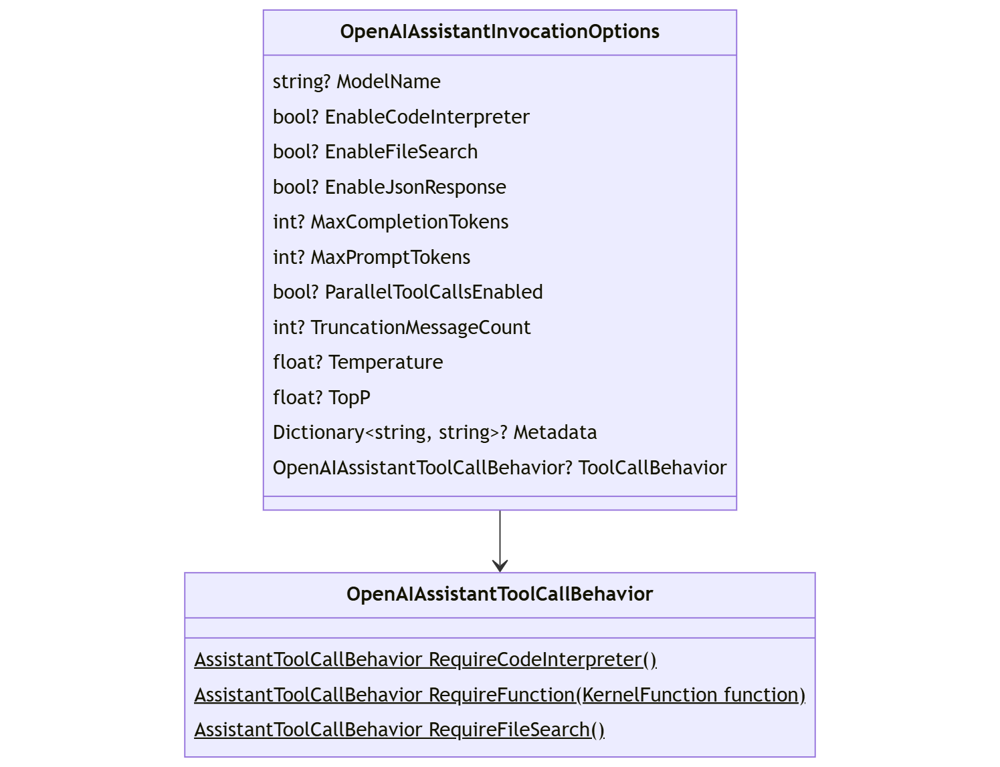
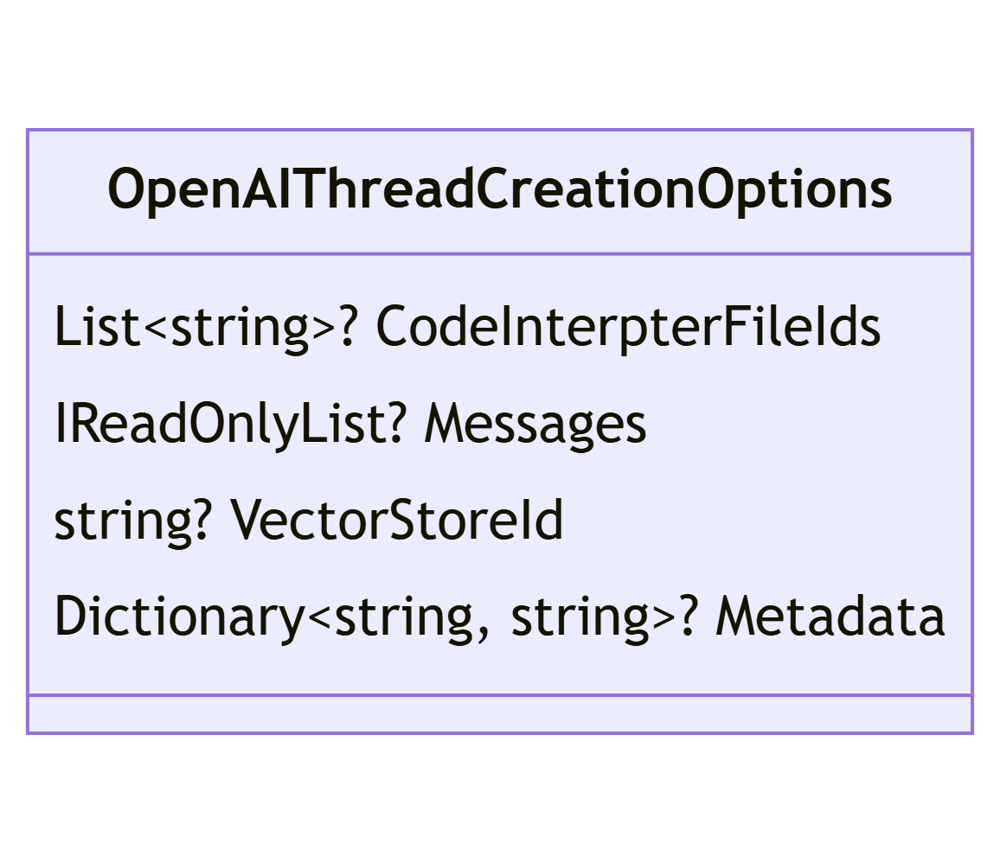
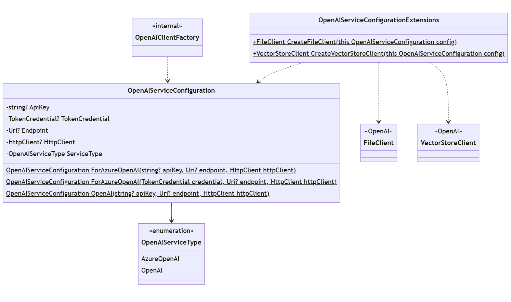

# 에이전트 프레임워크 - Assistant V2 마이그레이션

## 컨텍스트 및 문제 설명

Open AI가 _Assistants V2_ API를 출시했습니다. 이것은 V1 _assistant_ 개념 위에 구축되지만 특정 V1 기능을 무효화하기도 합니다. 또한 _Assistant V2_ 기능을 지원하는 _dotnet_ API는 현재 사용 중인 `Azure.AI.OpenAI.Assistants` SDK와 완전히 다릅니다.

### 미해결 이슈
- **스트리밍:** 별도의 기능으로 다룰 예정

## 설계

Assistant V2 API로의 마이그레이션은 다음과 같은 이유로 기존 패키지에 대한 호환성 깨짐 변경입니다:
- 기본 기능 차이 (예: `file-search` vs `retrieval`)
- 기본 V2 SDK가 V1과 버전 호환되지 않음 (`OpenAI` 및 `Azure.AI.OpenAI`)

### 에이전트 구현

`OpenAIAssistant` 에이전트는 다음 사항을 제외하면 V1 형태와 대체로 동일합니다:

- _assistant_, _thread_, _run_에 대한 옵션 지원
- 에이전트 정의가 `Definition` 속성으로 이동
- OpenAI 클라이언트 생성을 위한 편의 메서드

이전에는 에이전트 정의가 다음과 같은 직접 속성을 통해 노출되었습니다:

- `FileIds`
- `Metadata`

이 모든 것이 `Definition` 속성으로 이동 및 확장되었으며, 이 속성은 어시스턴트를 생성하고 조회하는 데 사용되는 것과 동일한 타입(`OpenAIAssistantDefinition`)입니다.

<kbd></kbd>

다음 표는 `OpenAIAssistantAgent`에 다이어그램으로 표시된 메서드의 목적을 설명합니다.

|메서드 이름|설명|
---|---
**Create**|새 어시스턴트 에이전트 생성
**ListDefinitions**|기존 어시스턴트 정의 목록 조회
**Retrieve**|기존 어시스턴트 검색
**CreateThread**|어시스턴트 스레드 생성
**DeleteThread**|어시스턴트 스레드 삭제
**AddChatMessage**|어시스턴트 스레드에 메시지 추가
**GetThreadMessages**|어시스턴트 스레드의 모든 메시지 검색
**Delete**|어시스턴트 에이전트의 정의 삭제 (에이전트를 종료 상태로 전환)
**Invoke**|어시스턴트 에이전트 호출 (채팅 없음)
**GetChannelKeys**|`Agent`에서 상속
**CreateChannel**|`Agent`에서 상속

### 클래스 목록
이 섹션은 이 ADR에서 설명하는 모든 공개 API 영역에 대한 개요/목록을 제공합니다.

|클래스 이름|설명|
---|---
**OpenAIAssistantAgent**|Open AI Assistant API 기반의 `Agent`
**OpenAIAssistantChannel**|`OpenAIAssistantAgent`용 'AgentChannel' (_thread-id_와 연결됨.)
**OpenAIAssistantDefinition**|Open AI Assistant의 모든 메타데이터/정의. 구현 제약(생성자가 public이 아님)으로 인해 _Open AI API_ 모델을 사용할 수 없음.
**OpenAIAssistantExecutionOptions**|_run_에 영향을 미치지만 에이전트/어시스턴트에 대해 전역적으로 정의되는 옵션.
**OpenAIAssistantInvocationOptions**|개별 run에 바인딩된 옵션, 직접(채팅 없음) 호출에 사용.
**OpenAIThreadCreationOptions**|지정 시 어시스턴트 정의보다 우선하는 스레드 생성 옵션.
**OpenAIServiceConfiguration**|서비스 연결을 설명하며 `OpenAIClient` 생성에 사용됨

### Run 처리

_assistant_ 에이전트를 지원하는 핵심은 `Run`을 생성하고 처리하는 것입니다.

`Run`은 실질적으로 `Thread`(또는 대화)에서의 개별 _assistant_ 상호작용입니다.

- https://platform.openai.com/docs/api-reference/runs
- https://platform.openai.com/docs/api-reference/run-steps

이 `Run` 처리는 _OpenAI 에이전트 프레임워크_ 내의 내부 로직으로 구현되며 여기에 개요가 설명됩니다:

처리 시작에 사용되는 요소: 

- `agent` -> `OpenAIAssistantAgent`
- `client` -> `AssistantClient`
- `threadid` -> `string`
- `options` -> `OpenAIAssistantInvocationOptions` (선택 사항)

처리 수행:

- `agent`가 삭제되지 않았는지 확인
- `RunCreationOptions` 정의
- `run` 생성 (`threadid`와 `agent.Id` 기반)
- run 처리:

    do

    - `run` 상태가 _queued_, _in-progress_ 또는 _cancelling_이 아닐 때까지 폴링
    - `run` 상태가 _expired_, _failed_ 또는 _cancelled_이면 예외 발생
    - `run`의 `steps` 조회

    - `run` 상태가 _requires-action_인 경우
        
        - 함수 `steps` 처리

        - 함수 결과 전송

    - foreach (완료된 `step`)

        - (`step`이 tool-call인 경우) 도구 콘텐츠 생성 및 반환

        - else if (`step`이 message인 경우) 메시지 콘텐츠 생성 및 반환

    while (`run` 상태가 completed가 아닐 때까지)

### 벡터 스토어 지원

`file-search` 도구의 사용을 가능하게 하려면 _벡터 스토어_ 지원이 필요합니다.

V2 `FileClient` 스트리밍에 맞춰, 호출자는 _OpenAI SDK_의 `VectorStoreClient`를 직접 대상으로 할 수도 있습니다.

### 정의 / 옵션 클래스

지원되는 각 조절 지점(즉, _assistant_, _thread_, _run_)에서 어시스턴트 동작을 정의하는 능력을 지원하기 위해 특정 구성/옵션 클래스가 도입됩니다.

|클래스|목적|
|---|---|
|`OpenAIAssistantDefinition`|어시스턴트의 정의. 새 어시스턴트 생성, 어시스턴트 에이전트 인스턴스 검사 또는 어시스턴트 정의 조회 시 사용.|
|`OpenAIAssistantExecutionOptions`|어시스턴트 범위 내에서 정의되는 run 실행에 영향을 미치는 옵션.|
|`OpenAIAssistantInvocationOptions`|지정 시 어시스턴트 정의보다 우선하는 Run 수준 옵션.|
|`OpenAIAssistantToolCallBehavior`|관련 범위(어시스턴트 또는 run)에 대한 도구 호출 동작을 알려줌.|
|`OpenAIThreadCreationOptions`|지정 시 어시스턴트 정의보다 우선하는 스레드 범위 옵션.|
|`OpenAIServiceConfiguration`|대상 서비스와 연결 방법을 알려줌.|

#### 어시스턴트 정의

`OpenAIAssistantDefinition`은 이전에 저장된 에이전트 목록을 열거할 때만 사용되었습니다. 이것이 에이전트를 생성하기 위한 입력으로도 사용되고 `OpenAIAssistantAgent` 인스턴스의 개별 속성으로 노출되도록 발전했습니다.

여기에는 기본 _run_ 동작을 정의하는 선택적 `ExecutionOptions`가 포함됩니다. 이러한 실행 옵션은 원격 어시스턴트 정의의 일부가 아니므로, 기존 에이전트를 검색할 때를 위해 어시스턴트 메타데이터에 유지됩니다. `OpenAIAssistantToolCallBehavior`는 _실행 옵션_의 일부로 포함되며 _AI 커넥터_와 연관된 `ToolCallBehavior`에 맞춰 모델링됩니다.

> 참고: 수동 함수 호출은 현재 `OpenAIAssistantAgent` 또는 `AgentChat`에서 지원되지 않으며 향상으로 다룰 예정입니다. 이 지원이 도입되면 `OpenAIAssistantToolCallBehavior`가 함수 호출 동작을 결정합니다(마찬가지로 _AI 커넥터_와 연관된 `ToolCallBehavior`에 맞춤).

**대안 (향후?)**

기본/추상 `PromptExecutionSettings`의 속성으로 `FunctionChoiceBehavior`를 도입하는 보류 중인 변경이 작성되었습니다. 이것이 실현되면 `OpenAIAssistantAgent`에 이 패턴을 통합하는 것을 평가하는 것이 합리적일 수 있습니다. 이는 또한 `OpenAIAssistantExecutionOptions`와 `OpenAIAssistantInvocationOptions`(다음 섹션) 모두에 대해 `PromptExecutionSettings`의 상속 관계를 의미할 수 있습니다.

**결정**: `FunctionChoiceBehavior`가 실현될 때까지 `tool_choice`를 지원하지 않음.

<kbd></kbd>

#### 어시스턴트 호출 옵션

`OpenAIAssistantAgent`를 직접 호출할 때(채팅 없음), 개별 run에만 적용되는 정의를 지정할 수 있습니다. 이러한 정의는 `OpenAIAssistantInvocationOptions`로 정의되며 해당하는 어시스턴트 또는 스레드 정의보다 우선합니다.

> 참고: 이러한 정의도 `ToolCallBehavior` / `FunctionChoiceBehavior` 딜레마의 영향을 받습니다.

<kbd></kbd>

#### 스레드 생성 옵션

`OpenAIAssistantAgent`를 직접 호출할 때(채팅 없음), 스레드를 명시적으로 관리해야 합니다. 이 과정에서 스레드별 옵션을 지정할 수 있습니다. 이러한 옵션은 `OpenAIThreadCreationOptions`로 정의되며 해당하는 어시스턴트 정의보다 우선합니다.

<kbd></kbd>

#### 서비스 구성

`OpenAIServiceConfiguration`은 OpenAI, Azure 또는 프록시 등 특정 원격 서비스에 연결하는 방법을 정의합니다. 이를 통해 원격 API 서비스 연결(즉, _클라이언트_ 생성)이 필요한 각 호출 지점에 대해 여러 오버로드를 정의할 필요가 없어집니다.

> 참고: 이전에는 `OpenAIAssistantConfiguration`이라는 이름이었지만, 반드시 어시스턴트에 특화된 것은 아닙니다.

<kbd></kbd>

