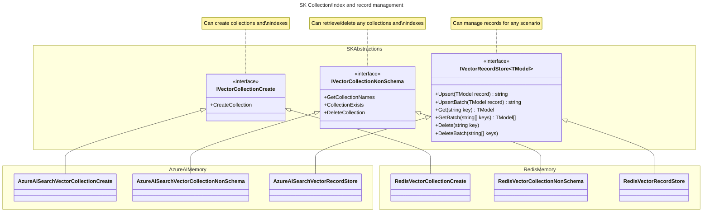

---
# These are optional elements. Feel free to remove any of them.
status: proposed
contact: westey-m
date: 2024-06-05
deciders: sergeymenshykh, markwallace, rbarreto, dmytrostruk, westey-m, matthewbolanos, eavanvalkenburg
consulted: stephentoub, dluc, ajcvickers, roji
informed: 
---

# 업데이트된 메모리 커넥터 설계

## 컨텍스트 및 문제 설명

Semantic Kernel은 인기 있는 벡터 데이터베이스(예: Azure AI Search, Chroma, Milvus 등)에 대한 커넥터 컬렉션을 보유하고 있습니다.
각 메모리 커넥터는 Semantic Kernel이 정의한 메모리 추상화를 구현하며, 개발자가 벡터 데이터베이스를 애플리케이션에 쉽게 통합할 수 있게 합니다.
현재 추상화는 실험적이며, 이 ADR의 목적은 추상화의 설계를 진전시켜 비실험적 상태로 졸업할 수 있도록 하는 것입니다.

### 현재 설계의 문제점

1. `IMemoryStore` 인터페이스에 다른 카디널리티를 가진 네 가지 책임이 있습니다. 일부는 스키마 인식이고 다른 일부는 스키마 비인식입니다.
2. `IMemoryStore` 인터페이스는 데이터 저장, 검색 및 검색을 위한 고정 스키마만 지원하여, 기존 데이터 세트를 가진 고객의 사용성을 제한합니다.
2. `IMemoryStore` 구현은 키 인코딩/디코딩 및 컬렉션 이름 정규화에 대해 의견이 있어, 기존 데이터 세트를 가진 고객의 사용성을 제한합니다.

책임:

|기능 영역|카디널리티|Semantic Kernel에 대한 중요성|
|-|-|-|
|컬렉션/인덱스 생성|스토어 타입 및 모델당 하나의 구현|스토어를 구축하고 데이터를 추가할 때 유용|
|컬렉션/인덱스 이름 목록, 존재 여부 확인 및 삭제|스토어 타입당 하나의 구현|스토어를 구축하고 데이터를 추가할 때 유용|
|데이터 저장 및 검색|스토어 타입당 하나의 구현|스토어를 구축하고 데이터를 추가할 때 유용|
|벡터 검색|스토어 타입, 모델 및 검색 타입당 하나의 구현|RAG, 사용자 입력 기반 모순되는 사실 찾기, 유사한 메모리를 병합하기 위한 찾기 등 많은 시나리오에 유용|


### 현재 메모리 스토어
```cs
interface IMemoryStore
{
    // Collection / Index Management
    Task CreateCollectionAsync(string collectionName, CancellationToken cancellationToken = default);
    IAsyncEnumerable<string> GetCollectionsAsync(CancellationToken cancellationToken = default);
    Task<bool> DoesCollectionExistAsync(string collectionName, CancellationToken cancellationToken = default);
    Task DeleteCollectionAsync(string collectionName, CancellationToken cancellationToken = default);

    // Data Storage and Retrieval
    Task<string> UpsertAsync(string collectionName, MemoryRecord record, CancellationToken cancellationToken = default);
    IAsyncEnumerable<string> UpsertBatchAsync(string collectionName, IEnumerable<MemoryRecord> records, CancellationToken cancellationToken = default);
    Task<MemoryRecord?> GetAsync(string collectionName, string key, bool withEmbedding = false, CancellationToken cancellationToken = default);
    IAsyncEnumerable<MemoryRecord> GetBatchAsync(string collectionName, IEnumerable<string> keys, bool withVectors = false, CancellationToken cancellationToken = default);
    Task RemoveAsync(string collectionName, string key, CancellationToken cancellationToken = default);
    Task RemoveBatchAsync(string collectionName, IEnumerable<string> keys, CancellationToken cancellationToken = default);

    // Vector Search
    IAsyncEnumerable<(MemoryRecord, double)> GetNearestMatchesAsync(
        string collectionName,
        ReadOnlyMemory<float> embedding,
        int limit,
        double minRelevanceScore = 0.0,
        bool withVectors = false,
        CancellationToken cancellationToken = default);

    Task<(MemoryRecord, double)?> GetNearestMatchAsync(
        string collectionName,
        ReadOnlyMemory<float> embedding,
        double minRelevanceScore = 0.0,
        bool withEmbedding = false,
        CancellationToken cancellationToken = default);
}
```

### 조치 사항

1. `IMemoryStore`를 스키마 인식 작업과 스키마 비인식 작업이 분리되도록 다른 인터페이스로 분할해야 합니다.
2. **데이터 저장 및 검색**과 **벡터 검색** 영역은 데이터에 대한 타입 접근을 허용하고, 고객 데이터 스토어에 현재 존재하는 모든 스키마를 지원해야 합니다.
3. 컬렉션/인덱스 생성 기능은 개발자가 추상화의 일부인 공통 정의를 사용하여 컬렉션을 생성할 수 있도록 해야 합니다.
4. 컬렉션/인덱스 목록/존재 여부 확인/삭제 기능은 스키마에 관계없이 모든 컬렉션을 관리할 수 있도록 해야 합니다.
5. 커넥터에서 의견이 있는 동작을 제거합니다. 의견이 있는 동작은 기존 벡터 데이터베이스에서 이러한 커넥터를 사용하는 능력을 제한합니다. 가능한 한 이러한 동작은 데코레이터로 이동하거나 주입 가능해야 합니다. 의견이 있는 동작의 예:
    1. AzureAISearch 커넥터는 Azure AI Search의 키가 제한된 문자 세트를 지원하므로 저장 전에 키를 인코딩하고 검색 후 디코딩합니다.
    2. AzureAISearch 커넥터는 Azure AI Search가 제한된 문자 세트를 지원하므로 사용 전에 컬렉션 이름을 정규화합니다.
    3. Redis 커넥터는 레코드를 저장하기 전에 키 앞에 컬렉션 이름을 추가하고, 인덱스에 의해 색인될 레코드의 접두사로 컬렉션 이름을 등록합니다.

### 새 커넥터의 비기능적 요구 사항
1. 모든 커넥터가 일관된 방식으로 요청에 대한 데이터와 함께 동일한 예외를 일관되게 throw하도록 합니다.
2. 모든 커넥터에 대해 일관된 텔레메트리를 추가합니다.
3. 가능한 한 통합 테스트를 빌드 서버에서 실행할 수 있어야 합니다.

### 새로운 설계

컬렉션/인덱스 관리와 레코드 관리의 분리.



자체 스키마를 코어 SK 기능과 함께 사용하는 방법.

```mermaid
---
title: Chat History Break Glass
---
classDiagram
    note for IVectorRecordStore "Can manage records\nfor any scenario"
    note for IVectorCollectionCreate "Can create collections\nan dindexes"
    note for IVectorCollectionNonSchema "Can retrieve/delete any\ncollections and indexes"
    note for CustomerHistoryVectorCollectionCreate "Creates history collections and indices\nusing Customer requirements"
    note for CustomerHistoryVectorRecordStore "Decorator class for IVectorRecordStore that maps\nbetween the customer model to our model"

    namespace SKAbstractions{
        class IVectorCollectionCreate{
            <<interface>>
            +CreateCollection
        }

        class IVectorCollectionNonSchema{
            <<interface>>
            +GetCollectionNames
            +CollectionExists
            +DeleteCollection
        }

        class IVectorRecordStore~TModel~{
            <<interface>>
            +Upsert(TModel record) string
            +Get(string key) TModel
            +Delete(string key) string
        }

        class ISemanticTextMemory{
            <<interface>>
            +SaveInformationAsync()
            +SaveReferenceAsync()
            +GetAsync()
            +DeleteAsync()
            +SearchAsync()
            +GetCollectionsAsync()
        }
    }

    namespace CustomerProject{
        class CustomerHistoryModel{
            +string text
            +float[] vector
            +Dictionary~string, string~ properties
        }

        class CustomerHistoryVectorCollectionCreate{
            +CreateCollection
        }

        class CustomerHistoryVectorRecordStore{
            -IVectorRecordStore~CustomerHistoryModel~ _store
            +Upsert(ChatHistoryModel record) string
            +Get(string key) ChatHistoryModel
            +Delete(string key) string
        }
    }

    namespace SKCore{
        class SemanticTextMemory{
            -IVectorRecordStore~ChatHistoryModel~ _VectorRecordStore
            -IMemoryCollectionService _collectionsService
            -ITextEmbeddingGenerationService _embeddingGenerationService
        }

        class ChatHistoryPlugin{
            -ISemanticTextMemory memory
        }

        class ChatHistoryModel{
            +string message
            +float[] embedding
            +Dictionary~string, string~ metadata
        }
    }

    IVectorCollectionCreate <|-- CustomerHistoryVectorCollectionCreate

    IVectorRecordStore <|-- CustomerHistoryVectorRecordStore
    IVectorRecordStore <.. CustomerHistoryVectorRecordStore
    CustomerHistoryModel <.. CustomerHistoryVectorRecordStore
    ChatHistoryModel <.. CustomerHistoryVectorRecordStore

    ChatHistoryModel <.. SemanticTextMemory
    IVectorRecordStore <.. SemanticTextMemory
    IVectorCollectionCreate <.. SemanticTextMemory

    ISemanticTextMemory <.. ChatHistoryPlugin
```



### 벡터 스토어 크로스 스토어 지원 - 일반 기능

결정을 이끌기 위한 스토어들의 저장 기능 구현 방식 비교:

|Feature|Azure AI Search|Weaviate|Redis|Chroma|FAISS|Pinecone|LLamaIndex|PostgreSql|Qdrant|Milvus|
|-|-|-|-|-|-|-|-|-|-|-|
|Get Item Support|Y|Y|Y|Y||Y||Y|Y|Y|
|Batch Operation Support|Y|Y|Y|Y||Y||||Y|
|Per Item Results for Batch Operations|Y|Y|Y|N||N|||||
|Keys of upserted records|Y|Y|N<sup>3</sup>|N<sup>3</sup>||N<sup>3</sup>||||Y|
|Keys of removed records|Y||N<sup>3</sup>|N||N||||N<sup>3</sup>|
|Retrieval field selection for gets|Y||Y<sup>4<sup>|P<sup>2</sup>||N||Y|Y|Y|
|Include/Exclude Embeddings for gets|P<sup>1</sup>|Y|Y<sup>4,1<sup>|Y||N||P<sup>1</sup>|Y|N|
|Failure reasons when batch partially fails|Y|Y|Y|N||N|||||
|Is Key separate from data|N|Y|Y|Y||Y||N|Y|N|
|Can Generate Ids|N|Y|N|N||Y||Y|N|Y|
|Can Generate Embedding|Not Available Via API yet|Y|N|Client Side Abstraction|||||N||

각주:
- P = 부분 지원
- <sup>1</sup> Only if you have the schema, to select the appropriate fields.
- <sup>2</sup> Supports broad categories of fields only.
- <sup>3</sup> Id is required in request, so can be returned if needed.
- <sup>4</sup> No strong typed support when specifying field list.

### 벡터 스토어 크로스 스토어 지원 - 필드, 타입 및 인덱싱

|Feature|Azure AI Search|Weaviate|Redis|Chroma|FAISS|Pinecone|LLamaIndex|PostgreSql|Qdrant|Milvus|
|-|-|-|-|-|-|-|-|-|-|-|
|Field Differentiation|Fields|Key, Props, Vectors|Key, Fields|Key, Document, Metadata, Vector||Key, Metadata, SparseValues, Vector||Fields|Key, Props(Payload), Vectors|Fields|
|Multiple Vector per record support|Y|Y|Y|N||[N](https://docs.pinecone.io/guides/data/upsert-data#upsert-records-with-metadata)||Y|Y|Y|
|Index to Collection|1 to 1|1 to 1|1 to many|1 to 1|-|1 to 1|-|1 to 1|1 to 1|1 to 1|
|Id Type|String|UUID|string with collection name prefix|string||string|UUID|64Bit Int / UUID / ULID|64Bit Unsigned Int / UUID|Int64 / varchar|
|Supported Vector Types|[Collection(Edm.Byte) / Collection(Edm.Single) / Collection(Edm.Half) / Collection(Edm.Int16) / Collection(Edm.SByte)](https://learn.microsoft.com/en-us/rest/api/searchservice/supported-data-types)|float32|FLOAT32 and FLOAT64|||[Rust f32](https://docs.pinecone.io/troubleshooting/embedding-values-changed-when-upserted)||[single-precision (4 byte float) / half-precision (2 byte float) / binary (1bit) / sparse vectors (4 bytes)](https://github.com/pgvector/pgvector?tab=readme-ov-file#pgvector)|UInt8 / Float32|Binary / Float32 / Float16 / BFloat16 / SparseFloat|
|Supported Distance Functions|[Cosine / dot prod / euclidean dist (l2 norm)](https://learn.microsoft.com/en-us/azure/search/vector-search-ranking#similarity-metrics-used-to-measure-nearness)|[Cosine dist / dot prod / Squared L2 dist / hamming (num of diffs) / manhattan dist](https://weaviate.io/developers/weaviate/config-refs/distances#available-distance-metrics)|[Euclidean dist (L2) / Inner prod (IP) / Cosine dist](https://redis.io/docs/latest/develop/interact/search-and-query/advanced-concepts/vectors/)|[Squared L2 / Inner prod / Cosine similarity](https://docs.trychroma.com/guides#changing-the-distance-function)||[cosine sim / euclidean dist / dot prod](https://docs.pinecone.io/reference/api/control-plane/create_index)||[L2 dist / inner prod / cosine dist / L1 dist / Hamming dist / Jaccard dist (NB: Specified at query time, not index creation time)](https://github.com/pgvector/pgvector?tab=readme-ov-file#pgvector)|[Dot prod / Cosine sim / Euclidean dist (L2) / Manhattan dist](https://qdrant.tech/documentation/concepts/search/)|[Cosine sim / Euclidean dist / Inner Prod](https://milvus.io/docs/index-vector-fields.md)|
|Supported index types|[Exhaustive KNN (FLAT) / HNSW](https://learn.microsoft.com/en-us/azure/search/vector-search-ranking#algorithms-used-in-vector-search)|[HNSW / Flat / Dynamic](https://weaviate.io/developers/weaviate/config-refs/schema/vector-index)|[HNSW / FLAT](https://redis.io/docs/latest/develop/interact/search-and-query/advanced-concepts/vectors/#create-a-vector-field)|[HNSW not configurable](https://cookbook.chromadb.dev/core/concepts/#vector-index-hnsw-index)||[PGA](https://www.pinecone.io/blog/hnsw-not-enough/)||[HNSW / IVFFlat](https://github.com/pgvector/pgvector?tab=readme-ov-file#indexing)|[HNSW for dense](https://qdrant.tech/documentation/concepts/indexing/#vector-index)|<p>[In Memory: FLAT / IVF_FLAT / IVF_SQ8 / IVF_PQ / HNSW / SCANN](https://milvus.io/docs/index.md)</p><p>[On Disk: DiskANN](https://milvus.io/docs/disk_index.md)</p><p>[GPU: GPU_CAGRA / GPU_IVF_FLAT / GPU_IVF_PQ / GPU_BRUTE_FORCE](https://milvus.io/docs/gpu_index.md)</p>|

각주:
- HNSW = Hierarchical Navigable Small World (HNSW는 [근사 최근접 이웃(ANN)](https://learn.microsoft.com/en-us/azure/search/vector-search-overview#approximate-nearest-neighbors) 검색을 수행)
- KNN = k-최근접 이웃 (전체 벡터 공간을 스캔하는 무차별 대입 검색 수행)
- IVFFlat = Inverted File with Flat Compression (이 인덱스 타입은 빠른 검색을 제공하기 위해 근사 최근접 이웃 검색(ANNS)을 사용)
- Weaviate Dynamic = flat으로 시작하여 객체 수가 한계를 초과하면 HNSW로 전환
- PGA = [Pinecone Graph Algorithm](https://www.pinecone.io/blog/hnsw-not-enough/)

### 벡터 스토어 크로스 스토어 지원 - 검색 및 필터링

|Feature|Azure AI Search|Weaviate|Redis|Chroma|FAISS|Pinecone|LLamaIndex|PostgreSql|Qdrant|Milvus|
|-|-|-|-|-|-|-|-|-|-|-|
|Index allows text search|Y|Y|Y|Y (On Metadata by default)||[Only in combination with Vector](https://docs.pinecone.io/guides/data/understanding-hybrid-search)||Y (with TSVECTOR field)|Y|Y|
|Text search query format|[Simple or Full Lucene](https://learn.microsoft.com/en-us/azure/search/search-query-create?tabs=portal-text-query#choose-a-query-type-simple--full)|[wildcard](https://weaviate.io/developers/weaviate/search/filters#filter-text-on-partial-matches)|wildcard & fuzzy|[contains & not contains](https://docs.trychroma.com/guides#filtering-by-document-contents)||Text only||[wildcard & binary operators](https://www.postgresql.org/docs/16/textsearch-controls.html#TEXTSEARCH-PARSING-QUERIES)|[Text only](https://qdrant.tech/documentation/concepts/filtering/#full-text-match)|[wildcard](https://milvus.io/docs/single-vector-search.md#Filtered-search)|
|Multi Field Vector Search Support|Y|[N](https://weaviate.io/developers/weaviate/search/similarity)||N (no multi vector support)||N||[Unclear due to order by syntax](https://github.com/pgvector/pgvector?tab=readme-ov-file#querying)|[N](https://qdrant.tech/documentation/concepts/search/)|[Y](https://milvus.io/api-reference/restful/v2.4.x/v2/Vector%20(v2)/Hybrid%20Search.md)|
|Targeted Multi Field Text Search Support|Y|[Y](https://weaviate.io/developers/weaviate/search/hybrid#set-weights-on-property-values)|[Y](https://redis.io/docs/latest/develop/interact/search-and-query/advanced-concepts/query_syntax/#field-modifiers)|N (only on document)||N||Y|Y|Y|
|Vector per Vector Field for Search|Y|N/A||N/A|||N/A||N/A|N/A|[Y](https://milvus.io/docs/multi-vector-search.md#Step-1-Create-Multiple-AnnSearchRequest-Instances)|
|Separate text search query from vectors|Y|[Y](https://weaviate.io/developers/weaviate/search/hybrid#specify-a-search-vector)|Y|Y||Y||Y|Y|[Y](https://milvus.io/api-reference/restful/v2.4.x/v2/Vector%20(v2)/Hybrid%20Search.md)|
|Allows filtering|Y|Y|Y (on TAG)|Y (On Metadata by default)||[Y](https://docs.pinecone.io/guides/indexes/configure-pod-based-indexes#selective-metadata-indexing)||Y|Y|Y|
|Allows filter grouping|Y (Odata)|[Y](https://weaviate.io/developers/weaviate/search/filters#nested-filters)||[Y](https://docs.trychroma.com/guides#using-logical-operators)||Y||Y|[Y](https://qdrant.tech/documentation/concepts/filtering/#clauses-combination)|[Y](https://milvus.io/docs/get-and-scalar-query.md#Use-Basic-Operators)|
|Allows scalar index field setup|Y|Y|Y|N||Y||Y|Y|Y|
|Requires scalar index field setup to filter|Y|Y|Y|N||N (on by default for all)||N|N|N (can filter without index)|

### 다양한 매퍼 지원

데이터 모델과 스토리지 모델 간의 매핑은 관련된 데이터 모델과 스토리지 모델의 타입에 따라 커스텀 로직이 필요할 수 있습니다.

따라서 각 `VectorStoreCollection` 인스턴스에 대해 매퍼를 주입 가능하게 허용할 것을 제안합니다. 이에 대한 인터페이스는 각 벡터 스토어에서 사용하는 스토리지 모델과 각 벡터 스토어가 가질 수 있는 고유한 기능에 따라 달라집니다. 예: qdrant은 `single` 또는 `multiple named vector` 모드에서 작동할 수 있으므로, 매퍼는 단일 벡터를 설정할지 벡터 맵을 채울지 알아야 합니다.

이에 더하여, 내장된 제네릭 모델을 지원하거나 메타데이터를 사용하여 매핑을 수행하는 각 벡터 스토어에 대한 퍼스트 파티 매퍼를 구축해야 합니다.

### 다양한 스토리지 스키마 지원

다양한 스토어는 데이터가 구성되는 방식에서 여러 면에서 다릅니다.
- 일부는 필드가 있는 레코드를 저장하기만 하며, 필드는 키, 데이터 필드 또는 벡터일 수 있고 해당 타입은 컬렉션 생성 시 결정됩니다.
- 다른 것들은 API와 상호작용할 때 타입별로 필드를 분리합니다. 예: 키를 명시적으로 지정하고, 메타데이터를 메타데이터 딕셔너리에 넣고, 벡터를 벡터 배열에 넣어야 합니다.

소비자 데이터 모델과 스토리지 데이터 모델 간의 데이터 매핑에 필요한 정보를 제공하는 두 가지 방법을 허용할 것을 제안합니다.
첫 번째는 각 필드의 타입을 캡처하는 구성 객체 세트입니다. 두 번째는 모델 자체를 장식하는 데 사용할 수 있고 구성 객체로 변환할 수 있는 어트리뷰트 세트로, 단일 실행 경로를 허용합니다.
IsFilterable이나 IsFullTextSearchable 같은 추가 구성 속성을 각 필드 타입에 필요에 따라 쉽게 추가할 수 있어, 제공된 구성에서 인덱스도 생성할 수 있습니다.

또한 유사한 어트리뷰트가 다른 시스템에 이미 존재하지만(예: System.ComponentModel.DataAnnotations.KeyAttribute), 자체적으로 만들 것을 제안합니다.
기존 어트리뷰트에서 현재 지원되지 않는 추가 속성이 모든 이러한 어트리뷰트에 필요할 가능성이 높습니다. 예: 필드가 필터링 가능한지 여부. 나중에 사용자에게 새 어트리뷰트로 전환하도록 요구하는 것은 파괴적일 것입니다.

다음은 어트리뷰트의 모습과 샘플 사용 사례입니다.

```cs
sealed class VectorStoreRecordKeyAttribute : Attribute
{
}
sealed class VectorStoreRecordDataAttribute : Attribute
{
    public bool HasEmbedding { get; set; }
    public string EmbeddingPropertyName { get; set; }
}
sealed class VectorStoreRecordVectorAttribute : Attribute
{
}

public record HotelInfo(
    [property: VectorStoreRecordKey, JsonPropertyName("hotel-id")] string HotelId,
    [property: VectorStoreRecordData, JsonPropertyName("hotel-name")] string HotelName,
    [property: VectorStoreRecordData(HasEmbedding = true, EmbeddingPropertyName = "DescriptionEmbeddings"), JsonPropertyName("description")] string Description,
    [property: VectorStoreRecordVector, JsonPropertyName("description-embeddings")] ReadOnlyMemory<float>? DescriptionEmbeddings);
```

다음은 구성 객체의 모습입니다.

```cs
abstract class VectorStoreRecordProperty(string propertyName);

sealed class VectorStoreRecordKeyProperty(string propertyName): Field(propertyName)
{
}
sealed class VectorStoreRecordDataProperty(string propertyName): Field(propertyName)
{
    bool HasEmbedding;
    string EmbeddingPropertyName;
}
sealed class VectorStoreRecordVectorProperty(string propertyName): Field(propertyName)
{
}

sealed class VectorStoreRecordDefinition
{
    IReadOnlyList<VectorStoreRecordProperty> Properties;
}
```

### 기존 인터페이스에서의 주요 메서드 시그니처 변경

IMemoryStore에 현재 존재하는 모든 메서드는 새 인터페이스로 포팅되지만, 일관성과 확장성을 개선하기 위한 변경을 제안하는 곳이 있습니다.

1. `RemoveAsync`와 `RemoveBatchAsync`를 `DeleteAsync`와 `DeleteBatchAsync`로 이름 변경. 레코드가 실제로 삭제되며, 이는 컬렉션에 사용되는 동사와도 일치합니다.
2. `GetCollectionsAsync`를 `GetCollectionNamesAsync`로 이름 변경. 이름만 검색하고 컬렉션에 대한 다른 정보는 검색하지 않으므로.
3. `DoesCollectionExistAsync`를 `CollectionExistsAsync`로 이름 변경. 이것이 더 짧고 다른 API에서 더 일반적으로 사용됩니다.

### 다른 AI 프레임워크와의 비교

|Criteria|Current SK Implementation|Proposed SK Implementation|Spring AI|LlamaIndex|Langchain|
|-|-|-|-|-|-|
|Support for Custom Schemas|N|Y|N|N|N|
|Naming of store|MemoryStore|VectorStore, VectorStoreCollection|VectorStore|VectorStore|VectorStore|
|MultiVector support|N|Y|N|N|N|
|Support Multiple Collections via SDK params|Y|Y|N (via app config)|Y|Y|

## 결정 요인

GitHub 이슈에서:
- API 표면은 사용하기 쉽고 직관적이어야 합니다
- SK의 다른 패턴과의 정렬
- - 설계는 메모리 플러그인이 모든 커넥터로 쉽게 인스턴스화될 수 있도록 해야 합니다
- 설계는 모든 Kernel 콘텐츠 타입을 지원해야 합니다
- 설계는 데이터베이스별 구성을 허용해야 합니다
- 프로덕션 준비를 위한 모든 비기능적 요구 사항(NFR)이 구현되어야 합니다 (자세한 내용은 로드맵 참조)
- 기본 CRUD 작업이 지원되어야 커넥터를 다형적으로 사용할 수 있습니다
- 가능한 경우 공식 데이터베이스 클라이언트를 사용해야 합니다
- 동적 데이터베이스 스키마가 지원되어야 합니다
- 의존성 주입이 지원되어야 합니다
- Azure-ML YAML 형식이 지원되어야 합니다
- 비상 시나리오(Breaking glass scenarios)가 지원되어야 합니다

## 검토된 질문

1. 컬렉션과 레코드 관리의 결합 vs 분리.
2. 데코레이터 또는 메인 클래스에서의 컬렉션 이름 및 키 값 정규화.
3. 메서드 파라미터 또는 생성자 파라미터로서의 컬렉션 이름.
4. 다양한 타입이 지원되는 다른 벡터 스토어 간에 ID를 정규화하는 방법.
5. 스토어 인터페이스/클래스 네이밍

### 질문 1: 컬렉션과 레코드 관리의 결합 vs 분리.

#### 옵션 1 - 컬렉션과 레코드 관리 결합

```cs
interface IVectorRecordStore<TRecord>
{
    Task CreateCollectionAsync(CollectionCreateConfig collectionConfig, CancellationToken cancellationToken = default);
    IAsyncEnumerable<string> ListCollectionNamesAsync(CancellationToken cancellationToken = default);
    Task<bool> CollectionExistsAsync(string name, CancellationToken cancellationToken = default);
    Task DeleteCollectionAsync(string name, CancellationToken cancellationToken = default);

    Task UpsertAsync(TRecord data, CancellationToken cancellationToken = default);
    IAsyncEnumerable<string> UpsertBatchAsync(IEnumerable<TRecord> dataSet, CancellationToken cancellationToken = default);
    Task<TRecord> GetAsync(string key, bool withEmbedding = false, CancellationToken cancellationToken = default);
    IAsyncEnumerable<TRecord> GetBatchAsync(IEnumerable<string> keys, bool withVectors = false, CancellationToken cancellationToken = default);
    Task DeleteAsync(string key, CancellationToken cancellationToken = default);
    Task DeleteBatchAsync(IEnumerable<string> keys, CancellationToken cancellationToken = default);
}

class AzureAISearchVectorRecordStore<TRecord>(
    Azure.Search.Documents.Indexes.SearchIndexClient client,
    Schema schema): IVectorRecordStore<TRecord>;

class WeaviateVectorRecordStore<TRecord>(
    WeaviateClient client,
    Schema schema): IVectorRecordStore<TRecord>;

class RedisVectorRecordStore<TRecord>(
    StackExchange.Redis.IDatabase database,
    Schema schema): IVectorRecordStore<TRecord>;
```

#### 옵션 2 - 의견이 있는 생성 구현으로 분리된 컬렉션 및 레코드 관리

```cs

interface IVectorCollectionStore
{
    virtual Task CreateChatHistoryCollectionAsync(string name, CancellationToken cancellationToken = default);
    virtual Task CreateSemanticCacheCollectionAsync(string name, CancellationToken cancellationToken = default);

    IAsyncEnumerable<string> ListCollectionNamesAsync(CancellationToken cancellationToken = default);
    Task<bool> CollectionExistsAsync(string name, CancellationToken cancellationToken = default);
    Task DeleteCollectionAsync(string name, CancellationToken cancellationToken = default);
}

class AzureAISearchVectorCollectionStore: IVectorCollectionStore;
class RedisVectorCollectionStore: IVectorCollectionStore;
class WeaviateVectorCollectionStore: IVectorCollectionStore;

// Customers can inherit from our implementations and replace just the creation scenarios to match their schemas.
class CustomerCollectionStore: AzureAISearchVectorCollectionStore, IVectorCollectionStore;

// We can also create implementations that create indices based on an MLIndex specification.
class MLIndexAzureAISearchVectorCollectionStore(MLIndex mlIndexSpec): AzureAISearchVectorCollectionStore, IVectorCollectionStore;

interface IVectorRecordStore<TRecord>
{
    Task<TRecord?> GetAsync(string key, GetRecordOptions? options = default, CancellationToken cancellationToken = default);
    Task DeleteAsync(string key, DeleteRecordOptions? options = default, CancellationToken cancellationToken = default);
    Task<string> UpsertAsync(TRecord record, UpsertRecordOptions? options = default, CancellationToken cancellationToken = default);
}

class AzureAISearchVectorRecordStore<TRecord>(): IVectorRecordStore<TRecord>;
```

#### 옵션 3 - 다른 작업과 분리된 컬렉션 생성으로 분리된 컬렉션 및 레코드 관리.

벡터 스토어는 옵션 2와 동일하므로 간결함을 위해 반복하지 않습니다.

```cs

interface IVectorCollectionCreate
{
    virtual Task CreateCollectionAsync(string name, CancellationToken cancellationToken = default);
}

// Implement a generic version of create that takes a configuration that should work for 80% of cases.
class AzureAISearchConfiguredVectorCollectionCreate(CollectionCreateConfig collectionConfig): IVectorCollectionCreate;

// Allow custom implementations of create for break glass scenarios for outside the 80% case.
class AzureAISearchChatHistoryVectorCollectionCreate: IVectorCollectionCreate;
class AzureAISearchSemanticCacheVectorCollectionCreate: IVectorCollectionCreate;

// Customers can create their own creation scenarios to match their schemas, but can continue to use our get, does exist and delete class.
class CustomerChatHistoryVectorCollectionCreate: IVectorCollectionCreate;

interface IVectorCollectionNonSchema
{
    IAsyncEnumerable<string> ListCollectionNamesAsync(CancellationToken cancellationToken = default);
    Task<bool> CollectionExistsAsync(string name, CancellationToken cancellationToken = default);
    Task DeleteCollectionAsync(string name, CancellationToken cancellationToken = default);
}

class AzureAISearchVectorCollectionNonSchema: IVectorCollectionNonSchema;
class RedisVectorCollectionNonSchema: IVectorCollectionNonSchema;
class WeaviateVectorCollectionNonSchema: IVectorCollectionNonSchema;

```

#### 옵션 4 - 다른 작업과 분리된 컬렉션 생성으로 분리된 컬렉션 및 레코드 관리, 상위에 컬렉션 관리 집계 클래스 추가.

옵션 3의 변형. 

```cs

interface IVectorCollectionCreate
{
    virtual Task CreateCollectionAsync(string name, CancellationToken cancellationToken = default);
}

interface IVectorCollectionNonSchema
{
    IAsyncEnumerable<string> ListCollectionNamesAsync(CancellationToken cancellationToken = default);
    Task<bool> CollectionExistsAsync(string name, CancellationToken cancellationToken = default);
    Task DeleteCollectionAsync(string name, CancellationToken cancellationToken = default);
}

// DB Specific NonSchema implementations
class AzureAISearchVectorCollectionNonSchema: IVectorCollectionNonSchema;
class RedisVectorCollectionNonSchema: IVectorCollectionNonSchema;

// Combined Create + NonSchema Interface
interface IVectorCollectionStore: IVectorCollectionCreate, IVectorCollectionNonSchema {}

// Base abstract class that forwards non-create operations to provided implementation.
abstract class VectorCollectionStore(IVectorCollectionNonSchema collectionNonSchema): IVectorCollectionStore
{
    public abstract Task CreateCollectionAsync(string name, CancellationToken cancellationToken = default);
    public IAsyncEnumerable<string> ListCollectionNamesAsync(CancellationToken cancellationToken = default) { return collectionNonSchema.ListCollectionNamesAsync(cancellationToken); }
    public Task<bool> CollectionExistsAsync(string name, CancellationToken cancellationToken = default) { return collectionNonSchema.CollectionExistsAsync(name, cancellationToken); }
    public Task DeleteCollectionAsync(string name, CancellationToken cancellationToken = default) { return collectionNonSchema.DeleteCollectionAsync(name, cancellationToken); }
}

// Collections store implementations, that inherit from base class, and just adds the different creation implementations.
class AzureAISearchChatHistoryVectorCollectionStore(AzureAISearchVectorCollectionNonSchema nonSchema): VectorCollectionStore(nonSchema);
class AzureAISearchSemanticCacheVectorCollectionStore(AzureAISearchVectorCollectionNonSchema nonSchema): VectorCollectionStore(nonSchema);
class AzureAISearchMLIndexVectorCollectionStore(AzureAISearchVectorCollectionNonSchema nonSchema): VectorCollectionStore(nonSchema);

// Customer collections store implementation, that uses the base Azure AI Search implementation for get, doesExist and delete, but adds its own creation.
class ContosoProductsVectorCollectionStore(AzureAISearchVectorCollectionNonSchema nonSchema): VectorCollectionStore(nonSchema);

```

#### 옵션 5 - 다른 작업과 분리된 컬렉션 생성으로 분리된 컬렉션 및 레코드 관리, 상위에 전체 집계 클래스 추가.

옵션 3/4와 동일, 추가로:

```cs

interface IVectorStore : IVectorCollectionStore, IVectorRecordStore
{    
}

// Create a static factory that produces one of these, so only the interface is public, not the class.
internal class VectorStore<TRecord>(IVectorCollectionCreate create, IVectorCollectionNonSchema nonSchema, IVectorRecordStore<TRecord> records): IVectorStore
{
}

```

#### 옵션 6 - 컬렉션 스토어가 레코드 스토어의 팩토리 역할.

`IVectorStore`가 `IVectorStoreCollection`의 팩토리 역할을 하며, 스키마 비인식 다중 컬렉션 작업은 `IVectorStore`에 유지됩니다.


```cs
public interface IVectorStore
{
    IVectorStoreCollection<TKey, TRecord> GetCollection<TKey, TRecord>(string name, VectorStoreRecordDefinition? vectorStoreRecordDefinition = null);
    IAsyncEnumerable<string> ListCollectionNamesAsync(CancellationToken cancellationToken = default));
}

public interface IVectorStoreCollection<TKey, TRecord>
{
    public string Name { get; }

    // Collection Operations
    Task CreateCollectionAsync();
    Task<bool> CreateCollectionIfNotExistsAsync();
    Task<bool> CollectionExistsAsync();
    Task DeleteCollectionAsync();

    // Data manipulation
    Task<TRecord?> GetAsync(TKey key, GetRecordOptions? options = default, CancellationToken cancellationToken = default);
    IAsyncEnumerable<TRecord> GetBatchAsync(IEnumerable<TKey> keys, GetRecordOptions? options = default, CancellationToken cancellationToken = default);
    Task DeleteAsync(TKey key, DeleteRecordOptions? options = default, CancellationToken cancellationToken = default);
    Task DeleteBatchAsync(IEnumerable<TKey> keys, DeleteRecordOptions? options = default, CancellationToken cancellationToken = default);
    Task<TKey> UpsertAsync(TRecord record, UpsertRecordOptions? options = default, CancellationToken cancellationToken = default);
    IAsyncEnumerable<TKey> UpsertBatchAsync(IEnumerable<TRecord> records, UpsertRecordOptions? options = default, CancellationToken cancellationToken = default);
}
```


#### 결정 결과

옵션 1은 비상 시나리오를 위해 소비자가 컬렉션 생성의 커스텀 구현을 만들 수 있도록 허용해야 하므로 단독으로는 문제가 있습니다. 이와 같은 단일 인터페이스로는 변경하고 싶지 않은 많은 메서드를 구현해야 합니다. 옵션 4 & 5는 옵션 1에 설명된 집계 인터페이스의 사용 편의성을 유지하면서 더 많은 유연성을 제공합니다.

옵션 2는 특정 유형의 컬렉션만 생성할 수 있으므로 비상 시나리오에 필요한 유연성을 제공하지 않습니다. 또한 새 컬렉션 타입이 필요할 때마다 호환성 깨짐 변경이 도입되므로 실행 가능한 옵션이 아닙니다.

컬렉션 생성과 구성 및 가능한 옵션이 다른 데이터베이스 타입 간에 상당히 다르므로, 컬렉션 생성을 위한 사용하기 쉬운 비상 시나리오를 지원해야 합니다. 기본적인 구성 가능한 생성 옵션을 개발할 수 있지만, 복잡한 생성 시나리오의 경우 사용자가 자체 구현을 해야 합니다. 또한 기본 제공되는 여러 생성 구현을 지원해야 합니다. 예: 자체 구성을 사용하는 구성 기반 옵션, 하위 호환성을 위해 현재 모델을 재생성하는 생성 구현, 다른 구성을 입력으로 사용하는 생성 구현(예: Azure-ML YAML). 따라서 많은 구현을 가질 수 있는 생성을, 데이터베이스 타입당 단일 구현만 필요한 존재 여부 확인, 목록 조회 및 삭제에서 분리하는 것이 유용합니다.
옵션 3이 이 분리를 제공하지만, 옵션 4 + 5는 이 위에 구축되어 더 간단한 소비를 위해 서로 다른 구현을 결합할 수 있게 합니다.

선택된 옵션: 6

- 사용하기 쉽고, 많은 SDK 구현과 유사합니다.
- 컬렉션과 레코드 접근 모두를 위해 단일 객체를 전달할 수 있습니다.

###  질문 2: 스토어, 데코레이터 또는 주입을 통한 컬렉션 이름 및 키 값 정규화.

#### 옵션 1 - 메인 레코드 스토어에서 정규화

- 장점: 간단함
- 단점: 정규화가 레코드 스토어와 별도로 변해야 하므로, 이것은 작동하지 않음

```cs
    public class AzureAISearchVectorStoreCollection<TRecord> : IVectorStoreCollection<TRecord>
    {
        ...

        // On input.
        var normalizedCollectionName = this.NormalizeCollectionName(collectionName);
        var encodedId = AzureAISearchMemoryRecord.EncodeId(key);

        ...

        // On output.
        DecodeId(this.Id)

        ...
    }
```

#### 옵션 2 - 데코레이터에서 정규화

- 장점: 정규화가 레코드 스토어와 별도로 변할 수 있음.
- 장점: 정규화가 필요 없을 때 실행되는 코드 없음.
- 장점: 매칭되는 인코더/디코더를 함께 패키징하기 쉬움.
- 장점: 인코딩/정규화를 개념으로서 사용 중단하기 더 쉬움.
- 단점: 큰 단점은 아니지만, 옵션 3을 선택하면 예: 두 개의 변환 함수만 제공하는 대신 전체 VectorStoreCollection 인터페이스를 구현해야 함.
- 단점: upsert 시 제공된 객체의 데이터를 변경하거나 비용이 많이 드는 방식으로 복제하지 않고는 모든 모델에서 작동하는 제네릭 구현을 갖기 어려움.

```cs
    new KeyNormalizingAISearchVectorStoreCollection<MyModel>(
        "keyField",
         new AzureAISearchVectorStoreCollection<MyModel>(...));
```

#### 옵션 3 - 레코드 스토어 생성자에 선택적 함수 파라미터를 통한 정규화

- 장점: 정규화가 레코드 스토어와 별도로 변할 수 있음.
- 장점: 전체 VectorStoreCollection 인터페이스를 구현할 필요 없음.
- 장점: DB SDK에서 지원하는 경우 들어오는 레코드를 변경하지 않고 직렬화 시 값 수정 가능.
- 단점: 매칭되는 인코더/디코더를 함께 패키징하기 더 어려움.

```cs
public class AzureAISearchVectorStoreCollection<TRecord>(StoreOptions options);

public class StoreOptions
{
    public Func<string, string>? EncodeKey { get; init; }
    public Func<string, string>? DecodeKey { get; init; }
    public Func<string, string>? SanitizeCollectionName { get; init; }
}
```

#### 옵션 4 - 커스텀 매퍼를 통한 정규화

개발자가 값을 변경하고 싶으면 커스텀 매퍼를 만들어 변경할 수 있습니다.

- 단점: 정규화를 원하면 매퍼를 구현해야 함.
- 단점: 매핑의 일부로 컬렉션 이름을 변경할 수 없음.
- 장점: 정규화를 지원하기 위한 새 확장 지점이 필요 없음.
- 장점: 레코드의 모든 필드를 변경할 수 있음.

#### 결정 결과

선택된 옵션 3. 매퍼 주입 방식과 유사하고 Python에서도 잘 작동하기 때문입니다.

옵션 1은 작동하지 않습니다. 예: 다른 도구를 사용하여 데이터가 작성된 경우, 여기서 지원하는 것과 동일한 메커니즘으로 인코딩되었을 가능성이 낮으므로 이 기능이 적절하지 않을 수 있습니다. 개발자는 이 기능을 사용하지 않거나 자체 인코딩/디코딩 동작을 제공할 수 있는 능력이 있어야 합니다.

###  질문 3: 메서드 파라미터 또는 생성자를 통한 컬렉션 이름, 또는 둘 다

#### 옵션 1 - 메서드 파라미터로서의 컬렉션 이름

```cs
public class MyVectorStoreCollection()
{
    public async Task<TRecord?> GetAsync(string collectionName, string key, GetRecordOptions? options = default, CancellationToken cancellationToken = default);
}
```

#### 옵션 2 - 생성자를 통한 컬렉션 이름

```cs
public class MyVectorStoreCollection(string defaultCollectionName)
{
    public async Task<TRecord?> GetAsync(string key, GetRecordOptions? options = default, CancellationToken cancellationToken = default);
}
```

#### 옵션 3 - 둘 중 하나를 통한 컬렉션 이름

```cs
public class MyVectorStoreCollection(string defaultCollectionName)
{
    public async Task<TRecord?> GetAsync(string key, GetRecordOptions? options = default, CancellationToken cancellationToken = default);
}

public class GetRecordOptions
{
    public string CollectionName { get; init; };
}
```

#### 결정 결과

선택된 옵션 2. 질문 1의 결정 결과에서 `VectorStoreCollection`이 단일 컬렉션 인스턴스에 연결되어야 하므로, 다른 옵션은 작동하지 않습니다.

### 질문 4: 다양한 타입이 지원되는 다른 벡터 스토어 간에 ID를 정규화하는 방법.

#### 옵션 1 - 문자열을 받아 생성자에서 지정된 타입으로 변환

```cs
public async Task<TRecord?> GetAsync(string key, GetRecordOptions? options = default, CancellationToken cancellationToken = default)
{
    var convertedKey = this.keyType switch
    {
        KeyType.Int => int.parse(key),
        KeyType.GUID => Guid.parse(key)
    }

    ...
}
```

- 시간이 지남에 따라 추가 오버로드가 필요하지 않아 호환성 깨짐 변경 없음.
- 대부분의 데이터 타입은 문자열 형태로 쉽게 표현하고 변환할 수 있음.

#### 옵션 2 - 객체를 받아 생성자에서 지정된 타입으로 캐스팅.

```cs
public async Task<TRecord?> GetAsync(object key, GetRecordOptions? options = default, CancellationToken cancellationToken = default)
{
    var convertedKey = this.keyType switch
    {
        KeyType.Int => key as int,
        KeyType.GUID => key as Guid
    }

    if (convertedKey is null)
    {
        throw new InvalidOperationException($"The provided key must be of type {this.keyType}")
    }

    ...
}

```

- 시간이 지남에 따라 추가 오버로드가 필요하지 않아 호환성 깨짐 변경 없음.
- 모든 데이터 타입을 객체로 표현할 수 있음.

#### 옵션 3 - 가능한 경우 변환하고, 불가능한 경우 throw하는 다중 오버로드.

```cs
public async Task<TRecord?> GetAsync(string key, GetRecordOptions? options = default, CancellationToken cancellationToken = default)
{
    var convertedKey = this.keyType switch
    {
        KeyType.Int => int.Parse(key),
        KeyType.String => key,
        KeyType.GUID => Guid.Parse(key)
    }
}
public async Task<TRecord?> GetAsync(int key, GetRecordOptions? options = default, CancellationToken cancellationToken = default)
{
    var convertedKey = this.keyType switch
    {
        KeyType.Int => key,
        KeyType.String => key.ToString(),
        KeyType.GUID => throw new InvalidOperationException($"The provided key must be convertible to a GUID.")
    }
}
public async Task<TRecord?> GetAsync(GUID key, GetRecordOptions? options = default, CancellationToken cancellationToken = default)
{
    var convertedKey = this.keyType switch
    {
        KeyType.Int => throw new InvalidOperationException($"The provided key must be convertible to an int.")
        KeyType.String => key.ToString(),
        KeyType.GUID => key
    }
}
```

- 새 커넥터에서 새 키 타입이 발견되면 시간이 지남에 따라 추가 오버로드가 필요하며, 호환성 깨짐 변경을 유발함.
- 타입이 지원되지 않을 때 런타임 오류를 유발하는 메서드를 여전히 호출할 수 있음.

#### 옵션 4 - 인터페이스에 키 타입을 제네릭으로 추가

```cs
interface IVectorRecordStore<TRecord, TKey>
{
    Task<TRecord?> GetAsync(TKey key, GetRecordOptions? options = default, CancellationToken cancellationToken = default);
}

class AzureAISearchVectorRecordStore<TRecord, TKey>: IVectorRecordStore<TRecord, TKey>
{
    public AzureAISearchVectorRecordStore()
    {
        // Check if TKey matches the type of the field marked as a key on TRecord and throw if they don't match.
        // Also check if keytype is one of the allowed types for Azure AI Search and throw if it isn't.
    }
}

```

- 생성 후 런타임 이슈 없음.
- 더 번거로운 인터페이스.

#### 결정 결과

선택된 옵션 4. 향후 지원해야 할 수 있는 복잡한 키 타입과 순방향 호환되면서도, 벡터 DB가 특정 키 타입만 지원하는 경우 각 구현이 허용된 키 타입을 하드코딩할 수 있기 때문입니다.

### 질문 5: 스토어 인터페이스/클래스 네이밍.

#### Option 1 - VectorDB

```cs
interface IVectorDBRecordService {}
interface IVectorDBCollectionUpdateService {}
interface IVectorDBCollectionCreateService {}
```

#### Option 2 - Memory

```cs
interface IMemoryRecordService {}
interface IMemoryCollectionUpdateService {}
interface IMemoryCollectionCreateService {}
```

### Option 3 - VectorStore

```cs
interface IVectorRecordStore<TRecord> {}
interface IVectorCollectionNonSchema {}
interface IVectorCollectionCreate {}
interface IVectorCollectionStore {}: IVectorCollectionCreate, IVectorCollectionNonSchema
interface IVectorStore<TRecord> {}: IVectorCollectionStore, IVectorRecordStore<TRecord>
```

### Option 4 - VectorStore + VectorStoreCollection

```cs
interface IVectorStore
{
    IVectorStoreCollection GetCollection()
}
interface IVectorStoreCollection
{
    Get()
    Delete()
    Upsert()
}
```

#### 결정 결과

선택된 옵션 4. memory라는 단어는 모든 데이터를 포괄할 수 있을 만큼 넓어 사용하는 것이 임의적으로 보입니다. 모든 경쟁사가 vector store라는 용어를 사용하고 있으므로, 유사한 용어를 사용하는 것이 인지도에 좋습니다.
옵션 4는 또한 질문 1에서 선택된 설계와 일치합니다.

## 사용 예시

### DI 프레임워크: .net 8 키 서비스

```cs
class CacheEntryModel(string prompt, string result, ReadOnlyMemory<float> promptEmbedding);

class SemanticTextMemory(IVectorStore configuredVectorStore, VectorStoreRecordDefinition? vectorStoreRecordDefinition): ISemanticTextMemory
{
    public async Task SaveInformation<TDataType>(string collectionName, TDataType record)
    {
        var collection = vectorStore.GetCollection<TDataType>(collectionName, vectorStoreRecordDefinition);
        if (!await collection.CollectionExists())
        {
            await collection.CreateCollection();
        }
        await collection.UpsertAsync(record);
    }
}

class CacheSetFunctionFilter(ISemanticTextMemory memory); // Saves results to cache.
class CacheGetPromptFilter(ISemanticTextMemory memory);   // Check cache for entries.

var builder = Kernel.CreateBuilder();

builder
    // Existing registration:
    .AddAzureOpenAITextEmbeddingGeneration(textEmbeddingDeploymentName, azureAIEndpoint, apiKey, serviceId: "AzureOpenAI:text-embedding-ada-002")

    // Register an IVectorStore implementation under the given key.
    .AddAzureAISearch("Cache", azureAISearchEndpoint, apiKey, new Options() { withEmbeddingGeneration = true });

// Add Semantic Cache Memory for the cache entry model.
builder.Services.AddTransient<ISemanticTextMemory>(sp => {
    return new SemanticTextMemory(
        sp.GetKeyedService<IVectorStore>("Cache"),
        cacheRecordDefinition);
});

// Add filter to retrieve items from cache and one to add items to cache.
// Since these filters depend on ISemanticTextMemory<CacheEntryModel> and that is already registered, it should get matched automatically.
builder.Services.AddTransient<IPromptRenderFilter, CacheGetPromptFilter>();
builder.Services.AddTransient<IFunctionInvocationFilter, CacheSetFunctionFilter>();
```

## 로드맵

### 레코드 관리

1. Azure AI Search, Qdrant 및 Redis용 VectorStoreCollection 공개 인터페이스 및 구현 출시.
2. 자동 의존성 주입을 허용하기 위해 SK 컨테이너에 레코드 스토어 등록 지원 추가.
3. 나머지 스토어에 대한 VectorStoreCollection 구현 추가.

### 컬렉션 관리

4. Azure AI Search, Qdrant 및 Redis용 컬렉션 관리 공개 인터페이스 및 구현 출시.
5. 자동 의존성 주입을 허용하기 위해 SK 컨테이너에 컬렉션 관리 등록 지원 추가.
6. 나머지 스토어에 대한 컬렉션 관리 구현 추가.

### 컬렉션 생성

7. 컬렉션 생성 공개 인터페이스 출시.
8. 공통 기능을 지원하는 크로스 DB 컬렉션 생성 구성과 이 구성을 지원하는 데이터베이스별 구현 생성.
9. 자동 의존성 주입을 허용하기 위해 SK 컨테이너에 컬렉션 생성 등록 지원 추가.

### 퍼스트 파티 메모리 기능 및 잘 알려진 모델 지원

10. 레거시 SK MemoryStore 인터페이스에 대한 모델 및 매퍼를 추가하여, 이를 사용하는 소비자에게 새 메모리 저장 스택으로의 업그레이드 경로를 제공.
11. Kernel Memory나 LlamaIndex와 같은 인기 로더 시스템에 대한 모델 및 매퍼 추가.
11. 시맨틱 캐싱과 같은 일반적인 시나리오에 대한 퍼스트 파티 구현 추가 탐색. 세부 사항 미정.

### 횡단 요구 사항

모든 기능에 다음이 필요합니다:

- 단위 테스트
- 통합 테스트
- 로깅 / 텔레메트리
- 공통 예외 처리
- 샘플, 포함:
  - 커스텀 모델과 구성된 컬렉션 생성을 사용한 컬렉션 및 레코드 관리 사용 시나리오.
  - 시맨틱 캐싱과 같은 간단한 소비 예제, 세부 사항 미정.
  - 자체 컬렉션 생성 구현 추가.
  - 자체 커스텀 모델 매퍼 추가.
- 문서화, 포함:
  - 스토리지 시스템에서 사용하기 위해 모델을 만들고 어노테이션/설명하는 방법.
  - 공통 생성 구현을 사용하여 컬렉션 생성을 위한 구성을 정의하는 방법.
  - 레코드 및 컬렉션 관리 API를 사용하는 방법.
  - 비상 시나리오를 위해 자체 컬렉션 생성 구현을 구현하는 방법.
  - 자체 매퍼를 구현하는 방법.
  - 현재 스토리지 시스템에서 새 시스템으로 업그레이드하는 방법.
