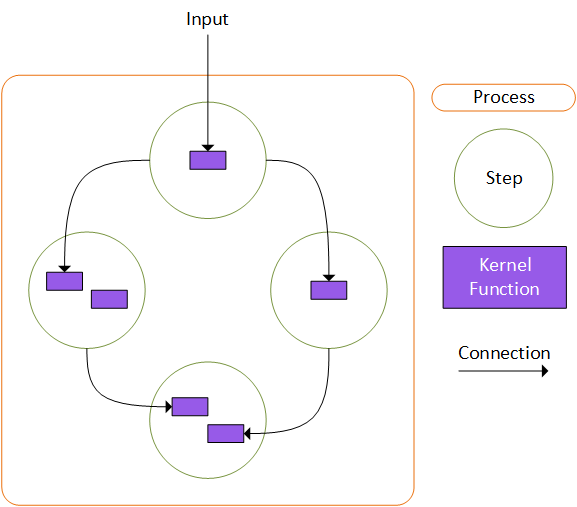

---
# 이 항목들은 선택 사항입니다. 필요 없는 항목은 자유롭게 제거하세요.
status: accepted
contact: bentho
date: September 20, 2024
deciders: bentho, markwallace, estenori, crickman, eavanvalkenburg, evchaki
consulted: bentho, markwallace, estenori, crickman, eavanvalkenburg, evchaki, mabolan
informed: SK-3P-FTE
---

# Semantic Kernel을 사용한 비즈니스 프로세스 실행

## 컨텍스트 및 문제 설명

많은 고객으로부터 AI 통합 비즈니스 프로세스를 자동화하기 위한 엔터프라이즈급 솔루션의 필요성에 대해 들었습니다.
높은 수준에서 비즈니스 프로세스의 구조는 다음과 같습니다:

- 외부 이벤트로 시작
- 구조화된 활동 또는 작업의 컬렉션 포함
- 가치를 추가하는 서비스나 제품을 생산하는 이러한 작업의 정의된 순서
- 비즈니스 목표 달성

기술적 용어로, 프로세스는 그래프의 노드가 작업 단위를 나타내고 노드 간의 엣지가 데이터를 전달할 수도 있고 전달하지 않을 수도 있는 인과적 활성화를 나타내는 그래프로 표현할 수 있는 것입니다. 전통적인 엔터프라이즈 프로세스를 처리하는 데 적합한 그래프 기반 워크플로우 엔진의 많은 예가 있습니다. GitHub Actions & Workflows, Argo Workflows, Dapr Workflows 등이 있습니다. 그러나 AI 통합에 대한 추가 요구 사항은 이러한 프레임워크에서 적절하게 지원되지 않을 수 있는 새로운 요구 사항을 추가합니다. 그래프의 순환 지원, 동적으로 생성되는 노드와 엣지, AI 기반 시나리오를 지원하는 노드 및 엣지 수준 메타데이터, AI 오케스트레이션과의 간소화된 통합 등은 이러한 프레임워크 중 어느 것에서도 완전히 지원되지 않는 것들의 예입니다.

## 결정 요인

- 고객은 Semantic Kernel의 모든 지원 언어에서 기존 투자를 활용할 수 있어야 합니다.
- ```

  ```

- 고객은 기존 인프라 투자를 활용할 수 있어야 합니다.
- 고객은 비즈니스 프로세스 동료와 협업하여 합성 가능한 프로세스를 구축할 수 있어야 합니다.
- 고객은 AI를 사용하여 비즈니스 프로세스 내의 단계를 향상하고 간소화할 수 있어야 합니다.
- 고객은 정의되고 반복 가능한 방식으로 프로세스 흐름을 제어할 수 있어야 합니다.
- 고객은 순환과 동적 엣지가 필요할 수 있는 일반적인 AI 기반 시나리오를 쉽게 모델링할 수 있어야 합니다.
- 프로세스는 단기 일시적 비즈니스 프로세스와 장기 비즈니스 프로세스를 모두 지원할 수 있어야 합니다.
- 프로세스는 로컬에서 실행되거나, 단일 프로세스로 배포되거나, 분산 서비스에 배포될 수 있어야 합니다.
- 프로세스는 추가 소프트웨어나 인프라 없이 로컬에서 실행하고 디버깅할 수 있어야 합니다.
- 프로세스는 상태를 가지며 일시 중지 상태나 복구 가능한 오류에서 재개할 수 있어야 합니다.
- 규제 대상 고객은 현재 실행 중이거나 완료된 프로세스를 엔드 투 엔드로 감사할 수 있어야 합니다.

## 고려된 옵션

### 옵션 #1:

**_기존 워크플로우 프레임워크 위에 기존 샘플 구축_**:
이 옵션은 Dapr Workflows, Argo, Durable Tasks 등의 프레임워크로 탐색되었습니다. 위에 나열된 기술 요구 사항을 지원할 수 있는 이러한 옵션의 하위 집합 중, 주요 관심사는 작업에 필요한 오버헤드의 양입니다. 이러한 프레임워크 중 많은 것들이 시작하는 데 많은 코드와 인프라가 필요하며, 로컬 실행을 위해 특수 에뮬레이터가 필요하여 바람직하지 않습니다. 이 옵션은 다른 옵션과 상호 배타적이지 않다는 점을 언급하는 것이 중요합니다. 다른 경로를 선택하더라도 SK가 다른 워크플로우 엔진과 통합되는 샘플을 구축하기로 선택할 수 있습니다.

### 옵션 #2:

**_기존 워크플로우 프레임워크 내에서 SK Process 라이브러리 구축_**:
탐색된 모든 프레임워크 중에서, 위에 나열된 기술 요구 사항을 가장 가깝게 충족하는 것들은 [Durable Tasks](https://github.com/Azure/durabletask) 기반입니다. 여기에는 Dapr Workflows, Azure Durable Functions 또는 Durable Tasks Framework 자체가 포함됩니다. 이러한 프레임워크에서 작동하는 솔루션을 구축하려는 시도는 노드가 상태를 가지지 않고 중앙 오케스트레이터만 상태를 가지는 Durable Tasks의 기본 구조로 인해 기본 시나리오에 대한 어색한 인터페이스를 만들어 냈습니다. 많은 AI 기반 워크플로우가 이러한 유형의 시스템에서 모델링될 수 있겠지만, 우리의 탐색은 사용성 관점에서 만족스러운 결과를 만들어 내지 못했습니다.

### 옵션 #3:

**_커스텀 빌드 워크플로우 엔진으로 SK Process 라이브러리 구축_**:
커스텀 워크플로우 엔진을 구축하면 가장 깨끗한 통합을 제공할 수 있지만, 우리에게 없는 광범위한 리소스와 시간이 필요합니다. 분산 워크플로우 엔진은 그 자체로 하나의 제품입니다.

### 옵션 #4:

**_기존 워크플로우 프레임워크를 위한 커넥터를 갖춘 플랫폼 독립적 SK Process 라이브러리 구축_**:
이것이 선택된 옵션입니다.

## 결정 결과

**_선택된 옵션 - #4_**: 기존 워크플로우 프레임워크를 위한 커넥터를 갖춘 플랫폼 독립적 SK Process 라이브러리 구축.
이것은 모든 기술적 및 시나리오 기반 요구 사항을 충족할 수 있었던 유일한 옵션입니다. 이 옵션은 Semantic Kernel에 대한 간단하고 잘 통합된 인터페이스와 함께, 고객에게 기존 인프라와 전문 지식을 사용할 수 있는 유연성을 제공하는 많은 기존 분산 런타임을 지원하는 능력을 제공해야 합니다.

### Process 라이브러리의 구성 요소

제안된 프로세스 아키텍처는 그래프 실행 모델을 기반으로 하며, Step이라 부르는 노드는 사용자 정의 Kernel Function을 호출하여 작업을 수행합니다. 그래프의 엣지는 이벤트 기반 관점에서 정의되며 이벤트에 대한 메타데이터와 Kernel Function 호출의 출력을 포함하는 데이터 페이로드를 전달합니다.

기초부터 시작하여, 프로세스의 구성 요소는 다음과 같습니다:

1.  **_KernelFunctions_**: 고객이 이미 알고 사용하는 것과 동일한 KernelFunctions입니다. 새로운 것은 없습니다.
1.  **_Steps_**: Step은 하나 이상의 KernelFunction을 선택적 사용자 정의 상태가 있는 객체로 그룹화합니다. Step은 프로세스 내의 하나의 작업 단위를 나타냅니다. Step은 이벤트를 발생시켜 다른 Step에 작업 결과를 노출합니다. 이 이벤트 기반 구조는 Step이 어떤 프로세스에서 사용되는지 알 필요 없이 생성될 수 있게 하여, 여러 프로세스에서 재사용 가능하게 합니다.
1.  **_Process_**: 프로세스는 여러 Step을 그룹화하고 출력이 Step에서 Step으로 흐르는 방식을 정의합니다. 프로세스는 개발자가 Step에서 발생하는 이벤트의 라우팅을 정의할 수 있는 메서드를 제공하며, 이벤트를 수신해야 하는 Step과 연관된 KernelFunction을 지정합니다.



간단한 프로세스를 만드는 데 필요한 코드를 살펴보겠습니다.

#### 1단계 - Step 정의:

Step은 선택적 활성화 및 비활성화 생명주기 메서드의 구현을 허용하는 추상 `KernelStepBase` 타입을 상속해야 합니다.

```csharp
// 상태 없는 UserInputStep 정의
public class UserInputStep : KernelStepBase
{
    public override ValueTask ActivateAsync()
    {
        return ValueTask.CompletedTask;
    }

    [KernelFunction()]
    public string GetUserInput(string userMessage)
    {
        return $"User: {userMessage}";
    }
}

```

위에 표시된 `UserInputStep`은 하나의 KernelFunction과 상태 관리가 없는 Step의 최소 구현입니다. 이 Step의 코드는 명시적으로 이벤트를 발생시키지 않지만, `PrintUserMessage`의 실행은 관련 결과와 함께 실행의 성공 또는 관련 오류와 함께 실행의 실패를 나타내는 이벤트를 자동으로 발생시킵니다.

사용자 입력을 받아 LLM으로부터 응답을 얻는 두 번째 Step을 만들어 봅시다. 이 Step은 `ChatHistory` 인스턴스를 유지하기 위해 상태를 가집니다. 먼저 상태 추적에 사용할 클래스를 정의합니다:

```csharp
public class ChatBotState
{
    public ChatHistory ChatMessages { get; set; } = new();
}

```

다음으로 Step을 정의합니다:

```csharp
// ChatBotState 타입의 상태를 가진 ChatBotResponseStep 정의
public class ChatBotResponseStep : KernelStepBase<ChatBotState>
{
    private readonly Kernel _kernel;
    internal ChatBotState? _state;

    public ChatBotResponseStep(Kernel kernel)
    {
        _kernel = kernel;
    }

    public override ValueTask ActivateAsync(ChatBotState state)
    {
        _state = state;
        _state.ChatMessages ??= new();
        return ValueTask.CompletedTask;
    }

    [KernelFunction()]
    public async Task GetChatResponse(KernelStepContext context, string userMessage)
    {
        _state!.ChatMessages.Add(new(AuthorRole.User, userMessage));
        IChatCompletionService chatService = _kernel.Services.GetRequiredService<IChatCompletionService>();
        ChatMessageContent response = await chatService.GetChatMessageContentAsync(_state.ChatMessages);
        if (response != null)
        {
            _state.ChatMessages.Add(response!);
        }

        // 이벤트 발생: assistantResponse
        context.PostEvent(new CloudEvent { Id = ChatBotEvents.AssistantResponseGenerated, Data = response });
    }
}

```

`ChatBotResponseStep`은 `UserInputStep`보다 더 현실적이며 다음 기능을 보여줍니다:

**_상태 관리_**: 가장 먼저 눈에 띄는 것은 상태 객체가 프로세스에 의해 자동으로 생성되어 `ActivateAsync` 메서드에 주입된다는 것입니다. 프로세스는 Step의 KernelFunction이 성공적으로 실행된 직후 자동으로 상태 객체를 유지합니다. 프로세스는 상태 객체를 유지하고 복원하기 위해 JSON 직렬화를 사용하므로, 이러한 타입에 기본 생성자가 있고 JSON 직렬화 가능한 객체만 포함해야 합니다.

**_Step 컨텍스트_**: `GetChatResponse` KernelFunction에는 프로세스에 의해 자동으로 제공되는 `KernelStepContext` 타입의 인수가 있습니다. 이 객체는 이 경우 `ChatBotEvents.AssistantResponseGenerated`와 같은 이벤트를 명시적으로 발생시킬 수 있는 기능을 제공합니다. Step 컨텍스트는 또한 내구성 타이머 활용 및 프로세스에 새 Step을 동적으로 추가하는 것과 같은 고급 시나리오를 위한 기능을 제공할 수 있습니다.

**_Cloud Events_**: Step과 프로세스의 이벤트는 [Cloud Events](https://github.com/cloudevents/spec)를 활용합니다. Cloud Events는 서비스, 플랫폼 및 시스템 간의 상호 운용성을 제공하기 위해 일반적인 형식으로 이벤트 데이터를 설명하는 오픈 소스 및 산업 표준 사양을 제공합니다. 이를 통해 프로세스가 커스텀 커넥터나 매핑 미들웨어 없이 외부 시스템으로/에서 이벤트를 발생/수신할 수 있습니다.

#### 2단계 - 프로세스 정의:

이제 Step이 정의되었으므로, 프로세스를 정의하는 단계로 넘어갈 수 있습니다. 먼저 프로세스에 Step을 추가합니다...

```csharp

KernelProcess process = new("ChatBot");

var userInputStep = process.AddStepFromType<UserInputStep>(isEntryPoint: true);
var responseStep = process.AddStepFromType<ChatBotResponseStep>();

```

위에서 생성된 두 Step이 새 `ChatBot` 프로세스에 추가되었고 `UserInputStep`이 진입점으로 선언되었습니다. 이는 프로세스가 수신하는 모든 이벤트가 이 Step으로 전달됨을 의미합니다. 이제 Step의 이벤트에 의해 트리거되는 작업을 설명하여 프로세스의 흐름을 정의해야 합니다.

```csharp

// userInput Step이 완료되면, 출력을 llm 응답 Step으로 전송
userInputStep
    .OnFunctionResult(nameof(UserInputStep.GetUserInput))
    .SendOutputTo(responseStep, nameof(ChatBotResponseStep.GetChatResponse), "userMessage");

```

위 코드에서 `userInputStep.OnFunctionResult(nameof(UserInputStep.GetUserInput))`는 `userInputStep`이 참조하는 Step 인스턴스에서 `GetUserInput` KernelFunction의 성공적인 실행 시 프로세스가 발생시키는 이벤트를 선택합니다. 그런 다음 컨텍스트에 기반한 작업을 제공하는 빌더 타입 객체를 반환합니다. 이 경우 `SendOutputTo(responseStep, nameof(ChatBotResponseStep.GetChatResponse), "userMessage")` 작업은 이벤트 데이터를 `responseStep`이 참조하는 Step 인스턴스의 `GetChatResponse` KernelFunction의 `userMessage` 파라미터로 전달하는 데 사용됩니다.

여기서 핵심 포인트 중 하나는 주어진 Step에서 발생한 이벤트가 다른 Step 내의 **_특정 KernelFunction의 특정 파라미터_**로 선택되어 전달될 수 있다는 것입니다. KernelFunction의 파라미터로 전송된 이벤트 데이터는 함수의 모든 필수 파라미터가 입력을 받을 때까지 큐에 저장되며, 그 시점에 함수가 호출됩니다.

#### 3단계 - 프로세스에서 출력 가져오기:

프로세스를 정의했으므로, 이제 생성하는 최종 결과를 검사하고 싶습니다. 많은 경우 프로세스의 결과는 데이터베이스나 큐 또는 다른 내부 시스템에 기록되며 그것으로 충분합니다. 그러나 동기식 REST 호출의 결과로 서버에서 실행되는 프로세스의 경우와 같이, 완료된 프로세스에서 결과를 추출하여 호출자에게 반환해야 하는 경우가 있습니다. 이러한 경우 특정 이벤트에 의해 트리거되도록 프로세스에 핸들러 함수를 등록할 수 있습니다.

`ChatBotResponseStep` Step이 완료될 때 핸들러 함수를 실행하도록 위의 프로세스를 연결해 봅시다.

```csharp

process.OnEvent(ChatBotEvents.AssistantResponseGenerated).Run((CloudEvent e) =>
{
    result = (int)e.Data!;
    Console.WriteLine($"Result: {result}");
});

```

주목해야 할 핵심 사항은 프로세스 내에서 `ChatBotResponseStep`이 발생시킨 이벤트가 프로세스 자체에서도 발생된다는 것입니다. 이를 통해 핸들러를 등록할 수 있습니다. 프로세스 내의 모든 이벤트는 프로세스에서 부모로 버블업되며, 부모는 프로세스를 실행하는 프로그램이거나 다른 프로세스일 수 있습니다. 이 패턴은 기존 프로세스를 다른 프로세스의 Step으로 사용할 수 있는 중첩 프로세스를 허용합니다.

#### 4단계 - 프로세스 객체 모델:

우리가 만든 `KernelProcess` 인스턴스는 기본 그래프를 설명하는 객체 모델에 불과합니다. 이는 Step의 컬렉션을 포함하며, 각 Step은 엣지의 컬렉션을 포함합니다. 이 객체 모델은 Json/Yaml과 같은 사람이 읽을 수 있는 형식으로 직렬화 가능하도록 설계되어, 프로세스 정의를 프로세스가 실행되는 시스템과 분리할 수 있습니다.

```json
{
  "EntryPointId": "efbfc9ca0c1942a384d21402c9078784",
  "Id": "19f669adfa5b40688e818e400cb9750c",
  "Name": "NestedChatBot",
  "StepType": "SemanticKernel.Processes.Core.KernelProcess, SemanticKernel.Processes.Core, Version=1.0.0.0, Culture=neutral, PublicKeyToken=null",
  "StateType": "SemanticKernel.Processes.Core.DefaultState, SemanticKernel.Processes.Core, Version=1.0.0.0, Culture=neutral, PublicKeyToken=null",
  "OutputEdges": {},
  "StepProxies": [
    {
      "Id": "6fa2d6b513464eb5a4daa9b5ebc1a956",
      "Name": "UserInputStep",
      "StepType": "SkProcess.Orleans.Silo.UserInputStep, SkProcess.Orleans.Silo, Version=1.0.0.0, Culture=neutral, PublicKeyToken=null",
      "StateType": "SkProcess.Orleans.Silo.UserInputState, SkProcess.Orleans.Silo, Version=1.0.0.0, Culture=neutral, PublicKeyToken=null",
      "OutputEdges": {
        "UserInputStep_6fa2d6b513464eb5a4dxa9b5ebc1a956.exit": [
          {
            "SourceId": "6fa2d6b513464eb5a4dxa9b5ebc1a956",
            "OutputTargets": [
              {
                "StepId": "End",
                "FunctionName": "",
                "ParameterName": ""
              }
            ]
          }
        ],
        "UserInputStep_6fa2d6b513464eb5a4dxa9b5ebc1a956.userInputReceived": [
          {
            "SourceId": "6fa2d6b513464eb5a4daa9b5ebc1a956",
            "OutputTargets": [
              {
                "StepId": "5035d41383314343b99ebf6e1a1a1f99",
                "FunctionName": "GetChatResponse",
                "ParameterName": "userMessage"
              }
            ]
          }
        ]
      }
    },
    {
      "Id": "5035d41383314343b99ebf6e1a1a1f99",
      "Name": "AiResponse",
      "StepType": "SemanticKernel.Processes.Core.KernelProcess, SemanticKernel.Processes.Core, Version=1.0.0.0, Culture=neutral, PublicKeyToken=null",
      "StateType": "SemanticKernel.Processes.Core.DefaultState, SemanticKernel.Processes.Core, Version=1.0.0.0, Culture=neutral, PublicKeyToken=null",
      "OutputEdges": {
        "AiResponse_5035d41383314343b99ebf6e1a1a1f99.TransformUserInput.OnResult": [
          {
            "SourceId": "5035d41383314343b99ebf6e1a1a1f99",
            "OutputTargets": [
              {
                "StepId": "6fa2d6b513464eb5a4daa9b5ebc1a956",
                "FunctionName": "GetUserInput",
                "ParameterName": ""
              }
            ]
          }
        ]
      }
    }
  ]
}
```

#### 5단계 - 프로세스 실행:

프로세스를 실행하려면 지원되는 런타임에 대한 "커넥터"를 사용해야 합니다. 코어 패키지의 일부로 개발 머신이나 서버에서 로컬로 프로세스를 실행할 수 있는 인프로세스 런타임을 포함합니다. 이 런타임은 초기에 메모리 또는 파일 기반 영속성을 사용하며 쉬운 개발과 디버깅을 가능하게 합니다.

또한 [Orleans](https://learn.microsoft.com/en-us/dotnet/orleans/overview) 및 [Dapr Actor](https://docs.dapr.io/developing-applications/building-blocks/actors/actors-overview/) 기반 런타임을 지원하여 고객이 프로세스를 분산되고 높은 확장성을 가진 클라우드 기반 시스템으로 쉽게 배포할 수 있게 합니다.

### 패키지

프로세스를 위해 다음 패키지가 생성됩니다:

- **_Microsoft.SemanticKernel.Process.Abstractions_**

  모든 다른 패키지에서 사용되는 공통 인터페이스와 DTO를 포함합니다.

- **_Microsoft.SemanticKernel.Process.Core_**

  Step과 프로세스 정의를 위한 핵심 기능을 포함합니다.

- **_Microsoft.SemanticKernel.Process.Server_**

  인프로세스 런타임을 포함합니다.

- **_Microsoft.SemanticKernel.Process_**

  Microsoft.SemanticKernel.Process.Abstractions, Microsoft.SemanticKernel.Process.Core, Microsoft.SemanticKernel.Process.Server를 포함합니다.

- **_Microsoft.SemanticKernel.Process.Orleans_**

  Orleans 기반 런타임을 포함합니다.

- **_Microsoft.SemanticKernel.Process.Dapr_**

  Dapr 기반 런타임을 포함합니다.

## 추가 정보

### 프로세스 런타임 아키텍처:

제안된 솔루션의 검증에서, 로컬/서버 시나리오용과 Orleans를 사용한 분산 액터 시나리오용 두 개의 런타임이 만들어졌습니다. 이 두 구현 모두 대규모 그래프 처리를 위한 [Pregel 알고리즘](https://kowshik.github.io/JPregel/pregel_paper.pdf)을 기반으로 합니다. 이 알고리즘은 잘 테스트되었으며 단일 머신 시나리오와 분산 시스템 모두에 적합합니다. Pregel 알고리즘의 작동 방식에 대한 자세한 정보는 다음 링크에서 찾을 수 있습니다.

<!-- [Pregel - The Morning Paper](https://blog.acolyer.org/2015/05/26/pregel-a-system-for-large-scale-graph-processing/) -->
<!-- [Pregel - Distributed Algorithms and Optimization](https://web.stanford.edu/~rezab/classes/cme323/S15/notes/lec8.pdf) -->
