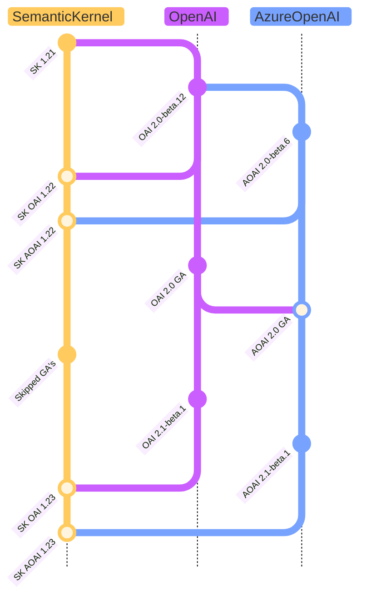
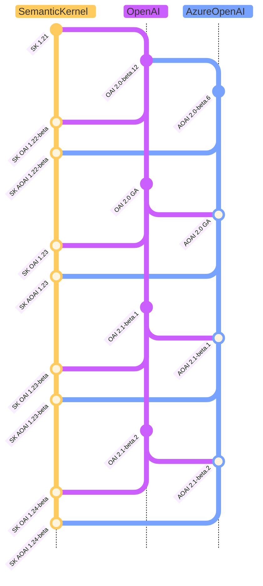
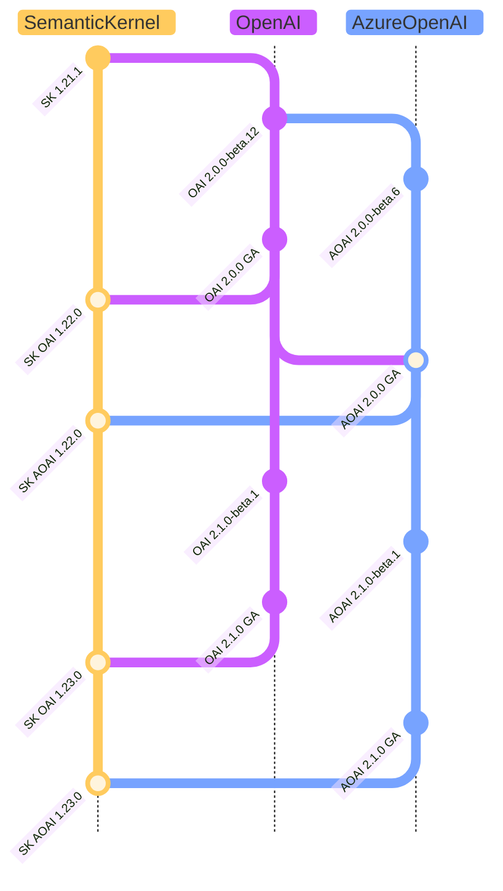

---
# 이 항목들은 선택 사항입니다. 필요 없는 항목은 자유롭게 제거하세요.
status: accepted
contact: rogerbarreto
date: 2024-10-03
deciders: sergeymenshykh, markwallace, rogerbarreto, westey-m, dmytrostruk, evchaki
consulted: crickman
---

# 기반 SDK에 대한 커넥터 버전 관리 전략

## 컨텍스트 및 문제 설명

이번 주(01-10-2024)에 OpenAI와 Azure OpenAI가 첫 번째 안정 버전을 출시했으며, 다른 커넥터 및 공급자 버전 관리 전략의 향후 방향을 설정할 `OpenAI` 및 `AzureOpenAI` 커넥터의 다음 릴리스에 대한 버전 관리 전략을 진행하기 위한 몇 가지 옵션을 제시해야 합니다.

이 ADR은 사용자에 대한 영향과 전략에 대한 명확한 메시지를 유지하는 방법을 고려하여 앞으로 나아갈 수 있는 다양한 옵션을 제시합니다.

현재 Azure Open AI GA 패키지는 예상과 달리 첫 GA 버전에서 이전에 프리뷰 패키지에서 사용 가능했던 많은 기능을 제거하기로 결정했습니다.

이로 인해 커넥터의 다음 버전에 대한 전략을 재고해야 합니다.

| 이름                | SDK 네임스페이스   | Semantic Kernel 네임스페이스                       |
| ------------------- | --------------- | ----------------------------------------------- |
| OpenAI (OAI)        | OpenAI          | Microsoft.SemanticKernel.Connectors.OpenAI      |
| Azure OpenAI (AOAI) | Azure.AI.OpenAI | Microsoft.SemanticKernel.Connectors.AzureOpenAI |

## 결정 요인

- 고객에 대한 영향 최소화
- 고객이 OpenAI 및 Azure.AI.OpenAI 패키지의 GA 또는 Beta 버전을 사용할 수 있도록 허용
- 전략에 대한 명확한 메시지 유지
- 이전 버전과의 호환성 유지
- 패키지 버전 관리로 어떤 버전의 OpenAI 또는 Azure.AI.OpenAI 패키지에 의존하는지 명확히 함
- 다른 SDK 버전 전략과 잘 맞는 방식으로 Semantic Kernel 버전 관리 전략을 따름

## 고려된 옵션

1. **현행 유지** - 프리뷰 패키지만 대상으로 함.
2. **프리뷰 + GA 버전 관리** (Azure OpenAI 및 OpenAI 커넥터의 새 버전(GA + 프리릴리스)을 나란히 생성).
3. **프리뷰 패키지 대상 중단**, 앞으로 GA 패키지만 대상으로 함.

## 1. 현행 유지 - 프리뷰 패키지만 대상으로 함

이 옵션은 프리뷰 패키지만 대상으로 하는 현재 전략을 유지하며, 이전 버전 및 고객을 위한 새 GA 대상 버전 및 파이프라인과의 호환성을 유지합니다. 이 옵션은 사용자와 파이프라인 전략에 가장 적은 영향을 미칩니다.

현재 Azure OpenAI 커넥터를 사용하는 모든 고객은 이미 프리뷰 패키지를 사용하도록 파이프라인이 구성되어 있습니다.

장점:

- 전략 변경 없음. (고객에 대한 최소 영향)
- 이전 버전 및 새 GA 대상 버전과 파이프라인과의 호환성 유지.
- 프리뷰 패키지를 대상으로 하는 이전 전략과 호환.
- Azure와 OpenAI SDK는 항상 새 GA 버전과 동기화되어, 최신 GA 패치로 프리뷰를 대상으로 계속 유지 가능.

단점:

- OpenAI 또는 AzureOpenAI에 대한 안정적인 GA 패키지를 대상으로 하는 SK 커넥터 버전이 없을 것임.
- GA로만 사용 가능한 기능을 이해하고 대상으로 하며 의존 패키지도 GA여야 하는 엄격한 요구 사항을 가진 새 고객은 SK 커넥터를 사용할 수 없음. (추정할 수는 없지만 지난 18개월 동안 사용 가능한 프리뷰 Azure SDK OpenAI SDK를 이미 사용하고 있는 고객 수에 비해 매우 적을 수 있음)
- OpenAI 및 Azure.AI.OpenAI 베타 버전에서 도입된 의존성으로 인해 결국 전달하게 될 수 있는 예상치 못한 호환성 깨짐 변경 가능성.

## 2. 프리뷰 + GA 버전 관리

이 옵션에서는 커넥터의 프리릴리스 버전을 도입합니다:

1. 커넥터의 일반 출시(GA) 버전은 SDK의 GA 버전을 대상으로 합니다.
2. 커넥터의 프리릴리스 버전은 SDK의 프리릴리스 버전을 대상으로 합니다.

이 옵션은 프리뷰 기능이 기반 SDK GA 버전에서 더 이상 사용 가능하지 않은 상태에서 파이프라인에서 엄격하게 GA 패키지만 대상으로 하던 고객에게 일부 영향을 미칩니다.

SDK의 GA 버전에서 사용 가능하지 않은 모든 프리뷰 전용 기능은 Semantic Kernel 커넥터에서 실험적 `SKEXP0011` 전용 식별자 어트리뷰트로 어노테이션되어, `GA` 패키지로 이동할 때의 잠재적 영향을 식별하고 명확히 합니다.
해당 어노테이션은 SDK의 GA 버전에서 공식적으로 지원되는 즉시 제거됩니다.

장점:

- Azure와 OpenAI가 안정적이라고 간주하는 것과 그렇지 않은 것에 대해 앞으로 명확한 메시지를 보내며, 이전에 GA로 사용 가능하다고 간주했던 기능에서 해당 SDK의 안정적인 기능만 노출합니다.
- 의존 패키지도 GA여야 하는 엄격한 요구 사항을 가진 새 고객이 SK 커넥터를 사용할 수 있게 됩니다.
- GA 버전에 영향을 주지 않으면서 아직 GA가 아닌 새 기능을 위한 커넥터의 프리뷰 버전을 가질 수 있습니다.

단점:

- 버전 관리 전략이 변경되어, 영향을 완화하거나 전환을 부드럽게 하기 위해 첫 번째 릴리스에 대한 명확한 설명과 커뮤니케이션이 필요합니다.
- 이전 SK GA 패키지에서 사용 가능했던 `OpenAI` 및 `AzureOpenAI` 프리뷰 전용 기능을 사용하던 고객은 향후 SK 프리릴리스 버전만 대상으로 하도록 파이프라인을 업데이트해야 합니다.
- 커넥터의 두 버전을 유지하는 데 약간의 오버헤드.

### 버전 및 브랜치 전략

해당 릴리스에 대상 `GA` 버전의 커넥터를 위한 특별 릴리스 브랜치를 만들어, 안정적 릴리스와 작동하기 위해 다른 모든 프로젝트가 수행해야 하는 모든 수정/제거 사항을 기록합니다. 이것은 또한 API 샘플에서 `SKEXP0011` 예외를 언제 어디에 추가/제거할지에 대한 중요한 가이드라인이 됩니다.

기반 SDK의 `beta` 버전에 대해서는 `beta` 접두사를 추가하여 자체 버전 케이던스를 따릅니다.

| 순서 | OpenAI 버전 | Azure OpenAI 버전 | Semantic Kernel 버전1 | 브랜치          |
| --- | -------------- | -------------------- | ----------------------------------- | --------------- |
| 1   | 2.0.0          | 2.0.0                | 1.25.0                              | releases/1.25.0 |
| 2   | 2.1.0-beta.1   | 2.1.0-beta.1         | 1.26.0-beta                         | main            |
| 3   | 2.1.0-beta.3   | 2.1.0-beta.2         | 1.27.0-beta                         | main            |
| 4   | 변경 없음     | 변경 없음           | 1.27.1-beta**2**         | main            |
| 5   | 2.1.0          | 2.1.0                | 1.28.0                              | releases/1.28.0 |
| 6   | 2.2.0-beta.1   | 2.1.0-beta.1         | 1.29.0-beta                         | main            |

1. 버전은 **커넥터 패키지**와 **Semantic Kernel 메타 패키지**에 적용됩니다.
2. SDK에는 변경이 없지만 버전 업데이트가 필요한 Semantic Kernel 코드베이스에 대한 기타 마이너 변경.

### 선택적 부드러운 전환

전환을 부드럽게 하고 SK GA 패키지에서 프리뷰 기능을 즉시 사용하는 고객에 대한 영향을 완화하기 위해, 고객이 향후 커넥터 패키지의 `preview` vs `GA` 릴리스에 적응할 시간을 주는 공지 기간을 제공합니다. 공지 기간 동안 **현행 유지** 옵션으로 전략을 유지한 후 **프리뷰 + GA 버전 관리** 옵션으로 전환합니다.

## 3. 프리뷰 패키지 대상 중단

> [!WARNING]
> 이 옵션은 권장되지 않지만 고려해야 합니다.

이 옵션은 프리뷰 패키지를 대상으로 하는 것을 중단하며, 1.0 GA 전략에 엄격하게 따라 고객을 비-GA SDK 기능에 GA 기능으로 노출시키지 않습니다.

Azure Assistants와 같은 대규모 기능이 아직 프리뷰 상태이므로, 에이전트 프레임워크 및 아직 일반 출시되지 않은 기타 중요한 기능을 대상으로 하던 고객에게 이 옵션은 큰 영향을 미칩니다. [여기](https://github.com/Azure/azure-sdk-for-net/releases/tag/Azure.AI.OpenAI_2.0.0)에 설명되어 있습니다.

> Assistants, Audio Generation, Batch, Files, Fine-Tuning, Vector Stores는 아직 GA에 포함되지 않았습니다. 프리뷰 라이브러리 릴리스와 원래 Azure OpenAI Service api-version 레이블에서 계속 사용 가능합니다.

장점:

- GA 버전의 커넥터만 배포해 왔으므로, 엄격하게 GA SK 패키지에서 고객을 프리뷰 기능에 GA 기능으로 노출시키지 않는 책임 있는 GA 전용 접근 방식을 따르게 됩니다.

단점:

- 커넥터의 프리뷰 버전에 의존할 옵션 없이 프리뷰 기능을 대상으로 하는 고객에게 큰 영향.
- 이 전략은 Azure의 Assistants 및 기타 프리뷰 기능과 함께 Semantic Kernel을 사용하는 것을 비실용적으로 만듭니다.

## 결정 결과

선택된 옵션: **현행 유지**

현재 AI SDK 환경은 빠르게 변화하는 환경이므로, 업데이트할 수 있어야 하면서 동시에 현재 버전 관리 전략을 가능한 한 혼합하지 않고 고객에 대한 영향을 최소화해야 합니다. 지금은 **현행 유지** 옵션을 결정했으며, 해당 결정이 이미 고객 기반이 사용하고 있는 중요한 기능의 부족으로 큰 영향을 미치지 않을 때 향후 **프리뷰 + GA 버전 관리** 옵션을 재고할 수 있습니다.
