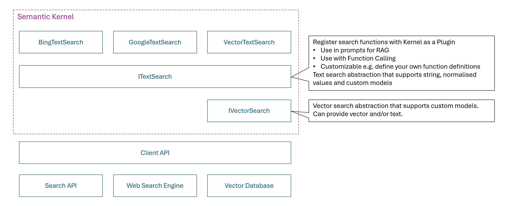
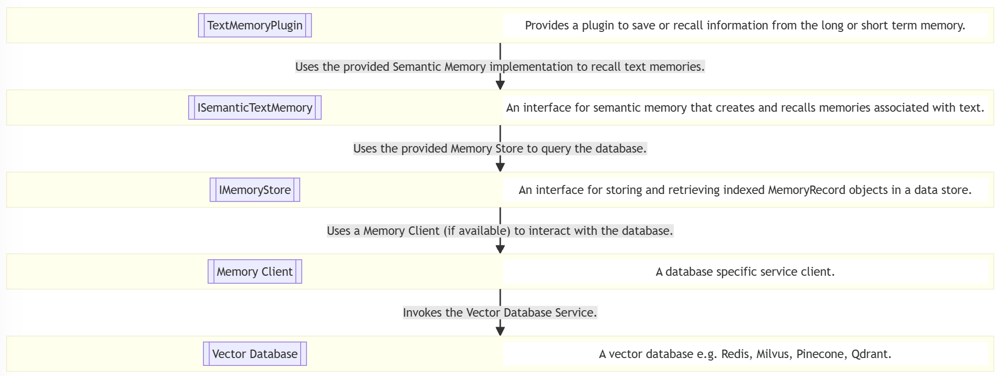
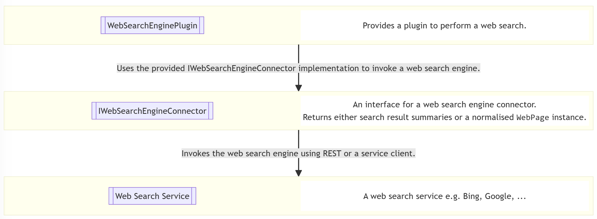

---
# These are optional elements. Feel free to remove any of them.
status: proposed
contact: markwallace
date: 2024-08-21
deciders: sergeymenshykh, markwallace, rbarreto, dmytrostruk, westey
consulted: stephentoub, matthewbolanos, shrojans 
informed: 
---

# 텍스트 검색 추상화

## 컨텍스트 및 문제 설명

Semantic Kernel은 인기 있는 벡터 데이터베이스(예: Azure AI Search, Chroma, Milvus)와 웹 검색 엔진(예: Bing, Google)을 사용한 검색을 지원합니다.
개발자가 벡터 데이터베이스 또는 웹 검색 엔진에 대해 검색을 수행하려는지에 따라 두 세트의 추상화와 플러그인이 있습니다.
현재 추상화는 실험적이며, 이 ADR의 목적은 추상화의 설계를 진전시켜 비실험적 상태로 졸업할 수 있도록 하는 것입니다.

지원해야 할 두 가지 주요 사용 사례가 있습니다:

1. 프롬프트 엔지니어가 프롬프트에 그라운딩 정보를 쉽게 삽입할 수 있도록 함, 즉 검색 증강 생성(RAG) 시나리오 지원.
2. 개발자가 LLM이 사용자 요청에 응답하는 데 필요한 추가 데이터를 검색하기 위해 호출할 수 있는 검색 플러그인을 등록할 수 있도록 함, 즉 함수 호출 시나리오 지원.

이 두 시나리오의 공통점은 검색 서비스에서 `KernelPlugin`을 생성하고 `Kernel`에 사용하도록 등록해야 한다는 것입니다.

### 검색 증강 생성(RAG) 시나리오

검색 증강 생성(RAG)은 LLM의 출력을 최적화하는 프로세스로, 응답 생성 시 학습 데이터에 포함되지 않을 수 있는 신뢰할 수 있는 데이터를 참조합니다. 이를 통해 환각의 가능성을 줄이고, 최종 사용자가 LLM의 응답을 독립적으로 검증하는 데 사용할 수 있는 인용을 제공할 수 있습니다. RAG는 사용자 쿼리와 관련된 추가 데이터를 검색한 다음, LLM에 보내기 전에 이 데이터로 프롬프트를 보강하는 방식으로 작동합니다.

상위 Bing 검색 결과가 프롬프트에 추가 데이터로 포함되는 다음 샘플을 고려해 보세요.

```csharp
// Create a kernel with OpenAI chat completion
IKernelBuilder kernelBuilder = Kernel.CreateBuilder();
kernelBuilder.AddOpenAIChatCompletion(
        modelId: TestConfiguration.OpenAI.ChatModelId,
        apiKey: TestConfiguration.OpenAI.ApiKey,
        httpClient: httpClient);
Kernel kernel = kernelBuilder.Build();

// Create a text search using the Bing search service
var textSearch = new BingTextSearch(new(TestConfiguration.Bing.ApiKey));

// Build a text search plugin with Bing search service and add to the kernel
var searchPlugin = textSearch.CreateKernelPluginWithTextSearch("SearchPlugin");
kernel.Plugins.Add(searchPlugin);

// Invoke prompt and use text search plugin to provide grounding information
var query = "What is the Semantic Kernel?";
KernelArguments arguments = new() { { "query", query } };
Console.WriteLine(await kernel.InvokePromptAsync("{{SearchPlugin.Search $query}}. {{$query}}", arguments));
```

이 예시의 작동 방식:

1. Bing 검색 쿼리를 수행할 수 있는 `BingTextSearch`를 생성합니다.
2. `BingTextSearch`를 프롬프트 렌더링 시 호출할 수 있는 플러그인으로 래핑합니다.
3. 사용자 쿼리를 사용하여 검색을 수행하는 플러그인 호출을 삽입합니다.
4. 프롬프트가 상위 검색 결과의 요약으로 보강됩니다.

**참고:** 이 경우 검색 결과의 요약만 프롬프트에 포함됩니다.
LLM은 관련성이 있다고 판단하면 이 데이터를 사용해야 하지만, 사용자가 데이터의 출처를 검증할 수 있는 피드백 메커니즘이 없습니다.

다음 샘플은 이 문제에 대한 해결책을 보여줍니다.

```csharp
// Create a kernel with OpenAI chat completion
IKernelBuilder kernelBuilder = Kernel.CreateBuilder();
kernelBuilder.AddOpenAIChatCompletion(
        modelId: TestConfiguration.OpenAI.ChatModelId,
        apiKey: TestConfiguration.OpenAI.ApiKey,
        httpClient: httpClient);
Kernel kernel = kernelBuilder.Build();

// Create a text search using the Bing search service
var textSearch = new BingTextSearch(new(TestConfiguration.Bing.ApiKey));

// Build a text search plugin with Bing search service and add to the kernel
var searchPlugin = textSearch.CreateKernelPluginWithGetSearchResults("SearchPlugin");
kernel.Plugins.Add(searchPlugin);

// Invoke prompt and use text search plugin to provide grounding information
var query = "What is the Semantic Kernel?";
string promptTemplate = @"
{{#with (SearchPlugin-GetSearchResults query)}}  
  {{#each this}}  
    Name: {{Name}}
    Value: {{Value}}
    Link: {{Link}}
    -----------------
  {{/each}}  
{{/with}}  

{{query}}

Include citations to the relevant information where it is referenced in the response.
";

KernelArguments arguments = new() { { "query", query } };
HandlebarsPromptTemplateFactory promptTemplateFactory = new();
Console.WriteLine(await kernel.InvokePromptAsync(
    promptTemplate,
    arguments,
    templateFormat: HandlebarsPromptTemplateFactory.HandlebarsTemplateFormat,
    promptTemplateFactory: promptTemplateFactory
));
```

이 예시의 작동 방식:

1. Bing 검색 쿼리를 수행하고 응답을 정규화된 형식으로 변환할 수 있는 `BingTextSearch`를 생성합니다.
2. 정규화된 형식은 각 검색 결과에 대한 이름, 값 및 링크를 포함하는 `TextSearchResult`라는 Semantic Kernel 추상화입니다.
3. `BingTextSearch`를 프롬프트 렌더링 시 호출할 수 있는 플러그인으로 래핑합니다.
4. 사용자 쿼리를 사용하여 검색을 수행하는 플러그인 호출을 삽입합니다.
5. 프롬프트가 상위 검색 결과의 이름, 값 및 링크로 보강됩니다.
6. 프롬프트는 또한 LLM에게 응답에 관련 정보에 대한 인용을 포함하도록 지시합니다.

An example response would look like this:

```
The Semantic Kernel (SK) is a lightweight and powerful SDK developed by Microsoft that integrates Large Language Models (LLMs) such as OpenAI, Azure OpenAI, and Hugging Face with traditional programming languages like C#, Python, and Java ([GitHub](https://github.com/microsoft/semantic-kernel)). It facilitates the combination of natural language processing capabilities with pre-existing APIs and code, enabling developers to add large language capabilities to their applications swiftly ([What It Is and Why It Matters](https://techcommunity.microsoft.com/t5/microsoft-developer-community/semantic-kernel-what-it-is-and-why-it-matters/ba-p/3877022)).

The Semantic Kernel serves as a middleware that translates the AI model's requests into function calls, effectively bridging the gap between semantic functions (LLM tasks) and native functions (traditional computer code) ([InfoWorld](https://www.infoworld.com/article/2338321/semantic-kernel-a-bridge-between-large-language-models-and-your-code.html)). It also enables the automatic orchestration and execution of tasks using natural language prompting across multiple languages and platforms ([Hello, Semantic Kernel!](https://devblogs.microsoft.com/semantic-kernel/hello-world/)).

In addition to its core capabilities, Semantic Kernel supports advanced functionalities like prompt templating, chaining, and planning, which allow developers to create intricate workflows tailored to specific use cases ([Architecting AI Apps](https://devblogs.microsoft.com/semantic-kernel/architecting-ai-apps-with-semantic-kernel/)).

By describing your existing code to the AI models, Semantic Kernel effectively marshals the request to the appropriate function, returns results back to the LLM, and enables the AI agent to generate a final response ([Quickly Start](https://learn.microsoft.com/en-us/semantic-kernel/get-started/quick-start-guide)). This process brings unparalleled productivity and new experiences to application users ([Hello, Semantic Kernel!](https://devblogs.microsoft.com/semantic-kernel/hello-world/)).

The Semantic Kernel is an indispensable tool for developers aiming to build advanced AI applications by seamlessly integrating large language models with traditional programming frameworks ([Comprehensive Guide](https://gregdziedzic.com/understanding-semantic-kernel-a-comprehensive-guide/)).
```

**참고:** 이 경우 관련 정보에 대한 링크가 있으므로 최종 사용자는 링크를 따라 응답을 검증할 수 있습니다.

다음 샘플은 Bing 텍스트 검색과 내장 결과 타입을 사용하는 대안 솔루션을 보여줍니다.

```csharp
// Create a kernel with OpenAI chat completion
IKernelBuilder kernelBuilder = Kernel.CreateBuilder();
kernelBuilder.AddOpenAIChatCompletion(
        modelId: TestConfiguration.OpenAI.ChatModelId,
        apiKey: TestConfiguration.OpenAI.ApiKey,
        httpClient: httpClient);
Kernel kernel = kernelBuilder.Build();

// Create a text search using the Bing search service
var textSearch = new BingTextSearch(new(TestConfiguration.Bing.ApiKey));

// Build a text search plugin with Bing search service and add to the kernel
var searchPlugin = textSearch.CreateKernelPluginWithGetBingWebPages("SearchPlugin");
kernel.Plugins.Add(searchPlugin);

// Invoke prompt and use text search plugin to provide grounding information
var query = "What is the Semantic Kernel?";
string promptTemplate = @"
{{#with (SearchPlugin-GetBingWebPages query)}}  
  {{#each this}}  
    Name: {{Name}}
    Snippet: {{Snippet}}
    Link: {{DisplayUrl}}
    Date Last Crawled: {{DateLastCrawled}}
    -----------------
  {{/each}}  
{{/with}}  

{{query}}

Include citations to and the date of the relevant information where it is referenced in the response.
";
KernelArguments arguments = new() { { "query", query } };
HandlebarsPromptTemplateFactory promptTemplateFactory = new();
Console.WriteLine(await kernel.InvokePromptAsync(
    promptTemplate,
    arguments,
    templateFormat: HandlebarsPromptTemplateFactory.HandlebarsTemplateFormat,
    promptTemplateFactory: promptTemplateFactory
));
```

이 예시의 작동 방식:

1. Bing 검색 쿼리를 수행할 수 있는 `BingTextSearch`를 생성합니다.
2. 기본 형식은 각 검색 결과에 대한 이름, 스니펫, 표시 URL 및 마지막 크롤링 날짜를 포함하는 `BingWebPage`라는 Bing 전용 클래스입니다.
3. `BingTextSearch`를 프롬프트 렌더링 시 호출할 수 있는 플러그인으로 래핑합니다.
4. 사용자 쿼리를 사용하여 검색을 수행하는 플러그인 호출을 삽입합니다.
5. 프롬프트가 상위 검색 결과의 이름, 스니펫, 표시 URL 및 마지막 크롤링 날짜로 보강됩니다.
6. 프롬프트는 또한 LLM에게 응답에 관련 정보에 대한 인용과 날짜를 포함하도록 지시합니다.

An example response would look like this:

```
Semantic Kernel is an open-source development kit designed to facilitate the integration of advanced AI models into existing C#, Python, or Java codebases. It serves as an efficient middleware that enables rapid delivery of enterprise-grade AI solutions (Microsoft Learn, 2024-08-14).

One of the standout features of Semantic Kernel is its lightweight SDK, which allows developers to blend conventional programming languages with Large Language Model (LLM) AI capabilities through prompt templating, chaining, and planning (Semantic Kernel Blog, 2024-08-10).

This AI SDK uses natural language prompting to create and execute semantic AI tasks across multiple languages and platforms, offering developers a simple yet powerful programming model to add large language capabilities to their applications in a matter of minutes (Microsoft Developer Community, 2024-08-13).

Semantic Kernel also leverages function calling—a native feature of most LLMs—enabling the models to request specific functions to fulfill user requests, thereby streamlining the planning process (Microsoft Learn, 2024-08-14).

The toolkit is versatile and extends support to multiple programming environments. For instance, Semantic Kernel for Java is compatible with Java 8 and above, making it accessible to a wide range of Java developers (Semantic Kernel Blog, 2024-08-14).

Additionally, Sketching an architecture with Semantic Kernel can simplify business automation using models from platforms such as OpenAI, Azure OpenAI, and Hugging Face (Semantic Kernel Blog, 2024-08-14).

For .NET developers, Semantic Kernel is highly recommended for working with AI in .NET applications, offering a comprehensive guide on incorporating Semantic Kernel into projects and understanding its core concepts (Microsoft Learn, 2024-08-14).

Last but not least, Semantic Kernel has an extension for Visual Studio Code that facilitates the design and testing of semantic functions, enabling developers to efficiently integrate and test AI models with their existing data (GitHub, 2024-08-14).

References:
- Microsoft Learn. "Introduction to Semantic Kernel." Last crawled: 2024-08-14.
- Semantic Kernel Blog. "Hello, Semantic Kernel!" Last crawled: 2024-08-10.
- Microsoft Developer Community. "Semantic Kernel: What It Is and Why It Matters." Last crawled: 2024-08-13.
- Microsoft Learn. "How to quickly start with Semantic Kernel." Last crawled: 2024-08-14.
- Semantic Kernel Blog. "Introducing Semantic Kernel for Java." Last crawled: 2024-08-14.
- Microsoft Learn. "Semantic Kernel overview for .NET." Last crawled: 2024-08-14.
- GitHub. "microsoft/semantic-kernel." Last crawled: 2024-08-14.
```

이전 샘플에서는 웹 페이지의 텍스트 스니펫이 관련 정보로 사용되었습니다. 전체 페이지 콘텐츠에 대한 URL도 사용 가능하므로 전체 페이지를 다운로드하여 사용할 수 있습니다. 관련 정보를 포함하지 않고 링크만 포함하는 다른 검색 구현이 있을 수 있으며, 다음 예시는 이 경우를 처리하는 방법을 보여줍니다.

```csharp
// Build a text search plugin with Bing search service and add to the kernel
var searchPlugin = KernelPluginFactory.CreateFromFunctions("SearchPlugin", null, [CreateGetFullWebPages(textSearch)]);
kernel.Plugins.Add(searchPlugin);

// Invoke prompt and use text search plugin to provide grounding information
var query = "What is the Semantic Kernel?";
string promptTemplate = @"
{{#with (SearchPlugin-GetFullWebPages query)}}  
  {{#each this}}  
    Name: {{Name}}
    Value: {{Value}}
    Link: {{Link}}
    -----------------
  {{/each}}  
{{/with}}  

{{query}}

Include citations to the relevant information where it is referenced in the response.
";
KernelArguments arguments = new() { { "query", query } };
HandlebarsPromptTemplateFactory promptTemplateFactory = new();
Console.WriteLine(await kernel.InvokePromptAsync(
    promptTemplate,
    arguments,
    templateFormat: HandlebarsPromptTemplateFactory.HandlebarsTemplateFormat,
    promptTemplateFactory: promptTemplateFactory
));
```

In this sample we call `BingSearchExample.CreateGetFullWebPagesOptions(textSearch)` to create the options that define the search plugin.

The code for this method looks like this:

```csharp
private static KernelFunction CreateGetFullWebPages(ITextSearch<BingWebPage> textSearch, BasicFilterOptions? basicFilter = null)
{
    async Task<IEnumerable<TextSearchResult>> GetFullWebPagesAsync(Kernel kernel, KernelFunction function, KernelArguments arguments, CancellationToken cancellationToken)
    {
        arguments.TryGetValue("query", out var query);
        if (string.IsNullOrEmpty(query?.ToString()))
        {
            return [];
        }

        var parameters = function.Metadata.Parameters;

        arguments.TryGetValue("count", out var count);
        arguments.TryGetValue("skip", out var skip);
        SearchOptions searchOptions = new()
        {
            Count = (count as int?) ?? 2,
            Offset = (skip as int?) ?? 0,
            BasicFilter = basicFilter
        };

        var result = await textSearch.SearchAsync(query.ToString()!, searchOptions, cancellationToken).ConfigureAwait(false);
        var resultList = new List<TextSearchResult>();

        using HttpClient client = new();
        await foreach (var item in result.Results.WithCancellation(cancellationToken).ConfigureAwait(false))
        {
            string? value = item.Snippet;
            try
            {
                if (item.Url is not null)
                {
                    value = await client.GetStringAsync(new Uri(item.Url), cancellationToken);
                    value = ConvertHtmlToPlainText(value);
                }
            }
            catch (HttpRequestException)
            {
            }

            resultList.Add(new() { Name = item.Name, Value = value, Link = item.Url });
        }

        return resultList;
    }

    var options = new KernelFunctionFromMethodOptions()
    {
        FunctionName = "GetFullWebPages",
        Description = "Perform a search for content related to the specified query. The search will return the name, full web page content and link for the related content.",
        Parameters =
        [
            new KernelParameterMetadata("query") { Description = "What to search for", IsRequired = true },
            new KernelParameterMetadata("count") { Description = "Number of results", IsRequired = false, DefaultValue = 2 },
            new KernelParameterMetadata("skip") { Description = "Number of results to skip", IsRequired = false, DefaultValue = 0 },
        ],
        ReturnParameter = new() { ParameterType = typeof(KernelSearchResults<string>) },
    };

    return KernelFunctionFactory.CreateFromMethod(GetFullWebPagesAsync, options);
}
```

커스텀 `CreateGetFullWebPages`는 `GetFullWebPages`라는 단일 함수를 가진 검색 플러그인을 생성하며, 이 메서드는 다음과 같이 작동합니다:

1. `BingTextSearch` 인스턴스를 사용하여 지정된 쿼리에 대한 상위 페이지를 검색합니다.
2. 각 웹 페이지에 대해 URL을 사용하여 전체 HTML 콘텐츠를 읽은 다음 일반 텍스트 표현으로 변환합니다.

다음은 응답이 어떻게 보이는지에 대한 예시입니다:

```
    The Semantic Kernel (SK) is an open-source development kit from Microsoft designed to facilitate the integration of large language models (LLMs) into AI applications. It acts as middleware, enabling the rapid development of enterprise-grade solutions by providing a flexible, modular, and extensible programming model that supports multiple languages like C#, Python, and Java [^1^][^4^].

### Key Features:

1. **AI Service Integration**:
   - The Semantic Kernel supports popular AI models from providers like OpenAI, Azure OpenAI, and Hugging Face. It abstracts the complexity of these services, making it easier to integrate them into applications using traditional programming languages [^1^][^3^][^5^].
   
2. **Extensibility and Modularity**:
   - Semantic Kernel leverages plugins and OpenAPI specifications to integrate seamlessly with existing codebases. This enables developers to maximize their current investments while extending functionalities through connectors and new AI capabilities [^1^][^2^][^5^].

3. **Orchestrating AI Tasks**:
   - Semantic Kernel uses "planners" to orchestrate the execution of functions, prompts, and API calls as needed. The planners coordinate multi-step processes to fulfill complex tasks based on a user's request, using predefined or dynamic execution plans [^2^][^7^].

4. **Memory and Context Management**:
   - It employs various types of memory such as local storage, key-value pairs, and vector (or semantic) search to maintain the context of interactions. This helps in preserving coherence and relevance in the outputs generated by the AI models [^8^].

5. **Responsible AI and Observability**:
   - The toolkit includes built-in logging, telemetry, and filtering support to enhance security and enable responsible AI deployment at scale. This ensures adherence to ethical guidelines and helps monitor the AI agents’ performance [^1^][^4^].

6. **Flexible Integration with Traditional Code**:
   - Developers can create native functions and semantic functions using SQL and other data manipulation techniques to extend the capabilities of the Semantic Kernel. This hybrid integration of AI and conventional code supports complex, real-world applications [^6^].

### Practical Uses:

- **Chatbots and Conversational Agents**:
   - By combining natural language prompting with API capabilities, Semantic Kernel allows the creation of intelligent chatbots that can interact dynamically with users [^6^].
   
- **Automation of Business Processes**:
   - AI agents built with SK can automate various business operations by interpreting natural language requests and executing corresponding actions through API integrations [^2^].

- **Enhanced Search and Data Retrieval**:
   - By using semantic memory and vector databases, SK facilitates advanced search functionalities that go beyond simple keyword matching, providing more accurate and contextually relevant search results [^8^].

### Getting Started:

Developers can get started with Semantic Kernel by following quick start guides and tutorials available on Microsoft Learn and GitHub [^3^][^4^][^5^].

For more detailed information, visit the official [Microsoft Learn page](https://learn.microsoft.com/en-us/semantic-kernel/overview/) or the [GitHub repository](https://github.com/microsoft/semantic-kernel).

[^1^]: [Introduction to Semantic Kernel | Microsoft Learn](https://learn.microsoft.com/en-us/semantic-kernel/overview/)
[^2^]: [Semantic Kernel: What It Is and Why It Matters | Microsoft Tech Community](https://techcommunity.microsoft.com/t5/microsoft-developer-community/semantic-kernel-what-it-is-and-why-it-matters/ba-p/3877022)
[^3^]: [How to quickly start with Semantic Kernel | Microsoft Learn](https://learn.microsoft.com/en-us/semantic-kernel/get-started/quick-start-guide)
[^4^]: [Understanding the kernel in Semantic Kernel | Microsoft Learn](https://learn.microsoft.com/en-us/semantic-kernel/concepts/kernel)
[^5^]: [Hello, Semantic Kernel! | Semantic Kernel](https://devblogs.microsoft.com/semantic-kernel/hello-world/)
[^6^]: [How to Get Started using Semantic Kernel .NET | Semantic Kernel](https://devblogs.microsoft.com/semantic-kernel/how-to-get-started-using-semantic-kernel-net/)
[^7^]: [Understanding Semantic Kernel](https://valoremreply.com/post/understanding-semantic-kernel/)
[^8^]: [Semantic Kernel: A bridge between large language models and your code | InfoWorld](https://www.infoworld.com/article/2338321/semantic-kernel-a-bridge-between-large-language-models-and-your-code.html)
```

**참고:** 전체 웹 페이지를 사용하면 토큰 사용량이 크게 증가합니다.
위의 예에서 총 토큰 수는 웹 페이지 스니펫을 사용할 때 `1081`에 비해 `26836`입니다.


### 함수 호출 시나리오

함수 호출을 사용하면 LLM을 외부 도구 및 시스템에 연결할 수 있습니다.
이 기능은 LLM이 사용자 쿼리에 대한 응답을 반환하는 데 필요한 관련 정보를 검색할 수 있도록 하는 데 사용할 수 있습니다.
이 논의의 맥락에서 우리는 LLM이 관련 정보를 반환하기 위해 검색을 수행할 수 있도록 하고 싶습니다.
또한 개발자가 LLM의 가장 관련성 높은 정보 검색 능력을 향상시키기 위해 검색 작업을 쉽게 사용자 정의할 수 있도록 하고 싶습니다.

다음 사용 사례를 지원해야 합니다:

1. 개발자가 임의의 텍스트 검색 구현을 LLM이 검색을 수행하기 위해 호출할 수 있는 검색 플러그인으로 적응시킬 수 있도록 함.
   - 검색 결과는 텍스트, 정규화된 형식 또는 텍스트 검색 구현과 관련된 독점 형식으로 반환될 수 있습니다.
1. 개발자가 검색 플러그인을 쉽게 사용자 정의할 수 있도록 함, 일반적인 사용자 정의에는 다음이 포함됩니다:
   - 검색 함수 메타데이터 변경, 즉 이름, 설명, 파라미터 세부 사항
   - 플러그인에 포함할 검색 함수 변경
   - 검색 함수 동작 변경

Consider the following sample where the LLM can call Bing search to help it respond to the user ask.

```csharp
// Create a kernel with OpenAI chat completion
IKernelBuilder kernelBuilder = Kernel.CreateBuilder();
kernelBuilder.AddOpenAIChatCompletion(
        modelId: TestConfiguration.OpenAI.ChatModelId,
        apiKey: TestConfiguration.OpenAI.ApiKey,
        httpClient: httpClient);
Kernel kernel = kernelBuilder.Build();

// Create a search service with Bing search service
var textSearch = new BingTextSearch(new(TestConfiguration.Bing.ApiKey));

// Build a text search plugin with Bing search service and add to the kernel
var searchPlugin = textSearch.CreateKernelPluginWithTextSearch("SearchPlugin");
kernel.Plugins.Add(searchPlugin);

// Invoke prompt and use text search plugin to provide grounding information
OpenAIPromptExecutionSettings settings = new() { ToolCallBehavior = ToolCallBehavior.AutoInvokeKernelFunctions };
KernelArguments arguments = new(settings);
Console.WriteLine(await kernel.InvokePromptAsync("What is the Semantic Kernel?", arguments));
```

This example works as follows:

1. Create a BingTextSearch which can perform Bing search queries.
1. Wrap the BingTextSearch as a plugin which can be advertised to the LLM.
1. Enable automatic function calling, which allows the LLM to call Bing search to retrieve relevant information.

**Note:** The `TextSearchKernelPluginFactory.CreateFromTextSearch` factory method is used to create the search plugin.
This method will create a plugin with a `Search` function which returns the search results as a collection of `string` instances.

An example response would look like this:

```
The Semantic Kernel is an open-source development kit aimed at integrating the latest AI models into various programming languages, such as C#, Python, or Java. It serves as a middleware enabling rapid delivery of enterprise-grade AI solutions. Key features and capabilities of the Semantic Kernel include:

1. **Function Call Planning**: It leverages function calling—a native feature of most large language models (LLMs)—to allow these models to request specific functions to satisfy user requests.

2. **Semantic Function Design**: The Semantic Kernel extension for Visual Studio Code simplifies the design and testing of semantic functions, providing an interface for creating and evaluating these functions with existing models and data.

3. **Programming Model**: It introduces a programming model that combines conventional programming languages with AI "prompts" through prompt templating, chaining, and planning capabilities.

4. **Multi-Language Support**: Compatible with programming in languages like C#, Python, and Java, ensuring broad accessibility and flexibility.

5. **AI Agent Creation**: Facilitates building AI agents that can call existing code, thus automating business processes using models from OpenAI, Azure OpenAI, Hugging Face, and more.

The Semantic Kernel helps developers quickly add large language capabilities to their applications, allowing the creation of smart, adaptable systems that can naturally interact with human users.
```

**Note:** In this case the abstract from the search result is the only data included in the prompt. The LLM should use this data if it considers it relevant but there is no feedback mechanism to the user which would allow them to verify the source of the data.

The following sample shows a solution to this problem.

```csharp
// Create a kernel with OpenAI chat completion
IKernelBuilder kernelBuilder = Kernel.CreateBuilder();
kernelBuilder.AddOpenAIChatCompletion(
        modelId: TestConfiguration.OpenAI.ChatModelId,
        apiKey: TestConfiguration.OpenAI.ApiKey,
        httpClient: httpClient);
Kernel kernel = kernelBuilder.Build();

// Create a search service with Bing search service
var textSearch = new BingTextSearch(new(TestConfiguration.Bing.ApiKey));

// Build a text search plugin with Bing search service and add to the kernel
var searchPlugin = textSearch.CreateKernelPluginWithGetSearchResults("SearchPlugin");
kernel.Plugins.Add(searchPlugin);

// Invoke prompt and use text search plugin to provide grounding information
OpenAIPromptExecutionSettings settings = new() { ToolCallBehavior = ToolCallBehavior.AutoInvokeKernelFunctions };
KernelArguments arguments = new(settings);
Console.WriteLine(await kernel.InvokePromptAsync("What is the Semantic Kernel? Include citations to the relevant information where it is referenced in the response.", arguments));
```

There is just one change in the sample, the plugin is created using the `TextSearchKernelPluginFactory.CreateFromTextSearchResults` factory method.
This method will create a plugin with a `Search` function which returns a collection of `TextSearchResult` instances which in turn will contain a link which can be used to provide a citation.

An example response would look like this:

```
    The Semantic Kernel is an open-source software development kit (SDK) that facilitates the integration of advanced AI models into applications. It allows developers to harness the power of large language models (LLMs) for building innovative AI solutions. Semantic Kernel supports C#, Python, and Java, and it emphasizes security, modularity, and flexibility, making it suitable for enterprise-grade applications.

Key Features:
1. **Integration of AI Models**: Semantic Kernel enables developers to incorporate AI models from platforms such as OpenAI and Hugging Face into their codebase. This allows for creating powerful AI agents that can automate a variety of tasks.

2. **Semantic Functions**: The SDK provides tools to design and test semantic functions. These functions facilitate natural language processing capabilities in applications, allowing for more intuitive user interactions ([GitHub - microsoft/semantic-kernel](https://github.com/microsoft/semantic-kernel)).

3. **Comprehensive Documentation and Guides**: Detailed guides and documentation are available to help developers get started quickly. They cover everything from installing the SDK to building AI agents and creating robust AI solutions ([Introduction to Semantic Kernel | Microsoft Learn](https://learn.microsoft.com/en-us/semantic-kernel/overview/), [How to quickly start with Semantic Kernel | Microsoft Learn](https://learn.microsoft.com/en-us/semantic-kernel/get-started/quick-start-guide)).

4. **Support for Enterprise Applications**: The kernel is designed to provide enterprise-grade services and plugins, ensuring scalability and robustness for large and complex applications ([Architecting AI Apps with Semantic Kernel | Semantic Kernel](https://devblogs.microsoft.com/semantic-kernel/architecting-ai-apps-with-semantic-kernel/)).

5. **Integration with Popular Tools**: Semantic Kernel can be seamlessly integrated with conventional programming languages and popular development environments, providing tools to extend functionalities with minimal effort ([GitHub - microsoft/semantic-kernel](https://github.com/microsoft/semantic-kernel)).

For more detailed information, the following sources can be referenced:
- [Introduction to Semantic Kernel | Microsoft Learn](https://learn.microsoft.com/en-us/semantic-kernel/overview/)
- [Semantic Kernel documentation | Microsoft Learn](https://learn.microsoft.com/en-us/semantic-kernel/)
- [GitHub - microsoft/semantic-kernel](https://github.com/microsoft/semantic-kernel)

These resources offer comprehensive insights into using the Semantic Kernel to leverage AI technology effectively in software development.
```

The next sample shows how a developer can customize the configuration of the search plugin.

```csharp
// Create a kernel with OpenAI chat completion
IKernelBuilder kernelBuilder = Kernel.CreateBuilder();
kernelBuilder.AddOpenAIChatCompletion(
        modelId: TestConfiguration.OpenAI.ChatModelId,
        apiKey: TestConfiguration.OpenAI.ApiKey,
        httpClient: httpClient);
Kernel kernel = kernelBuilder.Build();

// Create a search service with Bing search service
var textSearch = new BingTextSearch(new(TestConfiguration.Bing.ApiKey));

// Build a text search plugin with Bing search service and add to the kernel
var basicFilter = new BasicFilterOptions().Equality("site", "devblogs.microsoft.com");
var searchPlugin = KernelPluginFactory.CreateFromFunctions("SearchPlugin", "Search Microsoft Dev Blogs site", [textSearch.CreateGetSearchResults(basicFilter)]);
kernel.Plugins.Add(searchPlugin);

// Invoke prompt and use text search plugin to provide grounding information
OpenAIPromptExecutionSettings settings = new() { ToolCallBehavior = ToolCallBehavior.AutoInvokeKernelFunctions };
KernelArguments arguments = new(settings);
Console.WriteLine(await kernel.InvokePromptAsync("What is the Semantic Kernel? Include citations to the relevant information where it is referenced in the response.", arguments));
```

This sample provides a description for the search plugin i.e., in this case we only want to search the Microsoft Developer Blogs site and also the options for creating the plugin. The options allow the search plugin function definition(s) to be specified i.e., in this case we want to use a default search function that includes a basic filter which specifies the only site to include is `devblogs.microsoft.com`.

An example response would look like this and you will note that all of the citations are from `devblogs.microsoft.com`:

```
The Semantic Kernel (SK) is a lightweight Software Development Kit (SDK) that facilitates the integration of conventional programming languages like C# and Python with the latest advancements in Large Language Models (LLM) AI, such as prompt templating, chaining, and planning capabilities. It enables the building of AI solutions that can leverage models from platforms like OpenAI, Azure OpenAI, and Hugging Face ([Hello, Semantic Kernel!](https://devblogs.microsoft.com/semantic-kernel/hello-world/)).

Semantic Kernel is incredibly versatile, allowing developers to create advanced AI applications by incorporating AI agents into their applications. These agents can interact with code, automate business processes, and manage multiple LLMs with ease. The framework also supports pre-built features like planners to simplify orchestration and is fully compatible with .NET Dependency Injection abstractions ([Build AI Applications with ease using Semantic Kernel](https://devblogs.microsoft.com/semantic-kernel/build-ai-applications-with-ease-using-semantic-kernel-and-net-aspire/), [How to Get Started using Semantic Kernel .NET](https://devblogs.microsoft.com/semantic-kernel/how-to-get-started-using-semantic-kernel-net/)).

For more information and the latest updates from the Semantic Kernel team, you can visit their [official blog](https://devblogs.microsoft.com/semantic-kernel/).
```

In the previous example the site has hard coded. It is also possible to allow the LLM to extract the site from the user query. In the example below a custom search function is created which includes an additional argument to allow the LLM to set the site.

```csharp
// Create a kernel with OpenAI chat completion
IKernelBuilder kernelBuilder = Kernel.CreateBuilder();
kernelBuilder.AddOpenAIChatCompletion(
        modelId: TestConfiguration.OpenAI.ChatModelId,
        apiKey: TestConfiguration.OpenAI.ApiKey,
        httpClient: httpClient);
Kernel kernel = kernelBuilder.Build();

// Create a search service with Bing search service
var textSearch = new BingTextSearch(new(TestConfiguration.Bing.ApiKey));

// Build a text search plugin with Bing search service and add to the kernel
var searchPlugin = KernelPluginFactory.CreateFromFunctions("SearchPlugin", "Search Microsoft Dev Blogs site", [CreateSearchBySite(textSearch)]);
kernel.Plugins.Add(searchPlugin);

// Invoke prompt and use text search plugin to provide grounding information
OpenAIPromptExecutionSettings settings = new() { ToolCallBehavior = ToolCallBehavior.AutoInvokeKernelFunctions };
KernelArguments arguments = new(settings);
Console.WriteLine(await kernel.InvokePromptAsync("What is the Semantic Kernel? Only include results from devblogs.microsoft.com. Include citations to the relevant information where it is referenced in the response.", arguments));
```

The code below shows how the custom search function is created.

- The `KernelFunction` includes an additional optional parameter called `site`
- If the `site` parameter is provided a `BasicFilterOptions` instance is created which will cause Bing to return responses only from that site
- A custom function description and parameter description are provided to help the LLM in using this method.

```csharp
private static KernelFunction CreateSearchBySite(ITextSearch<BingWebPage> textSearch, BasicFilterOptions? basicFilter = null, MapSearchResultToString? mapToString = null)
{
    async Task<IEnumerable<BingWebPage>> SearchAsync(Kernel kernel, KernelFunction function, KernelArguments arguments, CancellationToken cancellationToken)
    {
        arguments.TryGetValue("query", out var query);
        if (string.IsNullOrEmpty(query?.ToString()))
        {
            return [];
        }

        var parameters = function.Metadata.Parameters;

        arguments.TryGetValue("count", out var count);
        arguments.TryGetValue("skip", out var skip);
        arguments.TryGetValue("site", out var site);
        BasicFilterOptions? basicFilter = null;
        if (string.IsNullOrEmpty(site?.ToString()))
        {
            basicFilter = new BasicFilterOptions().Equality("site", site?.ToString()!);
        }
        SearchOptions searchOptions = new()
        {
            Count = (count as int?) ?? 2,
            Offset = (skip as int?) ?? 0,
            BasicFilter = basicFilter
        };

        var result = await textSearch.SearchAsync(query?.ToString()!, searchOptions, cancellationToken).ConfigureAwait(false);
        return await result.Results.ToListAsync(cancellationToken).ConfigureAwait(false);
    }

    var options = new KernelFunctionFromMethodOptions()
    {
        FunctionName = "Search",
        Description = "Perform a search for content related to the specified query and optionally from the specified domain.",
        Parameters =
        [
            new KernelParameterMetadata("query") { Description = "What to search for", IsRequired = true },
            new KernelParameterMetadata("count") { Description = "Number of results", IsRequired = false, DefaultValue = 2 },
            new KernelParameterMetadata("skip") { Description = "Number of results to skip", IsRequired = false, DefaultValue = 0 },
            new KernelParameterMetadata("site") { Description = "Only return results from this domain", IsRequired = false, DefaultValue = 2 },
        ],
        ReturnParameter = new() { ParameterType = typeof(KernelSearchResults<string>) },
    };

    return KernelFunctionFactory.CreateFromMethod(SearchAsync, options);
}
```

## 결정 요인

- AI는 검색 플러그인으로 검색을 수행하고 다음 타입의 결과를 받을 수 있어야 합니다:
   1. 단순 문자열 값.
   2. 이름, 콘텐츠 및 링크를 포함하는 정규화된 값.
   3. 기반 검색 구현에서 지원하는 데이터 모델.
- 애플리케이션 개발자는 최소한의 코드 줄(이상적으로 한 줄)로 검색 커넥터를 사용하여 검색 플러그인을 쉽게 추가할 수 있어야 합니다.
- 애플리케이션 개발자는 커넥터별 설정을 제공할 수 있어야 합니다.
- 애플리케이션 개발자는 검색 공급자를 위한 필수 정보(예: `IndexName`)를 설정할 수 있어야 합니다.
- 애플리케이션 개발자는 검색 커넥터에 대한 커스텀 스키마를 지원할 수 있어야 합니다. 필수 필드가 없어야 합니다.
- 커뮤니티 개발자는 새 검색 커넥터를 쉽게 만들 수 있어야 합니다.
- 커뮤니티 개발자는 `KernelSearchResults`(대안 제안 `SearchResultContent`)에서 상속하는 새 검색 커넥터 반환 타입을 쉽게 만들 수 있어야 합니다.
- 설계는 향후 요구 사항과 다양한 검색 모달리티를 지원할 수 있도록 유연해야 합니다.
- 애플리케이션 개발자는 설정/입력을 통해 등록된 인스턴스별로 검색 함수의 의미적 설명을 재정의할 수 있어야 합니다.
- 검색 서비스 개발자는 검색 메서드의 어트리뷰트(예: 이름, 설명, 입력 이름, 입력 설명, 반환 설명)를 정의할 수 있어야 합니다.

벡터 검색에서 처리될 것으로 예상

- 애플리케이션 개발자는 Kernel이 기본값을 제공하는 임베딩 서비스의 실행 설정을 선택적으로 정의할 수 있어야 합니다.
- 애플리케이션 개발자는 ML 인덱스 파일을 사용하여 벡터 DB 검색 연결을 가져올 수 있어야 합니다.

### 향후 요구 사항

- AI는 검색 플러그인을 사용하여 필터가 있는 검색을 수행할 수 있습니다. 이를 위해 커넥터 개발자가 Filter 객체를 받는 검색 인터페이스를 구현해야 합니다.
- 커넥터 개발자는 “기본적으로” AI에 어떤 검색 필터를 제공할지 결정할 수 있습니다.
- 애플리케이션 개발자는 검색 설정을 통해 AI가 사용할 수 있는 필터를 재정의할 수 있습니다.
- 애플리케이션 개발자는 연결을 만들 때 필터를 설정할 수 있습니다.

### 검색 추상화

아래 다이어그램은 제안된 설계의 계층화를 보여줍니다. 아래에서 위로:

- 웹 검색, 벡터 DB 검색 또는 독점 구현이 될 수 있는 임의의 검색 서비스를 지원하는 것을 목표로 합니다.
- 클라이언트 API 계층이 있을 것입니다. 이 계층을 정규화하는 검색 추상화를 제공하려는 것이 **아님**을 참고하세요.
- 여러 벡터 데이터베이스에 대해 검색을 수행할 수 있도록 하는 `IVectorSearch` 추상화를 정의하고 있습니다. 이것은 별도의 ADR에서 다룹니다.
- 이 ADR의 초점은 이 문서 앞부분에 설명된 사용 사례를 지원하도록 설계되고 있는 `ITextSearch` 추상화입니다.
- `ITextSearch` 추상화의 여러 구현을 제공할 예정입니다. 예: Bing, Google, 벡터 DB. 최종 목록은 미정입니다.



## 고려된 옵션

1. 단일 `Search` 메서드로 `ITextSearch<T>` 추상화 정의 및 구현에서 타입 확인
2. 단일 `Search` 메서드로 `ITextSearch<T>` 추상화 ��의 및 구현에서 지원하는 것만 구현
3. 여러 검색 메서드로 `ITextSearch<T>` 추상화 정���
4. 여러 검색 메서드와 구현의 추가 메서드로 `ITextSearch` 추상화 정의
5. `ITextSearch`와 `ITextSearch<T>` 추상화 정의

## 결정 결과

선택된 옵션: "여러 검색 메서드와 구현의 추가 메서드로 `ITextSearch` 추상화 정의", 요구 사항을 충족하고, 타입 안전한 메서드를 허용하며, 임의의 객체 응답을 지원할 수 있고, 추상화를 구현하는 개발자의 구현 부담을 단순화하기 때문입니다.

<!-- This is an optional element. Feel free to remove. -->

## 옵션의 장단점

### 1. Define `ITextSearch<T>` abstraction with single `Search` method and implementations check type

Abstraction would look like this:

```csharp
public interface ITextSearch<T> where T : class
{
  public Task<KernelSearchResults<T>> SearchAsync(string query, SearchOptions? searchOptions = null, CancellationToken cancellationToken = default);
}
```

Implementation would look like this:

```csharp
public class BingTextSearch<T> : ITextSearch<T> where T : class
{
  public async Task<KernelSearchResults<T>> SearchAsync(string query, SearchOptions? searchOptions = null, CancellationToken cancellationToken = default)
  {
    // Retrieve Bing search results

    if (typeof(T) == typeof(string))
    {
       // Convert to string (custom mapper is supported)
    }
    else if (typeof(T) == typeof(TextSearchResult))
    {
       // Convert to TextSearchResult (custom mapper is supported)
    }
    else if (typeof(T) == typeof(BingWebPage))
    {
      // Return Bing search results
    }
  }
}
```

**Note:** Custom mappers are specified when the `BingTextSearch` instance is created

For Vector Store the implementation would look like:

```csharp
public sealed class VectorTextSearch<T> : ITextSearch<T> where T : class
{
  public async Task<KernelSearchResults<T>> SearchAsync(string query, SearchOptions? searchOptions = null, CancellationToken cancellationToken = default)
  {
    // Retrieve Vector Store search results

    if (typeof(T) == typeof(string))
    {
       // Convert to string (custom mapper is supported)
    }
    else if (typeof(T) == typeof(TextSearchResult))
    {
       // Convert to TextSearchResult (custom mapper is required)
    }
    else
    {
      // Return search results
    }
  }
}
```

- Good, because can support custom types for `VectorTextSearch`
- Neitral, because type checking required for each invocation
- Bad, because not clear what return types are supported by an implementation

### 2. Define `ITextSearch<T>` abstraction with single `Search` method and implementations implement what they support

Abstraction would look like this:

```csharp
public interface ITextSearch<T> where T : class
{
  public Task<KernelSearchResults<T>> SearchAsync(string query, SearchOptions? searchOptions = null, CancellationToken cancellationToken = default);
}
```

Implementation would look like this:

```csharp
public sealed class BingTextSearch : ITextSearch<string>, ITextSearch<TextSearchResult>, ITextSearch<BingWebPage>
{
  /// <inheritdoc/>
  async Task<KernelSearchResults<TextSearchResult>> ITextSearch<TextSearchResult>.SearchAsync(string query, SearchOptions? searchOptions, CancellationToken cancellationToken)
  {
    // Retrieve Bing search results and convert to TextSearchResult
  }

  /// <inheritdoc/>
  async Task<KernelSearchResults<BingWebPage>> ITextSearch<BingWebPage>.SearchAsync(string query, SearchOptions? searchOptions, CancellationToken cancellationToken)
  {
    // Retrieve Bing search results
  }

  /// <inheritdoc/>
  async Task<KernelSearchResults<string>> ITextSearch<string>.SearchAsync(string query, SearchOptions? searchOptions, CancellationToken cancellationToken)
  {
    // Retrieve Bing search results and convert to string
  }
}
```

For Vector Store the implementation would still look like:

```csharp
public sealed class VectorTextSearch<T> : ITextSearch<T> where T : class
{
  public async Task<KernelSearchResults<T>> SearchAsync(string query, SearchOptions? searchOptions = null, CancellationToken cancellationToken = default)
  {
    // Retrieve Vector Store search results

    if (typeof(T) == typeof(string))
    {
       // Convert to string (custom mapper is supported)
    }
    else if (typeof(T) == typeof(TextSearchResult))
    {
       // Convert to TextSearchResult (custom mapper is required)
    }
    else
    {
      // Return search results
    }
  }
}
```

- Good, because separates the implementation for each return type where possible
- Good, because it can be made clear what types are supported by an implementation
- Bad, because you need to downcast

### 3. Define `ITextSearch<T>` abstraction with multiple search methods

Abstraction would look like this:

```csharp
public interface ITextSearch<T> where T : class
{
  public Task<KernelSearchResults<string>> SearchAsync(string query, SearchOptions? searchOptions = null, CancellationToken cancellationToken = default);

  public Task<KernelSearchResults<TextSearchResult>> GetTextSearchResultsAsync(string query, SearchOptions? searchOptions = null, CancellationToken cancellationToken = default);

  public Task<KernelSearchResults<T>> GetSearchResultsAsync(string query, SearchOptions? searchOptions = null, CancellationToken cancellationToken = default);
}
```

Implementation could look like this:

```csharp
public sealed class BingTextSearch : ITextSearch<BingWebPage>
{
  public async Task<KernelSearchResults<BingWebPage>> GetSearchResultsAsync(string query, SearchOptions? searchOptions, CancellationToken cancellationToken)
  {
    // Retrieve Bing search results
  }

  public async Task<KernelSearchResults<TextSearchResult>> GetTextSearchResultsAsync(string query, SearchOptions? searchOptions, CancellationToken cancellationToken)
  {
    // Retrieve Bing search results and convert to TextSearchResult
  }

  public async Task<KernelSearchResults<string>> SearchAsync(string query, SearchOptions? searchOptions, CancellationToken cancellationToken)
  {
    // Retrieve Bing search results and convert to string
  }
}
```

**Note:** This option would not be extensible i.e., to add support for Bing News search results we would have to add a new `BingNewTextSearch` implementation.

For Vector Store the implementation would look like:

```csharp
public sealed class VectorTextSearch<T> : ITextSearch<T> where T : class
{
  public Task<KernelSearchResults<T>> GetSearchResultsAsync(string query, SearchOptions? searchOptions, CancellationToken cancellationToken)
  {
    // Retrieve Vector Store search results
  }

  public Task<KernelSearchResults<TextSearchResult>> GetTextSearchResultsAsync(string query, SearchOptions? searchOptions, CancellationToken cancellationToken)
  {
    // Retrieve Vector Store search results and convert to TextSearchResult
  }

  public Task<KernelSearchResults<string>> SearchAsync(string query, SearchOptions? searchOptions, CancellationToken cancellationToken)
  {
    // Retrieve Vector Store search results and convert to string
  }
}
```

**Note:** This option would be extensible i.e., we can support custom record types in the underlying Vector Store implementation but developers will have to deal with run time exceptions if the type of record they specify is not supported.

- Good, because there are separate methods for each type
- Bad, because in the above BingTextSearch sample no additional types can be added
- Bad, because not clear what types are supported

### 4. Define `ITextSearch` abstraction with multiple search methods and additional methods on implementations

Abstraction would look like this:

```csharp
public interface ITextSearch
{
  public Task<KernelSearchResults<string>> SearchAsync(string query, SearchOptions? searchOptions = null, CancellationToken cancellationToken = default);

  public Task<KernelSearchResults<TextSearchResult>> GetTextSearchResultsAsync(string query, SearchOptions? searchOptions = null, CancellationToken cancellationToken = default);
}
```

Implementation could look like this:

```csharp
public sealed class BingTextSearch : ITextSearch
{
  public async Task<KernelSearchResults<TextSearchResult>> GetTextSearchResultsAsync(string query, SearchOptions? searchOptions, CancellationToken cancellationToken)
  {
    // Retrieve Bing search results and convert to TextSearchResult
  }

  public async Task<KernelSearchResults<string>> SearchAsync(string query, SearchOptions? searchOptions, CancellationToken cancellationToken)
  {
    // Retrieve Bing search results and convert to string
  }

  public async Task<KernelSearchResults<BingWebPage>> GetWebPagesAsync(string query, SearchOptions? searchOptions, CancellationToken cancellationToken)
  {
    // Retrieve Bing search results
  }
}
```

**Note:** This option would be extensible i.e., to add support for Bing News search results we would just have to add a new method to `BingTextSearch`.

For Vector Store the implementation would look like:

```csharp
public sealed class VectorTextSearch<T> : ITextSearch where T : class
{
  public Task<KernelSearchResults<T>> GetSearchResultsAsync(string query, SearchOptions? searchOptions, CancellationToken cancellationToken)
  {
    // Retrieve Vector Store search results
  }

  public Task<KernelSearchResults<TextSearchResult>> GetTextSearchResultsAsync(string query, SearchOptions? searchOptions, CancellationToken cancellationToken)
  {
    // Retrieve Vector Store search results and convert to TextSearchResult
  }

  public Task<KernelSearchResults<string>> SearchAsync(string query, SearchOptions? searchOptions, CancellationToken cancellationToken)
  {
    // Retrieve Vector Store search results and convert to string
  }
}
```

**Note:** This option would be extensible i.e., we can support custom record types in the underlying Vector Store implementation but developers will have to deal with run time exceptions if the type of record they specify is not supported.

- Good, because there are separate methods for each type
- Good, because support for additional types can be added
- Good, because this will be easier to implement in Python
- Bad, abstraction is limited to just including support for `string` and `TextSearchResult`

### 5. Define `ITextSearch` and `ITextSearch<T>` abstractions

Start with the `ITextSearch` abstraction and extend to include `ITextSearch<T>` as needed.

- Good, separate methods for each type
- Good, support for additional types can be added
- Good, additional abstraction using generics can be added when and if needed

## 추가 정보

### 현재 설계

현재 검색 설계는 두 가지 구현으로 나뉩니다:

1. 메모리 스토어(즉, 벡터 데이터베이스)를 사용한 검색
1. 웹 검색 엔진을 사용한 검색

각 경우에 프롬프트에 통합(예: 추가 컨텍스트 제공)하거나 플래너에서 호출하거나 LLM과 자동 함수 호출을 사용하여 호출할 수 있도록 하는 플러그인 구현이 제공됩니다.

#### 메모리 스토어 검색

아래 다이어그램은 메모리 스토어 검색 기능의 현재 설계 계층을 보여줍니다.



#### 웹 검색 엔진 통합

아래 다이어그램은 웹 검색 엔진 통합의 현재 설계 계층을 보여줍니다.



Semantic Kernel은 현재 Bing이나 Google과 같은 웹 검색 서비스와 통합하기 위해 `IWebSearchEngineConnector`를 통해 구성할 수 있는 `WebSearchEnginePlugin`에 대한 실험적 지원을 포함합니다. 검색 결과는 문자열 값의 컬렉션 또는 `WebPage` 인스턴스의 컬렉션으로 반환될 수 있습니다.

- 플러그인에서 반환되는 `string` 값은 일반 텍스트로 된 검색 결과의 스니펫을 나타냅니다.
- 플러그인에서 반환되는 `WebPage` 인스턴스는 전체 검색 결과의 정규화된 하위 집합입니다. 각 `WebPage`는 다음을 포함합니다:
  - `name` 검색 결과 웹 페이지의 이름
  - `url` 검색 결과 웹 페이지의 URL
  - `snippet` 일반 텍스트로 된 검색 결과의 스니펫

현재 설계는 비상 시나리오나 응답 값에 커스텀 타입 사용을 지원하지 않습니다.

이 ADR의 한 가지 목표는 텍스트 검색이 단일 추상화로 통합되고, 단일 플러그인을 구성하여 웹 기반 검색 또는 벡터 스토어 검색을 수행할 수 있는 설계를 갖추는 것입니다.