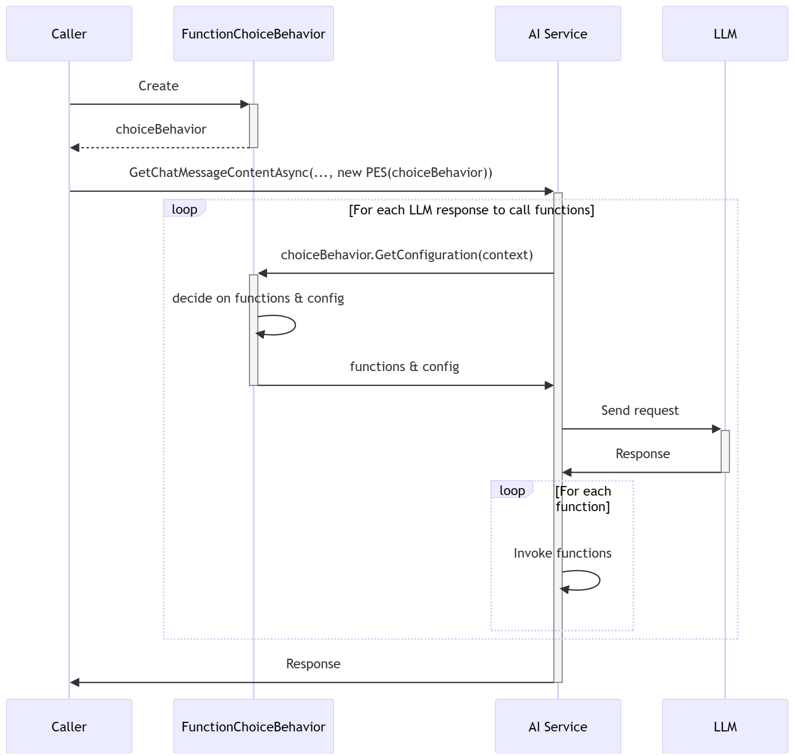

---
# 이것들은 선택적 요소입니다. 필요 없는 항목은 자유롭게 제거하세요.
status: accepted
contact: sergeymenshykh
date: 2024-04-22
deciders: markwallace, matthewbolanos, rbarreto, dmytrostruk, westey-m
consulted: 
informed:
---

# 함수 호출 동작

## 맥락과 문제 설명

현재 SK에서 함수 호출을 지원하는 모든 AI 커넥터는 도구 호출 동작 모델 클래스에 대한 자체 구현을 가지고 있습니다. 
이 클래스들은 커넥터가 함수를 어떻게 알리고 호출할지를 설정하는 데 사용됩니다. 
예를 들어, 동작 클래스는 커넥터가 AI 모델에 어떤 함수를 알릴지, 함수가 커넥터에 의해 자동으로 호출될지, 아니면 커넥터 호출자가 수동으로 호출할지를 지정할 수 있습니다.

모든 도구 호출 동작 클래스는 원하는 함수 호출 동작을 설명하는 측면에서 동일합니다. 
그러나 이 클래스들은 함수 호출 동작을 커넥터별 모델 클래스에 매핑하는 기능을 가지고 있어 함수 호출 클래스를 커넥터 간에 재사용할 수 없게 만듭니다. 예를 들어, 
[ToolCallBehavior 클래스의 생성자](https://github.com/microsoft/semantic-kernel/blob/aec65771c8c2443db2c832aed167bff566d4ab46/dotnet/src/Connectors/Connectors.OpenAI/ToolCallBehavior.cs#L172)는 
`Connectors.OpenAI` 프로젝트 내 `Microsoft.SemanticKernel.Connectors.OpenAI` 네임스페이스에 위치한 
[OpenAIFunction](https://github.com/microsoft/semantic-kernel/blob/main/dotnet/src/Connectors/Connectors.OpenAI/Core/OpenAIFunction.cs) 클래스를 참조합니다.
그 결과, `Connectors.Mistral` 프로젝트에서 `Connectors.OpenAI` 프로젝트로의 바람직하지 않은 명시적 프로젝트 종속성 없이는 Mistral AI 커넥터와 같은 다른 커넥터에서 이 클래스들을 재사용할 수 없습니다.  

또한 현재 YAML이나 JSON 프롬프트에서 함수 호출 동작을 선언적으로 지정하는 것이 불가능합니다.  

## 결정 동인
- 함수 호출을 지원하는 모든 SK 커넥터에서 사용할 수 있는 단일 커넥터/모델 비의존적 함수 호출 동작 클래스 세트가 있어야 합니다.  
- 함수 호출 동작은 커넥터별 파생 클래스가 아닌 `PromptExecutionSettings` 기본 클래스에서 지정되어야 합니다.  
- YAML(Handlebars, Prompty) 및 JSON(SK config.json)을 포함하여 현재 지원되는 모든 프롬프트 형식에서 함수 호출 동작을 정의할 수 있어야 하며, 그 방법이 간단해야 합니다.  
- 사용자는 프롬프트에 지정된 프롬프트 실행 설정을 코드에서 정의한 설정으로 재정의할 수 있어야 합니다.

## 기존 함수 호출 동작 모델 - ToolCallBehavior
현재 SK는 OpenAI 커넥터의 함수 호출 동작을 정의하기 위해 `ToolCallBehavior` 추상 클래스와 그 파생 클래스 `KernelFunctions`, `EnabledFunctions`, `RequiredFunction`을 활용합니다.
이 동작은 `OpenAIPromptExecutionSettings.ToolCallBehavior` 속성을 통해 지정됩니다. 이 모델은 함수 호출 동작 클래스의 이름만 다를 뿐 다른 커넥터에서도 일관됩니다.  

```csharp
OpenAIPromptExecutionSettings settings = new() { ToolCallBehavior = ToolCallBehavior.AutoInvokeKernelFunctions };

or

GeminiPromptExecutionSettings settings = new() { ToolCallBehavior = GeminiToolCallBehavior.AutoInvokeKernelFunctions };
```

함수 호출 동작이 SK v1 릴리스 이후 존재해 왔고 광범위하게 사용될 수 있다는 점을 고려하면, 새로운 함수 호출 추상화는 기존 함수 호출 모델과 공존하도록 도입되어야 합니다. 이 접근 방식은 호환성을 깨는 변경을 방지하고 사용자가 현재 모델에서 새로운 모델로 점진적으로 전환할 수 있게 합니다.

## [새 모델] 옵션 1.1 - 함수 선택별 클래스
"호환성을 깨는 변경 없음" 요구사항과 "커넥터/모델 비의존적" 설계 원칙을 충족하기 위해, 새로운 커넥터 비의존적 클래스 세트를 도입해야 합니다.

### 함수 선택 클래스 
`FunctionChoiceBehavior` 클래스는 모든 *FunctionChoiceBehavior 파생 클래스의 추상 기본 클래스입니다.

```csharp
public abstract class FunctionChoiceBehavior
{
    public static FunctionChoiceBehavior Auto(IEnumerable<KernelFunction>? functions = null, bool autoInvoke = true, FunctionChoiceBehaviorOptions? options = null) { ... }
    public static FunctionChoiceBehavior Required(IEnumerable<KernelFunction>? functions = null, bool autoInvoke = true, FunctionChoiceBehaviorOptions? options = null) { ... }
    public static FunctionChoiceBehavior None(IEnumerable<KernelFunction>? functions = null, FunctionChoiceBehaviorOptions? options = null)

    public abstract FunctionChoiceBehaviorConfiguration GetConfiguration(FunctionChoiceBehaviorConfigurationContext context);
}
```

`FunctionChoiceBehavior` 클래스의 모든 파생 클래스는 추상 `GetConfiguration` 메서드를 구현해야 합니다. 이 메서드는 커넥터가 제공하는 `FunctionChoiceBehaviorConfigurationContext`와 함께 호출됩니다. 해당 클래스가 정의한 특정 함수 호출 선택 동작에 따라 함수 호출 및 실행과 관련하여 커넥터가 어떻게 동작해야 하는지를 지시하는 `FunctionChoiceBehaviorConfiguration` 객체를 커넥터에 반환합니다.  


```csharp
public class FunctionChoiceBehaviorConfigurationContext
{
    public Kernel? Kernel { get; init; }
    public ChatHistory ChatHistory { get; }
    public int RequestSequenceIndex { get; init; }
}

public class FunctionChoiceBehaviorConfiguration
{
    public FunctionChoice Choice { get; internal init; }
    public IReadOnlyList<KernelFunction>? Functions { get; internal init; }
    public bool AutoInvoke { get; set; } = true;
    public FunctionChoiceBehaviorOptions Options { get; }
}
```

`AutoFunctionChoiceBehavior` 클래스는 모든 커널 함수 또는 생성자나 `Functions` 속성을 통해 정의할 수 있는 지정된 함수 하위 집합을 알릴 수 있습니다. 또한 AI 모델에 함수를 호출할지 여부와 호출한다면 어떤 특정 함수를 호출할지를 지시합니다.  
```csharp
public sealed class AutoFunctionChoiceBehavior : FunctionChoiceBehavior
{
    [JsonConstructor]
    public AutoFunctionChoiceBehavior() { }
    public AutoFunctionChoiceBehavior(IEnumerable<KernelFunction>? functions, bool autoInvoke, FunctionChoiceBehaviorOptions? options) { }

    [JsonPropertyName("functions")]
    public IList<string>? Functions { get; set; }

    [JsonPropertyName("options")]
    public FunctionChoiceBehaviorOptions? Options { get; set; }

    public override FunctionChoiceBehaviorConfiguration GetConfiguration(FunctionChoiceBehaviorConfigurationContext context)
    {
        var functions = base.GetFunctions(this.Functions, context.Kernel, this._autoInvoke);

        return new FunctionChoiceBehaviorConfiguration(this.Options ?? DefaultOptions)
        {
            Choice = FunctionChoice.Auto,
            Functions = functions,
            AutoInvoke = this._autoInvoke,
        };
    }
}
```
   
`RequiredFunctionChoiceBehavior` 클래스는 `AutoFunctionChoiceBehavior` 클래스와 마찬가지로 모든 커널 함수 또는 생성자나 `Functions` 속성을 통해 정의할 수 있는 지정된 함수 하위 집합을 알릴 수 있습니다. 그러나 모델이 제공된 함수를 반드시 호출하도록 강제한다는 점에서 다릅니다.  
```csharp
public sealed class RequiredFunctionChoiceBehavior : FunctionChoiceBehavior
{
    [JsonConstructor]
    public RequiredFunctionChoiceBehavior() { }
    public RequiredFunctionChoiceBehavior(IEnumerable<KernelFunction>? functions, bool autoInvoke, FunctionChoiceBehaviorOptions? options) { }

    [JsonPropertyName("functions")]
    public IList<string>? Functions { get; set; }

    [JsonPropertyName("options")]
    public FunctionChoiceBehaviorOptions? Options { get; set; }

    public override FunctionChoiceBehaviorConfiguration GetConfiguration(FunctionChoiceBehaviorConfigurationContext context)
    {
        // AI 모델이 동일한 함수를 반복적으로 호출하는 것을 방지하기 위해 첫 번째 요청 이후 함수 알림을 중단합니다.
        // 이것은 모델에 알릴 함수 목록을 동적으로 제어하는 방법이 마련될 때까지의 임시 솔루션입니다.
        if (context.RequestSequenceIndex >= 1)
        {
            return new FunctionChoiceBehaviorConfiguration(this.Options ?? DefaultOptions)
            {
                Choice = FunctionChoice.Required,
                Functions = null,
                AutoInvoke = this._autoInvoke,
            };
        }

        var functions = base.GetFunctions(this.Functions, context.Kernel, this._autoInvoke);

        return new FunctionChoiceBehaviorConfiguration(this.Options ?? DefaultOptions)
        {
            Choice = FunctionChoice.Required,
            Functions = functions,
            AutoInvoke = this._autoInvoke,
        };
    }
}
```

`NoneFunctionChoiceBehavior` 클래스는 다른 동작 클래스와 마찬가지로 모든 커널 함수 또는 생성자나 `Functions` 속성을 통해 정의할 수 있는 지정된 함수 하위 집합을 알릴 수 있습니다. 또한 AI 모델에 제공된 함수를 응답 생성을 위해 호출하지 않고 활용하도록 지시합니다. 이 동작은 실제로 함수를 호출하지 않고 모델이 어떤 함수를 호출할지 확인하려는 드라이런에 유용할 수 있습니다.  
```csharp
public sealed class NoneFunctionChoiceBehavior : FunctionChoiceBehavior
{
    [JsonConstructor]
    public NoneFunctionChoiceBehavior() { }
    public NoneFunctionChoiceBehavior(IEnumerable<KernelFunction>? functions, FunctionChoiceBehaviorOptions? options) { }

    [JsonPropertyName("functions")]
    public IList<string>? Functions { get; set; }

    [JsonPropertyName("options")]
    public FunctionChoiceBehaviorOptions? Options { get; set; }

    public override FunctionChoiceBehaviorConfiguration GetConfiguration(FunctionChoiceBehaviorConfigurationContext context)
    {
        var functions = base.GetFunctions(this.Functions, context.Kernel, autoInvoke: false);

        return new FunctionChoiceBehaviorConfiguration(this.Options ?? DefaultOptions)
        {
            Choice = FunctionChoice.None,
            Functions = functions,
            AutoInvoke = false,
        };
    }
}
```

'커넥터/모델 비의존적' 동인의 요구사항을 충족하기 위해, 함수 선택 동작은 현재와 같이 `OpenAIPromptExecutionSettings`와 같은 모델별 프롬프트 실행 설정 클래스가 아닌 모델 비의존적 `PromptExecutionSettings` 클래스 내에서 설정할 수 있어야 합니다.

```csharp
PromptExecutionSettings settings = new() { FunctionChoiceBehavior = FunctionChoiceBehavior.Required() };
```
   
위에서 설명한 모든 함수 선택 동작 클래스는 `IList<string>` 타입의 `Functions` 속성을 포함합니다.
함수는 `pluginName.functionName` 형식의 문자열로 지정할 수 있습니다. 이 속성의 주요 목적은 사용자가 
AI 모델에 알리려는 함수 목록을 YAML, Markdown 또는 JSON 프롬프트에서 선언할 수 있게 하는 것입니다. 그러나 코드에서 함수를 지정하는 데도 사용할 수 있지만, 일반적으로 `KernelFunction` 인스턴스 목록을 받는 
함수 선택 동작 클래스의 생성자를 통해 하는 것이 더 편리합니다.  
   
또한 함수 선택 동작 클래스는 `FunctionChoiceBehaviorOptions` 타입의 `Options` 속성을 가지고 있으며, 생성자를 통해 또는 클래스 인스턴스에 직접 설정할 수 있습니다.
이 속성은 AI 모델이 순차적 호출보다 병렬 함수 호출을 선호할지 여부와 같은 함수 선택 동작의 다양한 측면을 구성할 수 있게 합니다. 
이 클래스는 시간이 지남에 따라 대부분의 AI 모델에 관련된 속성을 통합하면서 발전할 것으로 의도됩니다. 
특정 AI 모델이 다른 모델에서 지원되지 않는 고유한 속성을 필요로 하는 경우, 모델별 파생 옵션 클래스를 만들 수 있습니다.
이 클래스는 해당 모델의 SK AI 커넥터에 의해 인식되어 특정 속성을 읽을 수 있습니다.

### 시퀀스 다이어그램


### 프롬프트에서의 동작 지원
선택 동작 모델 클래스의 계층적 특성을 고려하면, JSON 및 YAML 프롬프트에서 함수 선택 동작을 구성해야 하는 상황에서 다형성 역직렬화가 활성화되어야 합니다.
```json
{
    ...
    "execution_settings": {
        "default": {
            "temperature": 0.4,
            "function_choice_behavior": {
                "type": "auto", //가능한 값 - auto, required, none
                "functions": [
                    "plugin1.function1",
                    "plugin1.function2",
                ],
                "options": {
                    "allow_concurrent_invocation": true
                }
            }
        }
    }
}
```
```yaml
execution_settings:
  default:
    temperature: 0.4
    function_choice_behavior:
      type: auto
      functions:
      - plugin1.function1
      - plugin1.function2
      options:
        allow_concurrent_invocation: true
```
다형성 역직렬화는 System.Text.Json.JsonSerializer에서 지원되며, 사용하기 전에 다형성 역직렬화에 사용될 모든 타입을 미리 등록해야 합니다.
이는 기본 클래스에 JsonDerivedType 속성을 주석으로 추가하여 기본 타입의 하위 타입을 지정하거나, 역직렬화 시 사용할 JsonSerializerOptions를 통해 제공해야 하는 TypeInfoResolver에 하위 타입을 등록하는 방식으로 수행할 수 있습니다. 
자세한 내용은 여기에서 확인할 수 있습니다: [다형성 타입 직렬화](https://learn.microsoft.com/en-us/dotnet/standard/serialization/system-text-json/polymorphism?pivots=dotnet-8-0).

사용자 정의 함수 선택 동작을 지원하려면, 사용자 정의 타입을 다형성 역직렬화에 등록해야 합니다. 
분명히 JsonDerivedType 속성을 사용하는 접근 방식은 사용자가 `FunctionChoiceBehavior` SK 클래스에 주석을 달 수 없으므로 적용 불가능합니다. 
그러나 역직렬화 시 JsonSerializer가 사용하는 JsonSerializerOptions에 접근할 수 있다면 사용자 정의 타입 리졸버를 등록하여 사용자 정의 타입을 등록할 수 있습니다. 
안타깝게도 SK는 현재 이러한 옵션을 공개적으로 노출하지 않습니다. 노출하더라도, YamlDotNet 라이브러리로 역직렬화되는 YAML 프롬프트가 있어 동일한 사용자 정의 타입을 YAML 전용 역직렬화 확장 메커니즘인 YamlTypeConverter를 통해 제공해야 합니다. 
이는 사용자가 동일한 사용자 정의 함수 호출 선택을 YAML과 JSON 프롬프트 모두에서 사용하려는 경우, 동일한 사용자 정의 타입을 두 번 등록해야 함을 의미합니다 - JSON용 사용자 정의 타입 리졸버와 YAML용 사용자 정의 YamlTypeConverter. 또한 모든 SK `CreateFunctionFrom*Prompt` 확장 메서드에 사용자 정의 리졸버/컨버터를 공급하는 메커니즘도 필요합니다.


다형성 역직렬화는 `System.Text.Json.JsonSerializer`에서 지원되며, 다형성 역직렬화에 사용할 모든 타입이 미리 등록되어 있어야 합니다. 
이는 기본 클래스에 `JsonDerivedType` 속성을 주석으로 추가하여 기본 타입의 하위 타입을 지정하거나, 역직렬화 시 사용할 `JsonSerializerOptions`를 통해 제공해야 하는 `TypeInfoResolver`에 하위 타입을 등록하는 방식으로 수행할 수 있습니다. 
자세한 내용은 여기에서 확인할 수 있습니다: [다형성 타입 직렬화](https://learn.microsoft.com/en-us/dotnet/standard/serialization/system-text-json/polymorphism?pivots=dotnet-8-0).  

### 함수 선택 동작 노드의 위치
SK 프롬프트는 프롬프트 내에서 서비스별 구성을 설명하는 실행 설정을 지정하는 하나 이상의 항목을 포함할 수 있으며, 각 항목은 서비스에 해당합니다. 
각 섹션이 해당 서비스에서 사용하는 `PromptExecutionSettings` 클래스의 인스턴스로 역직렬화되므로, 
각 서비스 구성 섹션에서 함수 동작을 정의하는 것이 논리적입니다.
그러나 이 접근 방식은 모든 서비스가 동일한 선택 동작을 필요로 할 수 있어 불필요한 중복을 초래할 수 있습니다. 
또한 세 개의 서비스 중 두 개가 동일한 선택 동작 구성을 공유하고 나머지 하나는 다른 구성을 사용하는 시나리오가 있을 수 있습니다.

```json
"function_choice_behavior":{
    ...
},
"execution_settings": {
   "default": {
     "temperature": 0,
     "function_choice_behavior":{
        ...
     }
   },
   "gpt-3.5-turbo": {
     "model_id": "gpt-3.5-turbo-0613",
     "temperature": 0.1,
     "function_choice_behavior":{
        ...
     }
   },
   "gpt-4": {
     "model_id": "gpt-4-1106-preview",
     "temperature": 0.3,
     "function_choice_behavior":{
        ...
     }
   }
 }
```
위에서 언급한 시나리오를 해결하기 위해, 서비스가 부모 함수 선택 동작 구성(지정된 경우)을 상속할 수 있는 상속 메커니즘을 구현하는 것이 바람직합니다. 
부모에 함수 선택 동작 구성이 정의되어 있는지 여부와 관계없이, 각 서비스 항목 수준에서 부모의 구성을 지정하거나 재정의할 수 있어야 합니다.

### 비상 해제(Breaking Glass) 지원
위에서 설명한 선택 클래스 목록은 사용자가 겪을 수 있는 모든 시나리오를 커버하기에 충분하지 않을 수 있습니다. 
이를 해결하기 위해, `FunctionCallChoice.Configure` 메서드는 내부적으로 사용되는 모델 커넥터 인스턴스를 받아 사용자가 사용자 정의 함수 호출 선택의 구성 메서드 내에서 접근하고 수정할 수 있게 합니다.
```csharp
// 사용자 정의 함수 호출 선택
public sealed class NewCustomFunctionChoiceBehavior : FunctionChoiceBehavior
{
    public override FunctionChoiceBehaviorConfiguration GetConfiguration(FunctionChoiceBehaviorContext context)
    {
        var model = context.Model;

        // CompletionsOptions, ChatCompletionsToolChoice 등은 OpenAIChatCompletionService 커넥터가 내부적으로 사용하는 데이터 모델 클래스입니다.
        ((CompletionsOptions)model).ToolChoice = new ChatCompletionsToolChoice(new FunctionDefinition("NEW-TOOL-CHOICE-MODE"));
        ((CompletionsOptions)model).Tools.Add(new ChatCompletionsFunctionToolDefinition(<functions-to-advertise>);
 
        return new FunctionChoiceBehaviorConfiguration()
        {
            Model = model; // 함수 호출 선택을 직접 제어하고 있으며, 그렇지 않으면 커넥터 측에서 적용될 매핑 로직을 적용할 필요가 없음을 호출 커넥터에 알리기 위해 모델을 반환합니다.
            MaximumAutoInvokeAttempts = this.MaximumAutoInvokeAttempts,
            MaximumUseAttempts = this.MaximumUseAttempts,
            AllowAnyRequestedKernelFunction = false
        };
    }
}
...

// 사용자 정의 선택 등록
PromptExecutionSettings settings = new() { FunctionChoiceBehavior = new NewCustomFunctionChoiceBehavior() };
```

## [새 모델] 옵션 1.2 - 대안 설계
커널 인스턴스에 접근할 수 있는 위치의 역직렬화 후 단계에서 특정 타입을 해결하는 가능성을 탐구하여, 다형성 역직렬화의 필요성을 제거합니다. 
이 접근 방식은 사용자가 커널 서비스 컬렉션에 등록하는 사용자 정의 함수 선택 동작 클래스의 해결을 가능하게 합니다. 사용자는 자신의 사용자 정의 클래스를 등록할 수 있으며, JSON이든 YAML이든 프롬프트 형식에 관계없이 프롬프트 렌더링 시 또는 정보가 필요한 시점에 자동으로 선택됩니다.  

## 2. 함수 호출 선택과 함수 호출 구성의 분리
새 모델은 한 사람이 프롬프트를 엔지니어링하고 다른 사람이 실행하거나 호출하는 시나리오를 수용해야 합니다. 
이를 달성하는 한 가지 방법은 auto, enabled, none과 같은 함수 선택 동작 구성을 AllowParallelCalls와 같은 설정을 포함하는 함수 호출 구성과 분리하는 것입니다. 
함수 선택 동작 구성은 여전히 PromptExecutionSettings를 통해 제공될 수 있지만, 함수 호출 구성을 제공할 적절한 위치를 식별해야 합니다. 
또한 코드에서 직접 함수 선택 동작을 재정의할 수 있어야 합니다. 아래는 코드를 통해 함수 호출 구성을 제공할 잠재적 위치에 대한 몇 가지 옵션입니다:

### 옵션 2.1 - `IChatCompletionService.GetChatMessageContentsAsync` 메서드 및 스트리밍 대응 메서드의 매개변수로서의 호출 구성
장점:  
- 함수 호출 구성을 전체 AI 서비스 구성으로 제한하지 않고 각 작업에 대해 지정할 수 있습니다.
   
단점:  
- 인터페이스 메서드에 새 매개변수를 도입하면 인터페이스의 모든 비SK 사용자 정의 구현에 영향을 미치는 호환성 깨짐이 발생합니다.
- 이 접근 방식은 커넥터별 프롬프트 실행 설정을 통해 두 구성을 모두 제공할 수 있는 현재 개발 경험과 다릅니다.

### 옵션 2.2 - `IChatCompletionService` 인터페이스 각 구현의 생성자 매개변수로서의 호출 구성
장점:  
- 인터페이스 메서드 시그니처를 변경할 필요가 없어 비SK 사용자 정의 구현이 손상되지 않습니다.
   
단점:  
- 함수 호출 구성이 서비스 등록 단계에서 서비스 수준으로 적용됩니다. 일부 작업이 다른 구성을 필요로 하는 경우, 별도의 구성을 가진 새 서비스를 등록해야 합니다.
- 이 접근 방식은 커넥터별 프롬프트 실행 설정을 통해 두 구성을 모두 제공하는 현재 개발 경험과 다릅니다.

### 옵션 2.3 - `Kernel.FunctionInvocationConfig` 속성으로서의 호출 구성
장점:
- 호환성 깨짐 없음: `IChatCompletionService` 멤버와 구현 생성자의 시그니처 모두 변경되지 않습니다.

단점:
- 다른 구성이 필요할 때마다 새 커널을 생성하거나 기존 커널을 복제해야 합니다.
- 커널에 더 많은 AI 커넥터별 로직이 포함됩니다.
- 이 접근 방식은 커넥터별 프롬프트 실행 설정을 통해 두 구성을 모두 제공하는 현재 개발 경험과 다릅니다.

### 옵션 2.4 - `Kernel.Data` 컬렉션의 항목으로서의 호출 구성
장점:  
- 호환성 깨짐 없음: `IChatCompletionService` 멤버와 구현 생성자의 시그니처 모두 변경되지 않습니다.
- 커널에 AI 커넥터별 로직이 추가되지 않습니다.
   
단점:  
- 컴파일러에 의해 강제되지 않는 매직 상수가 필요합니다.
- 다른 구성이 필요할 때마다 새 커널을 생성하거나 기존 커널을 복제해야 합니다.
- 이 접근 방식은 커넥터별 프롬프트 실행 설정을 통해 두 구성을 모두 제공하는 현재 개발 경험과 다릅니다.

### 옵션 2.5 - 함수 호출 선택 구성과 호출 구성 모두를 위한 `PromptExecutionSettings.FunctionChoiceBehavior` 속성
장점:
- 이 접근 방식은 옵션 #1.1에서 제안되었으며, 두 구성 모두 커넥터 비의존적 프롬프트 실행 설정을 통해 제공됩니다.
- 호환성 깨짐 없음: `IChatCompletionService` 멤버와 구현 생성자의 시그니처 모두 변경되지 않습니다.

단점:
- 프롬프트를 통해 제공된 실행 설정과 개발자가 호출 단계에서 제공한 설정을 병합하기 위해 새로운 서비스 셀렉터를 구현하고 커널에 등록해야 합니다.

## 결정 결과
ADR 검토 중 몇 가지 결정이 내려졌습니다:
- 옵션 1.1이 새로운 함수 호출 동작 모델의 선호 옵션으로 선택되었습니다.
- 서비스가 부모 함수 선택 동작 구성을 상속할 수 있는 상속 메커니즘의 구현은 연기하기로 결정되었습니다.
- 비상 해제(Breaking Glass) 지원은 현재 범위 밖이지만, 필요한 경우 나중에 포함될 수 있다고 결정되었습니다.
- 프롬프트 실행 설정을 통해 함수 호출 선택과 함수 호출 구성을 제공하는 옵션 2.5가 단순성, 호환성 깨짐 없음, 익숙한 개발자 경험으로 인해 다른 옵션보다 선호되었습니다.
