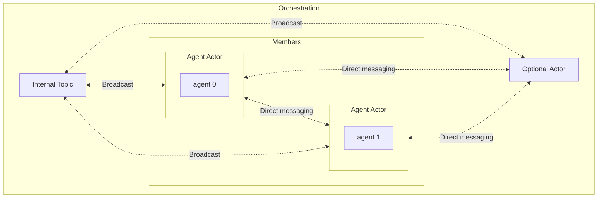
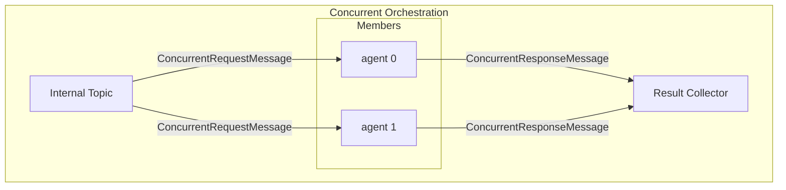
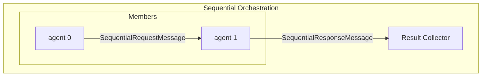
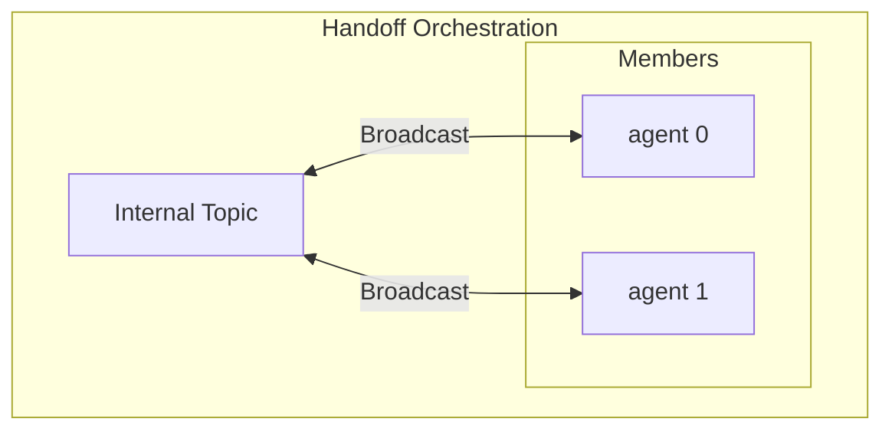
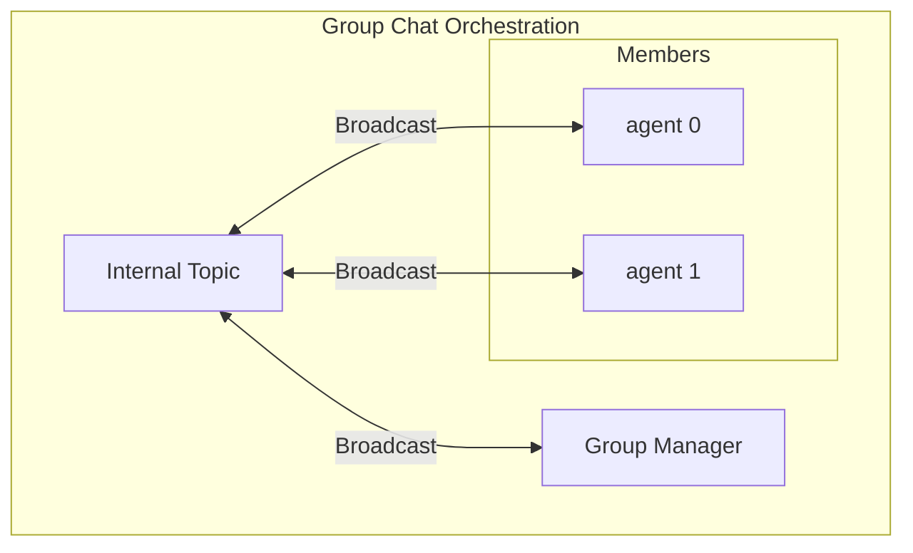

---
# 이것들은 선택적 요소입니다. 필요 없는 항목은 자유롭게 제거하세요.
status: { proposed }
contact: { Tao Chen }
date: { 2025-04-30 }
deciders: { Ben Thomas, Mark Wallace }
consulted: { Chris Rickman, Evan Mattson, Jack Gerrits, Eric Zhu }
informed: {}
---

# 멀티 에이전트 오케스트레이션

## 맥락

업계는 LLM을 사용하여 더 복잡한 시스템을 구축하기 위해 스택을 올라가고 있습니다. 파운데이션 모델과의 상호작용에서 RAG 시스템 구축으로, 그리고 이제 더 복잡한 작업을 수행하기 위한 단일 AI 에이전트 생성으로, 멀티 에이전트 시스템에 대한 욕구가 커지고 있습니다.

Semantic Kernel Agent Framework의 최근 GA와 함께, [안정적인 에이전트 추상화/API](https://github.com/microsoft/semantic-kernel/blob/main/python/semantic_kernel/agents/agent.py) 및 OpenAI Assistant와 Chat Completion 서비스 등 여러 에이전트 서비스 지원을 제공하면서, 이를 기반으로 멀티 에이전트 시스템을 구축할 수 있게 되었습니다. 이를 통해 고객들이 더 복잡한 시나리오를 활용할 수 있게 됩니다.

또한, AutoGen 팀과의 최근 협업으로 공유 에이전트 런타임 추상화가 만들어져, 그들의 작업을 프레임워크를 구축하는 기반으로 활용할 수 있게 되었습니다.

## 문제 설명

현재 Semantic Kernel Agent Framework의 상태는 단일 에이전트로 제한되어 있습니다. 즉, 에이전트가 협력적으로 작업하여 사용자 요청을 해결할 수 없습니다. 멀티 에이전트 오케스트레이션을 지원하도록 확장하여 Semantic Kernel 에이전트를 사용하는 고객들이 더 많은 가능성을 열 수 있도록 해야 합니다. 이 제안의 성공 기준은 [고려사항](#considerations) 섹션을 참조하세요.

## 배경 지식

### 용어

세부사항에 들어가기 전에, 이 문서 전체에서 사용될 몇 가지 용어를 명확히 하겠습니다.

| **용어** | **정의** |
| -------------------------------------------------------------------------------------------------------------------- | ------------------------------------------------------------------------------------------ |
| **Actor** | 메시지를 보내고 받을 수 있는 런타임의 엔티티. |
| **[Runtime](https://microsoft.github.io/autogen/stable/user-guide/core-user-guide/core-concepts/architecture.html)** | 액터 간의 통신을 촉진하고 액터의 상태와 수명주기를 관리합니다. |
| **Runtime Abstraction** | 다양한 런타임 구현을 위한 공통 인터페이스를 제공하는 추상화. |
| **Agent** | Semantic Kernel 에이전트. |
| **Orchestration** | 액터를 포함하고 그들이 서로 상호작용하는 규칙을 포함합니다. |

> Semantic Kernel Agent Framework에서 사용되는 "agent"라는 용어와의 혼동을 피하기 위해 "actor"라는 용어를 사용합니다. 런타임 문서에서 "actor"와 "agent"라는 이름이 교환적으로 사용되는 것을 볼 수 있습니다. 소프트웨어 설계에서 "actor"에 대해 더 알아보려면 다음을 참조하세요: <https://en.wikipedia.org/wiki/Actor_model>.

> 다른 맥락에서 "pattern"이라는 용어를 들을 수 있습니다. "Pattern"은 "orchestration"과 거의 의미적으로 동일하며, 후자는 패턴의 관리와 실행을 암시합니다. "pattern"을 "orchestration"의 유형으로 생각할 수도 있습니다. 예를 들어, "concurrent orchestration"은 동시 패턴을 따르는 오케스트레이션 유형입니다.

### AutoGen의 공유 런타임 추상화

> 런타임 추상화는 시스템의 기초 레이어 역할을 합니다. 런타임에 대한 기본적인 이해를 권장합니다. 자세한 내용은 [AutoGen Core User Guide](https://microsoft.github.io/autogen/stable/user-guide/core-user-guide/index.html)를 참조하세요.

AutoGen 팀은 시스템 내 액터 간의 pub-sub 통신을 지원하는 런타임 추상화(인프로세스 런타임 구현과 함께)를 구축했습니다. 이 작업을 활용할 수 있는 기회가 있었고, 이로 인해 Semantic Kernel이 의존하게 될 공유 에이전트 런타임 추상화가 만들어졌습니다.

실제 런타임 구현에 따라, 액터는 로컬 또는 분산될 수 있습니다. 우리의 에이전트 프레임워크는 특정 런타임 구현에 묶여 있지 **않으며**, 즉 **런타임 비의존적**입니다.

## 고려사항

### 오케스트레이션

멀티 에이전트 오케스트레이션 프레임워크의 첫 번째 버전은 아래 나열된 가장 일반적인 패턴을 다루는 사전 구축된 오케스트레이션 세트를 제공합니다. 시간이 지남에 따라 고객 피드백을 기반으로 더 많은 오케스트레이션을 추가하고, 프레임워크가 제공하는 구성 요소를 사용하여 고객이 자신만의 오케스트레이션을 쉽게 만들 수 있게 할 것입니다.

| **오케스트레이션** | **설명** |
| ------------------ | --------------------------------------------------------------------------------------------------------------------------------------------------------------------------------------------------- |
| **Concurrent** | 여러 에이전트의 독립적인 분석이 도움이 되는 작업에 유용합니다. |
| **Sequential** | 잘 정의된 단계별 접근 방식이 필요한 작업에 유용합니다. |
| **Handoff** | 본질적으로 동적이며 잘 정의된 단계별 접근 방식이 없는 작업에 유용합니다. |
| **GroupChat** | 여러 에이전트의 입력과 고도로 구성 가능한 대화 흐름이 도움이 되는 작업에 유용합니다. |
| **Magentic One** | 플래너 기반 관리자를 가진 GroupChat과 유사한 오케스트레이션. [Magentic One](https://www.microsoft.com/en-us/research/articles/magentic-one-a-generalist-multi-agent-system-for-solving-complex-tasks/)에서 영감을 받음. |

> 사전 구축된 오케스트레이션에 대한 더 자세한 설명은 [부록 A](#appendix-a-pre-built-orchestrations)를 참조하세요.

오케스트레이션 사용은 다음과 같이 간단해야 합니다:

```python
agent_1 = ChatCompletionAgent(...)
agent_2 = ChatCompletionAgent(...)

group_chat = GroupChatOrchestration(members=[agent_1, agent_2], manager=RoundRobinGroupChatManager())

# 런타임은 더 나은 리소스 관리와 개발자 경험을 위한 컨텍스트 매니저가 될 수 있습니다.
# 기본 런타임 인스턴스를 생성하기 위한 팩토리 사용도 고려할 수 있습니다.
runtime = InProcessRuntime()
runtime.start()

orchestration_result = await group_chat.invoke(task="Hello world", runtime=runtime)
result = await orchestration_result.get(timeout=20)
print(result)

await runtime.stop_when_idle()
```

### 애플리케이션 책임

- 런타임 인스턴스의 수명주기는 애플리케이션이 관리해야 하며 모든 오케스트레이션의 외부에 있어야 합니다.
- 오케스트레이션은 생성 시가 아닌 호출 시에만 런타임 인스턴스를 필요로 합니다.

### 지연 평가가 있는 그래프형 구조

오케스트레이션을 에이전트가 방향 그래프와 유사하게 서로 상호작용하는 방법을 설명하는 템플릿으로 간주해야 합니다. 오케스트레이션의 실제 실행은 런타임에 의해 수행되어야 합니다. 따라서 다음이 반드시 참이어야 합니다:

- 액터는 오케스트레이션이 생성될 때가 아니라 실행이 시작되기 전에 런타임에 등록됩니다.
- 런타임은 액터를 생성하고 수명주기를 관리하는 책임이 있습니다.

### 독립적이고 격리된 호출

오케스트레이션은 여러 번 호출될 수 있으며, 각 호출은 서로 독립적이고 격리되어야 합니다. 호출은 동일한 런타임 인스턴스를 공유할 수도 있습니다. 이를 위해 액터 이름이나 ID와 같은 충돌을 피하기 위한 명확한 호출 경계를 정의해야 합니다.

예를 들어, 다음 코드 스니펫에서 `task_1`과 `task_2`는 독립적이며 컨텍스트를 공유하지 않습니다:

```python
agent_1 = ChatCompletionAgent(...)
agent_2 = ChatCompletionAgent(...)

group_chat = GroupChatOrchestration(members=[agent_1, agent_2], manager=RoundRobinGroupChatManager())

runtime = InProcessRuntime()
runtime.start()

task_1 = await group_chat.invoke(task=TASK_1, runtime=runtime)
task_2 = await group_chat.invoke(task=TASK_2, runtime=runtime)

result_1 = await task_1.get(timeout=20)
result_2 = await task_2.get(timeout=20)

await runtime.stop_when_idle()
```

### 구조화된 입력 및 출력 타입 지원

오케스트레이션이 구조화된 입력을 받고 구조화된 출력을 반환하도록 해야 코드 관점에서 작업하기 쉬워집니다. 이는 또한 채팅 기반이 아닌 오케스트레이션(내부적으로는 에이전트가 여전히 채팅 기반이지만)과 작업할 때 개발자가 더 쉽게 작업할 수 있게 합니다.

## 범위 외

- 런타임 구현은 이 제안의 범위 밖입니다.
- [공개 토론](#open-discussions) 섹션에 언급된 주제는 멀티 에이전트 오케스트레이션 프레임워크의 초기 구현에서 다루지 않습니다. 그러나 향후 반복을 위해 이를 염두에 두고 있으며, 향후 확장을 위한 충분한 여지를 남겨야 합니다.

## 제안

> 보여주는 코드 스니펫은 완전하지 않지만 제안을 이해하기에 충분한 컨텍스트를 제공합니다.

### 구성 요소

| **컴포넌트** | **세부사항** |
| ------------------------ | -------------------------------------------------------------------------------------------------------------------- |
| **Agent actor** | - Semantic Kernel 에이전트 <br> - 에이전트 컨텍스트: 스레드와 히스토리 |
| **Data transform logic** | - 오케스트레이션의 입력/출력을 사용자 정의 타입으로/에서 변환하는 훅을 제공합니다. |
| **Orchestration** | - 여러 에이전트 액터와 기타 선택적 오케스트레이션 전용 액터로 구성됩니다. |
| **Optional actors** | - 에이전트 액터가 아닌 다른 액터. <br> - 예를 들어, 그룹 채팅 오케스트레이션의 그룹 매니저 액터. |



#### Agent Actor

이것은 에이전트가 런타임에서 메시지를 보내고 받을 수 있도록 Semantic Kernel 에이전트를 감싸는 래퍼입니다. `AgentActorBase`는 [`RoutedAgent`](https://microsoft.github.io/autogen/stable/reference/python/autogen_core.html#autogen_core.RoutedAgent) 클래스를 상속합니다:

```python
class AgentActorBase(RoutedAgent):
    """멀티 에이전트 오케스트레이션을 위한 Agent 런타임에서 실행되는 에이전트 액터."""

    def __init__(self, agent: Agent) -> None:
        """에이전트 컨테이너를 초기화합니다.

        Args:
            agent (Agent): 컨테이너에서 실행될 에이전트.
        """
        self._agent = agent
        self._agent_thread = None
        # 에이전트 스레드가 생성되기 전에 메시지를 임시로 저장하기 위한 채팅 히스토리
        self._chat_history = ChatHistory()

        RoutedAgent.__init__(self, description=agent.description or "Semantic Kernel Agent")
```

오케스트레이션은 각 오케스트레이션이 고유한 메시지 핸들러 세트를 가질 수 있으므로 `AgentActorBase`를 확장하는 자체 에이전트 액터를 가집니다.

> 메시지와 메시지 핸들러에 대해 더 알아보려면 [AutoGen 문서](https://microsoft.github.io/autogen/stable/user-guide/core-user-guide/framework/message-and-communication.html)를 참조하세요.

예를 들어, 그룹 채팅 오케스트레이션의 에이전트 액터는 다음과 같습니다:

```python
class GroupChatAgentActor(AgentActorBase):
    """그룹 채팅에서 메시지를 처리하는 에이전트 액터."""

    @message_handler
    async def _handle_start_message(self, message: GroupChatStartMessage, ctx: MessageContext) -> None:
        """사용자가 제공한 초기 메시지를 처리합니다."""
        ...

    @message_handler
    async def _handle_response_message(self, message: GroupChatResponseMessage, ctx: MessageContext) -> None:
        """그룹 채팅의 다른 에이전트로부터의 응답 메시지를 처리합니다."""
        ...

    @message_handler
    async def _handle_request_message(self, message: GroupChatRequestMessage, ctx: MessageContext) -> None:
        """그룹 매니저로부터의 요청 메시지를 처리합니다."""
        ...
```

다른 오케스트레이션의 에이전트 액터는 다른 메시지 타입이나 다른 수의 메시지 타입을 처리합니다. 이 제안은 오케스트레이션 내에서 에이전트 액터가 서로 상호작용하는 방법에 대한 제한을 두지 않습니다. 즉, 규칙은 개별 오케스트레이션에 의해 정의됩니다.

#### 데이터 변환 로직

데이터 변환 로직의 시그니처는 다음과 같습니다:

```python
DefaultTypeAlias = ChatMessageContent | list[ChatMessageContent]

TIn = TypeVar("TIn", default=DefaultTypeAlias)
TOut = TypeVar("TOut", default=DefaultTypeAlias)

input_transform: Callable[[TIn], Awaitable[DefaultTypeAlias] | DefaultTypeAlias]
output_transform: Callable[[DefaultTypeAlias], Awaitable[TOut] | TOut]
```

`TIn`은 오케스트레이션이 받을 입력 타입을 나타내고, `TOut`은 오케스트레이션이 호출자에게 반환할 출력 타입을 나타냅니다. `ChatMessageContent`와 `list[ChatMessageContent]`를 기본 타입으로 사용합니다. 이는 오케스트레이션이 단일 채팅 메시지 또는 채팅 메시지 목록을 입력으로 받고 단일 채팅 메시지 또는 채팅 메시지 목록을 출력으로 반환함을 의미합니다.

> 개발자의 삶의 질을 향상시키기 위해 기본 변환 세트를 제공할 수 있습니다. 타입이 주어지면 자동으로 변환을 수행하는 LLM을 가질 수도 있습니다.

#### 오케스트레이션

오케스트레이션은 단순히 Semantic Kernel 에이전트의 모음과 그들이 서로 상호작용하는 방법을 지배하는 규칙입니다. 구체적인 구현은 오케스트레이션의 호출을 시작하고 준비하는 로직을 제공해야 합니다. 호출 "준비"는 단순히 오케스트레이션 타입에 따라 런타임에 액터를 등록하고 그들 사이의 통신 채널을 설정하는 것을 의미합니다.

```python
class OrchestrationBase(ABC, Generic[TIn, TOut]):
    def __init__(
        self,
        members: list[Agent],
        input_transform: Callable[[TIn], Awaitable[DefaultTypeAlias] | DefaultTypeAlias]
        | None = None,
        output_transform: Callable[[DefaultTypeAlias], Awaitable[TOut] | TOut] | None = None,
    ) -> None:
        """오케스트레이션 기본을 초기화합니다.

        Args:
            members (list[Agent]): 사용할 에이전트 또는 오케스트레이션 목록.
            input_transform (Callable | None): 외부 입력 메시지를 변환하는 함수.
            output_transform (Callable | None): 내부 출력 메시지를 변환하는 함수.
        """
        ...

    async def invoke(
        self,
        task: str | DefaultTypeAlias | TIn,
        runtime: AgentRuntime,
    ) -> OrchestrationResult:
        """오케스트레이션을 호출하고 나중에 대기할 수 있는 결과를 즉시 반환합니다.

        런타임은 생성 시가 아닌 호출 시에 애플리케이션에 의해 제공됩니다.
        오케스트레이션은 런타임 비의존적이며 런타임 추상화를 구현하는 모든 런타임과 함께 사용할 수 있습니다.
        """
        orchestration_result = OrchestrationResult[TOut]()

        async def result_callback(result: DefaultTypeAlias) -> None:
            """결과가 준비되었을 때 호출되는 콜백 함수."""
            ...

        ...

        # 이 고유한 토픽 타입은 다른 호출과 격리하기 위해 사용됩니다.
        internal_topic_type = uuid.uuid4().hex

        await self._prepare(runtime, internal_topic_type, result_callback)

        ...

        await self._start(runtime, internal_topic_type, orchestration_result.cancellation_token)

        return orchestration_result

    @abstractmethod
    async def _start(
        self,
        runtime: AgentRuntime,
        internal_topic_type: str,
        cancellation_token: CancellationToken,
    ) -> None:
        ...

    @abstractmethod
    async def _prepare(
        self, runtime: AgentRuntime,
        internal_topic_type: str,
        result_callback: Callable[[DefaultTypeAlias], Awaitable[None]] | None = None,
    ) -> str:
        ...
```

오케스트레이션을 사용할 때, 사용자는 선택적으로 `TIn`과 `TOut`을 설정하고 입력 및 출력 변환을 제공할 수 있습니다. 예를 들어 Python에서는:

```python
class MyTypeA:
    pass

class MyTypeB:
    pass

sequential_orchestration = SequentialOrchestration[MyTypeA, MyTypeB](
    members=[agent_0, agent_1],
    input_transform=input_transform_func,
    output_transform=output_transform_func,
)
```

그리고 언어에 따라, 고급 사용자만 `TIn`과 `TOut`을 설정하면 되도록 기본값을 제공할 수 있습니다. 예를 들어 Python에서:

```python
DefaultTypeAlias = ChatMessageContent | list[ChatMessageContent]

TIn = TypeVar("TIn", default=DefaultTypeAlias)
TOut = TypeVar("TOut", default=DefaultTypeAlias)
```

그리고 .Net에서:

```csharp
public class SequentialOrchestration<TIn, TOut> : AgentOrchestration<TIn, TOut>
{
    ...
}

public sealed class SequentialOrchestration : SequentialOrchestration<ChatMessageContent, ChatMessageContent>
{
    ...
}
```

오케스트레이션 결과는 다음과 같이 표현됩니다:

```python
class OrchestrationResult(KernelBaseModel, Generic[TOut]):

    value: TOut | None = None
    event: asyncio.Event = Field(default_factory=lambda: asyncio.Event())
    cancellation_token: CancellationToken = Field(default_factory=lambda: CancellationToken())

    async def get(self, timeout: float | None = None) -> TOut:
        """호출 결과를 가져옵니다.

        Args:
            timeout (float | None): 타임아웃(초). None이면 무한히 대기합니다.

        Raises:
            TimeoutError: 결과가 준비되기 전에 타임아웃에 도달한 경우.
            RuntimeError: 호출이 취소된 경우.

        Returns:
            TOut: 호출의 결과.
        """
        ...

    def cancel(self) -> None:
        """호출을 취소합니다.

        이 메서드는 호출을 취소하고 취소 토큰을 설정합니다.
        메시지를 받은 액터는 계속 처리하지만, 새 메시지는 처리되지 않습니다.
        """
        ...
```

## 공개 토론

다음 항목들은 고려해야 할 중요한 주제이며 추가 논의가 필요합니다. 그러나 멀티 에이전트 오케스트레이션 프레임워크의 초기 구현을 차단해서는 안 됩니다.

### 상태 관리

진행하기 전에 `resume`과 `restart`에 대한 정의:

- **Resume**: 프로세스가 여전히 활성 상태이지만 일부 이벤트를 기다리는 유휴 상태입니다. 런타임은 유휴 상태에서 프로세스를 재개합니다.
- **Restart**: 프로세스가 더 이상 실행되지 않습니다. 수동으로 중지되었거나 오류가 발생했습니다. 오케스트레이션은 처음부터 또는 이전 체크포인트에서 다시 시작할 수 있습니다. 재시작은 멱등적이며, 오케스트레이션, 런타임, 에이전트에 부작용 없이 같은 체크포인트에서 여러 번 재시작할 수 있습니다.

오케스트레이션은 몇 시간, 며칠, 심지어 몇 년까지 장기 실행될 수 있습니다. 그리고 몇 분이나 초 이하로 단기일 수도 있습니다. 오케스트레이션의 상태는 다음을 의미할 수 있습니다:

- 사용자 입력이나 다른 이벤트를 기다리는 유휴 상태의 활성 실행 중인 오케스트레이션.
- 오류 상태에 진입한 오케스트레이션.
- 등.

유휴 상태에서의 **재개**는 런타임에 의해 처리됩니다. 런타임은 액터의 상태를 저장하고 오케스트레이션이 재개될 때 이를 재수화하는 책임이 있습니다.

또 다른 유형의 상태는 에이전트의 대화 컨텍스트입니다. 에이전트 **스레드**와 **메모리**에 대한 활발한 작업이 있으며, 이러한 개념이 프레임워크에 어떻게 맞는지 고려해야 합니다. 이상적으로, 기존 에이전트 컨텍스트에서 오케스트레이션을 **재시작**하는 능력을 원합니다. 추가 논의는 [에이전트 컨텍스트](#agent-context)를 참조하세요.

### 에이전트 컨텍스트

[상태 관리](#state-management) 섹션에서 오케스트레이션이 에이전트의 상태를 관리하지 않는다고 언급했지만, 기존 에이전트 컨텍스트에서 오케스트레이션을 호출/재시작하는 능력을 지원하고 싶습니다. 이는 오케스트레이션에 에이전트의 상태를 제공하는 방법이 필요함을 의미합니다.

한 가지 옵션은 에이전트 ID가 주어지면 에이전트 컨텍스트를 제공하는 컨텍스트 공급자를 갖는 것입니다. 컨텍스트 공급자는 에이전트 액터에 연결되어 에이전트 액터가 컨텍스트를 검색하고 업데이트할 수 있게 합니다. 오케스트레이션의 각 새로운 호출은 오케스트레이션의 텍스트 표현([선언적 오케스트레이션 지원](#support-declarative-orchestrations) 참조)을 반환하며, 이를 사용하여 오케스트레이션을 재수화할 수 있습니다.

### 오류 처리

고객에게 런타임에서 오류를 처리하는 방법에 대한 명확한 이야기가 필요합니다. 런타임은 애플리케이션이 관리합니다. 오케스트레이션은 런타임과 액터 수준에서 발생하는 오류를 캡처할 수 없습니다.

`in_process` 런타임에는 현재 기본적으로 `True`로 설정되고 생성 시 설정할 수 있는 `ignore_unhandled_exceptions` 플래그가 있습니다. 이 플래그를 `False`로 설정하면 실행 중 예외가 발생할 경우 런타임이 중지되고 예외를 발생시킵니다.

분산 런타임이 있을 때 더 복잡해질 것입니다. 런타임 수준에서 재시도와 멱등성도 고려해야 합니다.

### 인간 참여(Human in the loop)

인간 참여는 자율 시스템의 핵심 구성 요소입니다. 멀티 에이전트 오케스트레이션 프레임워크에서 인간 참여를 지원하는 방법을 고려해야 합니다.

- 호출 취소 지원
- 중요한 이벤트에 대해 사용자에게 알림
- 분산 사용 사례 지원. 예를 들어, 클라이언트가 오케스트레이션과 다른 시스템에 있을 수 있습니다.

> 그룹 채팅 오케스트레이션에는 사용자의 입력을 허용하는 실험적 기능이 있습니다. 자세한 내용은 [그룹 채팅 오케스트레이션](#group-chat-orchestration) 섹션을 참조하세요.

### 합성(Composition)

합성은 사용자가 기존 오케스트레이션을 가져와 더 강력한 오케스트레이션을 구축하는 데 사용할 수 있게 합니다. 오케스트레이션의 에이전트를 다른 오케스트레이션으로 대체하는 것을 생각해보세요. 이는 더 적은 노력으로 더 복잡한 시나리오를 가능하게 합니다. 그러나 다음과 같은 도전이 있습니다:

- 오케스트레이션의 불일치하는 입력 및 출력 타입 처리.
- 액터와 오케스트레이션 간의 통신.
- 다른 오케스트레이션 내부에 있는 오케스트레이션의 수명주기 처리.
- 다른 오케스트레이션 내부에 중첩된 오케스트레이션에서의 이벤트 전파.
- 사용의 단순성: 사용자가 오케스트레이션의 내부 작동을 이해할 필요 없이 사용할 수 있어야 합니다.
- 구현의 단순성: 개발자가 기존 오케스트레이션과 동일한 구성 요소로 새로운 오케스트레이션을 만들 수 있어야 합니다.

### 분산 오케스트레이션

오케스트레이션이 특정 런타임에 묶여 있지 않지만, 런타임이 분산을 허용하는 경우 액터와 오케스트레이션이 어떻게 분산될지 이해해야 합니다. 다음 질문에 답해야 합니다:

- 액터 등록은 팩토리를 통해 런타임과 같은 머신에서 로컬로 수행됩니다. 팩토리가 분산되어야 하나요?
- 런타임이 분산된 액터 실패를 어떻게 처리하나요?
- 분산된 오케스트레이션의 호출 취소를 런타임이 어떻게 처리하나요?
- 오케스트레이션이 분산된 경우 콜백 함수나 다른 메커니즘을 통해 호출 결과가 어떻게 반환되나요?

### 선언적 오케스트레이션 지원

선언적 오케스트레이션은 사용자에게 로우코드 솔루션을 제공합니다. 이미 선언적 에이전트에 대한 작업을 하고 있으며, 이 작업을 활용하여 선언적 오케스트레이션을 만들 수 있습니다.

### 가드레일

안전도 우선 사항입니다. 강력한 오케스트레이션은 많은 것을 달성할 수 있지만, 많은 해를 끼칠 수도 있습니다. OpenAI의 [agent SDK](https://openai.github.io/openai-agents-python/guardrails/)에 있는 것과 유사한 가드레일을 멀티 에이전트 오케스트레이션 프레임워크에 구현하는 방법을 고려해야 합니다.

- 오케스트레이션 수준에서 가드레일을 가져야 하나요?
- 액터 수준에서 가드레일을 가져야 하나요?
- 에이전트 수준에서 가드레일을 가져야 하나요?

### 관찰 가능성

SK가 엔터프라이즈 솔루션인 만큼, 관찰 가능성도 고려해야 합니다.

### 추가 보안 및 안전을 위한 런타임 앞의 중간 레이어

다음과 같은 이점을 위해 액터 간의 모든 메시지를 표준화하는 런타임 앞의 레이어를 추가하는 것을 고려할 수 있습니다:

- 내장 멱등성 및 재시도: 표준화된 메시지 타입이 id, causation_id, retry_count, ttl을 포함하여 결정론적 중복 제거, 텔레메트리를 위한 인과 그래프, 안전한 재배달을 가능하게 합니다.
- 일급 관찰 가능성: 표준화된 메시지 필드가 모든 홉에서 추적성과 메트릭을 위한 OpenTelemetry 속성에 1:1로 매핑될 수 있습니다.
- 지속성/재수화: 표준화된 메시지를 스토리지에 직렬화하고 필요에 따라 역직렬화할 수 있습니다.
- 가드레일: 균일한 래퍼는 런타임에서 정책/가드레일 검사를 중앙화할 수 있어, 검사되지 않은 페이로드가 에이전트에 도달하지 않습니다.

## 부록 A: 사전 구축된 오케스트레이션

### Concurrent 오케스트레이션

동시 오케스트레이션은 다음 단계로 작동합니다:

1. 작업으로 오케스트레이션이 호출됩니다.
2. 오케스트레이션이 모든 액터에 작업을 브로드캐스트합니다.
3. 액터가 작업을 처리하기 시작하고 결과를 결과 수집기에 보냅니다.
4. 결과 수집기가 결과를 수집하고 예상된 수의 결과가 수신되면, 오케스트레이션 종료를 알리는 콜백 함수를 호출합니다.



### Sequential 오케스트레이션

순차 오케스트레이션은 다음 단계로 작동합니다:

1. 작업으로 오케스트레이션이 호출됩니다.
2. 오케스트레이션이 첫 번째 액터에 작업을 보냅니다.
3. 첫 번째 액터가 작업을 처리하고 결과를 다음 액터에 보냅니다.
4. 마지막 액터가 결과를 처리하고 결과를 결과 수집기에 보냅니다.
5. 결과 수집기가 오케스트레이션 종료를 알리는 콜백 함수를 호출합니다.



### Handoff 오케스트레이션

핸드오프 오케스트레이션은 다음 단계로 작동합니다:

1. 작업으로 오케스트레이션이 호출됩니다.
2. 오케스트레이션이 모든 액터에 작업을 보냅니다.
3. 오케스트레이션이 첫 번째 액터에 "발언 요청" 메시지를 보냅니다.
4. 첫 번째 액터가 작업을 처리하고, 대화 컨텍스트를 브로드캐스트하며, 다른 액터에게 작업을 위임할지 결정합니다.
5. 첫 번째 액터가 작업을 위임하기로 결정하면, 다른 액터에게 "발언 요청" 메시지를 보냅니다.
6. 다른 액터가 작업을 처리하고 다른 액터에게 작업을 위임할지 결정합니다.
7. 마지막 액터가 작업이 완료되었다고 결정하고 오케스트레이션 종료를 알리는 콜백 함수를 호출할 때까지 프로세스가 계속됩니다.



### Group Chat 오케스트레이션

그룹 채팅 오케스트레이션은 다음 단계로 작동합니다:

1. 작업으로 오케스트레이션이 호출됩니다.
2. 오케스트레이션이 모든 액터에 작업을 보냅니다.
3. 오케스트레이션이 그룹 매니저에게 작업을 보내며, 이는 그룹 채팅 매니저가 오케스트레이션을 시작하도록 트리거합니다.
4. 그룹 매니저가 대화 상태를 다음 중 하나로 결정합니다:
   - 사용자 입력 요청 -> 콜백 함수를 호출하고 사용자 입력을 기다립니다.
   - 종료
   - 다음 액터
5. 대화가 계속되어야 하면, 그룹 매니저가 다음 액터를 선택하고 해당 액터에게 "발언 요청" 메시지를 보냅니다.
6. 액터가 요청을 처리하고 내부 토픽에 응답을 브로드캐스트합니다.
7. 다른 모든 액터가 응답을 받고 자신의 대화 컨텍스트에 응답을 추가합니다.
8. 그룹 매니저가 응답을 받고 4단계부터 계속합니다.
9. 대화가 끝나면, 그룹 매니저가 결과를 가져와 오케스트레이션 종료를 알리는 콜백 함수를 호출합니다.



그룹 채팅 매니저는 대화 흐름을 관리하는 책임이 있습니다. 다음과 같은 책임을 가집니다:

```python
class GroupChatManager(KernelBaseModel, ABC):
    """그룹 채팅의 흐름을 관리하는 그룹 채팅 매니저."""

    user_input_func: Callable[[ChatHistory], Awaitable[str]] | None = None

    @abstractmethod
    async def should_request_user_input(self, chat_history: ChatHistory) -> bool:
        raise NotImplementedError

    @abstractmethod
    async def should_terminate(self, chat_history: ChatHistory) -> bool:
        raise NotImplementedError

    @abstractmethod
    async def select_next_agent(self, chat_history: ChatHistory, participant_descriptions: dict[str, str]) -> str:
        raise NotImplementedError

    @abstractmethod
    async def filter_results(self, chat_history: ChatHistory) -> ChatMessageContent:
        raise NotImplementedError
```

### Magentic One 오케스트레이션

Magentic One은 특별한 그룹 매니저를 가진 그룹 채팅과 유사한 오케스트레이션입니다. 자세한 내용은 [Magentic One 블로그](https://www.microsoft.com/en-us/research/articles/magentic-one-a-generalist-multi-agent-system-for-solving-complex-tasks/) 또는 [논문](https://www.microsoft.com/en-us/research/wp-content/uploads/2024/11/MagenticOne.pdf)을 참조하세요.
