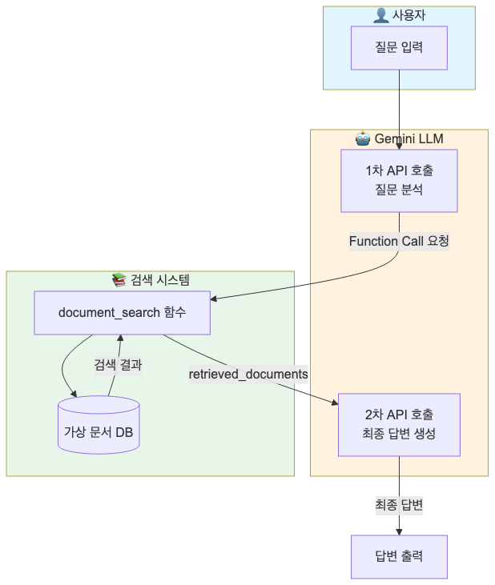
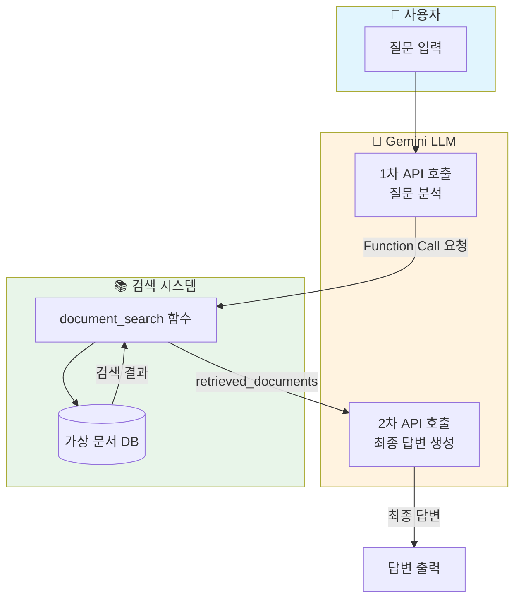
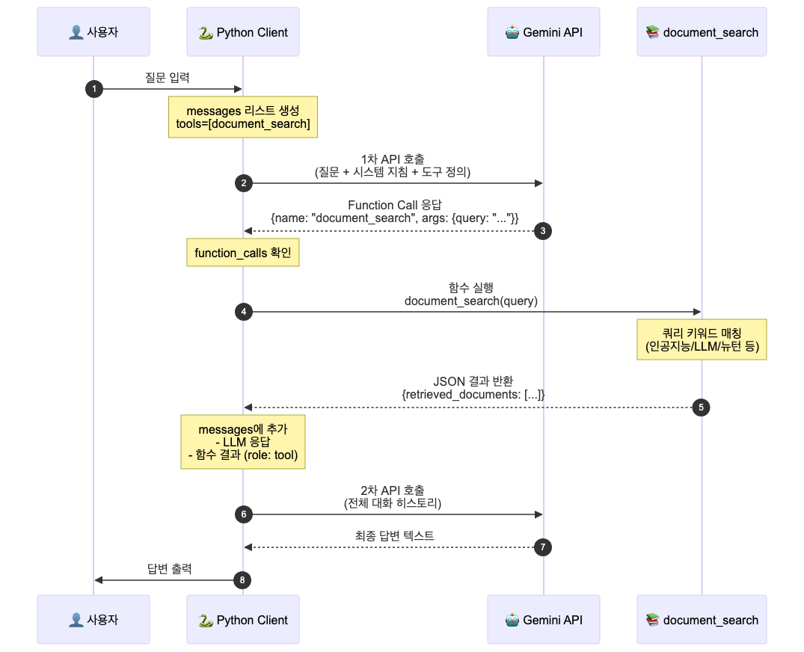
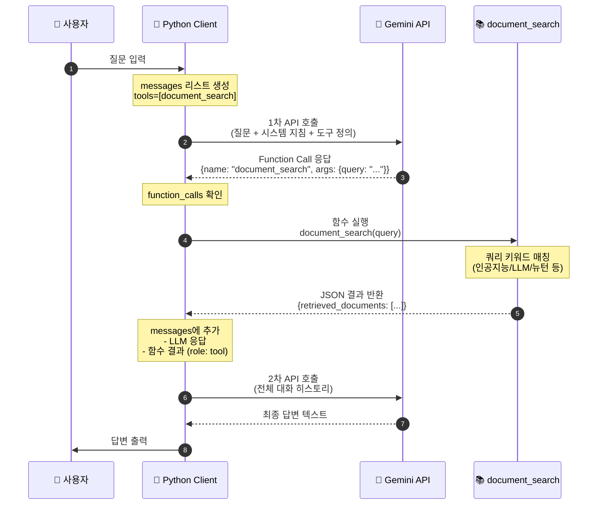
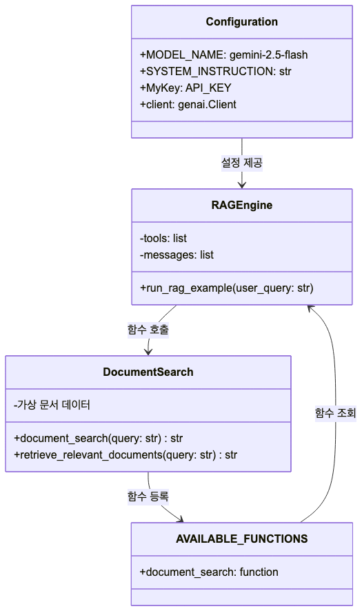
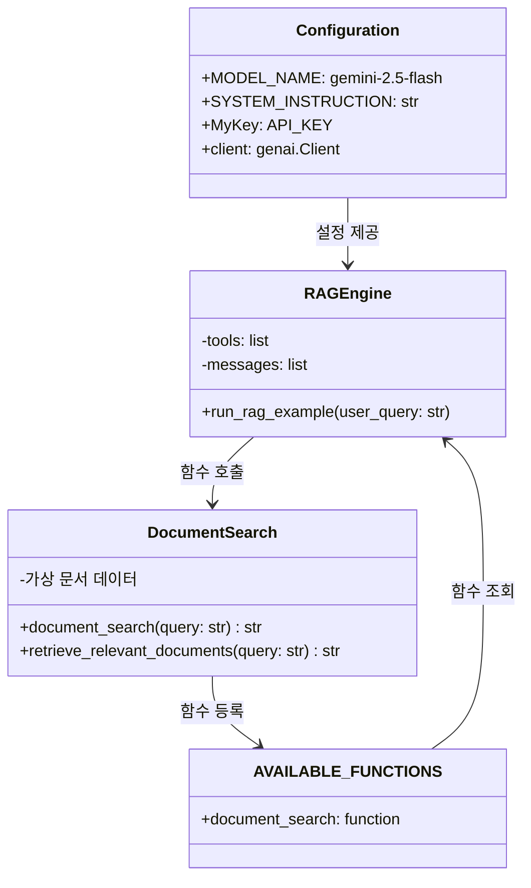
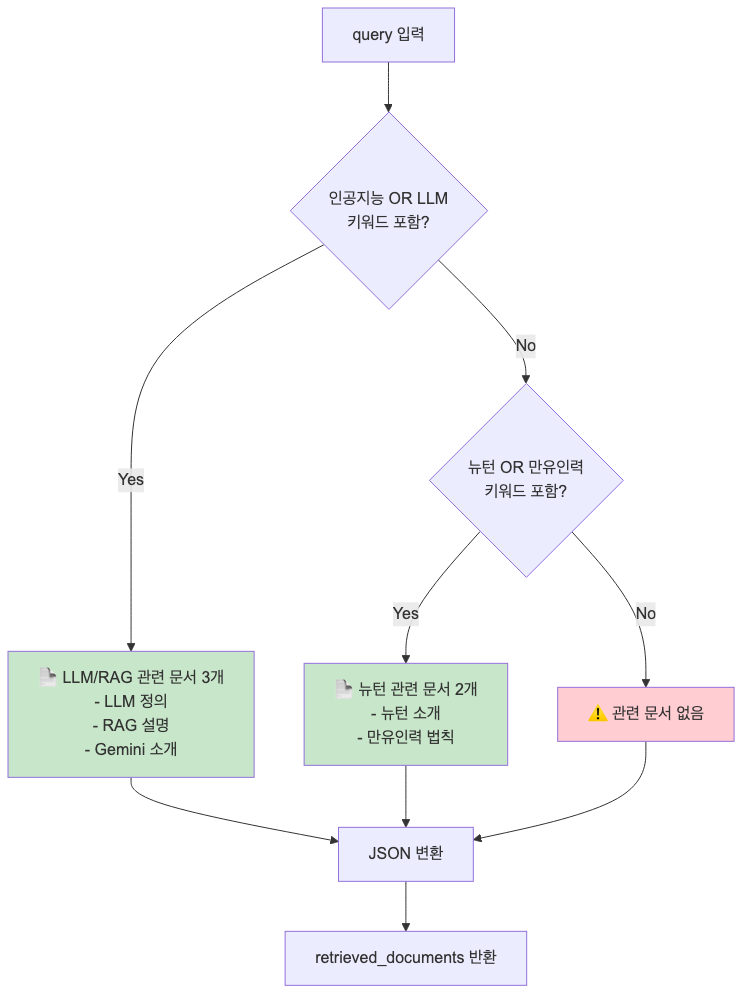
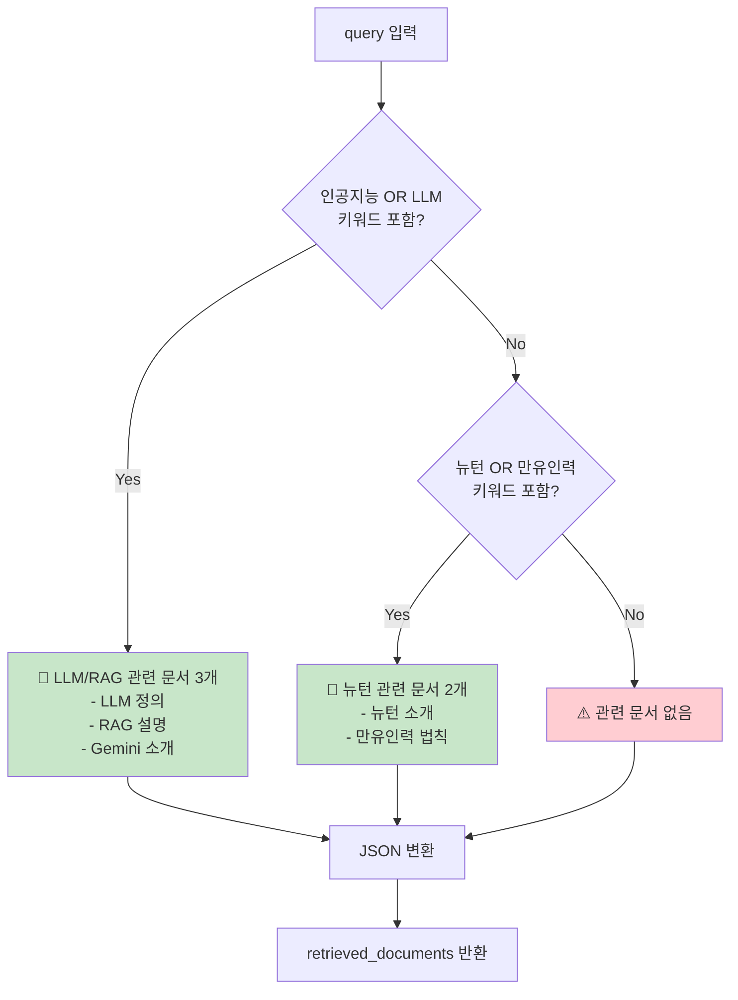

# RAG (Retrieval-Augmented Generation) 흐름도

`rag1.py` 코드의 RAG 아키텍처를 시각화한 다이어그램입니다.

## 전체 아키텍처

Mermaid 소스 코드

## 상세 실행 흐름

Mermaid 소스 코드

## 코드 구조

Mermaid 소스 코드

## 검색 로직 분기

Mermaid 소스 코드

## 핵심 개념

| 단계 | 설명 |
|------|------|
| **Retrieval** | 사용자 질문을 기반으로 관련 문서 검색 |
| **Augmentation** | 검색된 문서를 LLM 컨텍스트에 추가 |
| **Generation** | 검색 결과를 참고하여 최종 답변 생성 |
